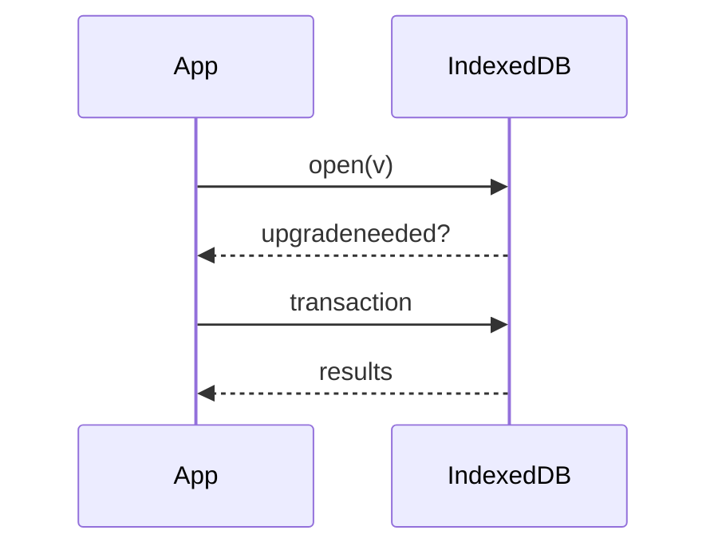
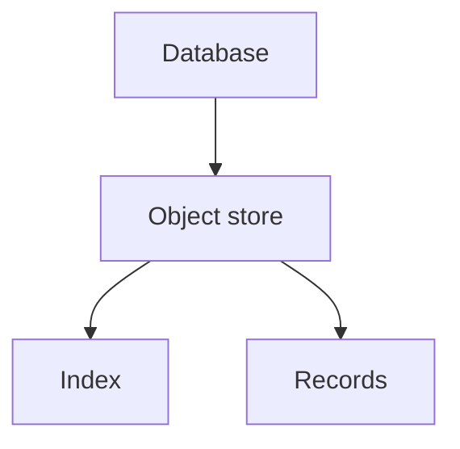

# IndexedDB

<TopicMeta />

<Prerequisites />

::: tip Published
This page meets the handbook **published** bar: deep explanation, ≥10 common mistakes, and official references. Further engine-level errata welcome via PR.
:::

## Introduction

**IndexedDB** is a low-level, async, transactional database in the browser. It stores structured clones (objects, arrays, blobs) in object stores with indexes—far more capable than Web Storage.

The API is verbose; many apps wrap it (idb).

## Why does it exist?

Offline apps, large caches, and client query needs exceed localStorage. IndexedDB provides quotas suitable for media/documents and non-blocking APIs.

## Historical Background

Standardized after competing proposals; widely supported. Evolved with promises wrappers and durability guidance.

## Mental Model

**Database → object stores → records** keyed by key path or out-of-line keys. Versions via `onupgradeneeded`. Transactions are short-lived; work inside them. All heavy ops are async.

## Internal Workflow

1. `open` with version.
2. Upgrade schema in `upgradeneeded`.
3. Run read/write transactions.
4. Index fields you query.
5. Handle blocked upgrades (other tabs).

## Lifecycle



## Browser Perspective

Origin-scoped; can be cleared with site data. Private mode may be ephemeral.

## JavaScript Engine Perspective

Not applicable.

## React Perspective

Keep IDB in effects/services; mirror into state carefully.

## Next.js Perspective

Not applicable.

## Server Perspective

Not applicable.

## Network Perspective

Often paired with service workers for offline.

## Memory Perspective

Cursoring avoids loading entire stores.

## Performance

Async helps main thread; still avoid giant transactions. Compound indexes for queries.

## Production Example

A notes app stores documents and attachments in IndexedDB, with a sync queue table for pending server mutations when offline.

## Code Examples

```ts
const req = indexedDB.open('app', 1)
req.onupgradeneeded = () => {
  const db = req.result
  db.createObjectStore('notes', { keyPath: 'id' })
}
req.onsuccess = () => {
  const db = req.result
  const tx = db.transaction('notes', 'readonly')
  tx.objectStore('notes').getAll().onsuccess = (e) => {
    console.log((e.target as IDBRequest).result)
  }
}
```

## Diagrams



## Common Mistakes

1. Using localStorage for large binary data instead
2. Long-lived transactions that block upgrades
3. Forgetting upgrade paths when changing schema
4. Main-thread JSON.parse of huge blobs without chunking
5. Assuming transactions auto-retry after errors
6. Ignoring `versionchange` / blocked events across tabs
7. Overlooking an edge case #1 specific to 09-browser-apis.indexeddb in production traffic
8. Overlooking an edge case #2 specific to 09-browser-apis.indexeddb in production traffic
9. Overlooking an edge case #3 specific to 09-browser-apis.indexeddb in production traffic
10. Overlooking an edge case #4 specific to 09-browser-apis.indexeddb in production traffic


## Best Practices

- Wrap with a Promise library (idb)
- Plan schema versions
- Index query fields
- Store blobs as blobs

## Anti-patterns

- Reopening the DB on every tiny read without reuse
- Schema-less chaos with no migrations

## Comparison

| | IndexedDB | localStorage |
| --- | --- | --- |
| Async | Yes | No |
| Structured | Yes | Strings |
| Size | Larger | Small |

## Interview Questions

### Easy

**Q:** Is IndexedDB synchronous?

**A:** No. It is asynchronous and transactional.

### Medium

**Q:** What happens in `onupgradeneeded`?

**A:** You create/delete object stores and indexes when the DB version increases.

### Hard

**Q:** How do you migrate a live schema with multiple tabs open?

**A:** Bump version, handle blocked upgrades by closing connections on `versionchange`, and design migrations to be forward-safe.

## Summary

- Async structured client DB
- Versioned object stores + indexes
- Prefer wrappers; plan migrations

## References

- [MDN: IndexedDB API](https://developer.mozilla.org/en-US/docs/Web/API/IndexedDB_API)
- [idb library](https://github.com/jakearchibald/idb)

<RelatedTopics />


Prev: [`09-browser-apis.sessionstorage`](/09-browser-apis/sessionstorage/) · Next: [`09-browser-apis.cache-storage`](/09-browser-apis/cache-storage/)
