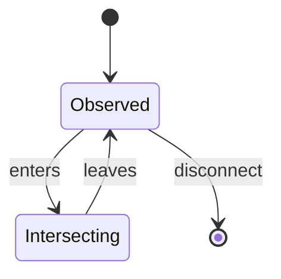
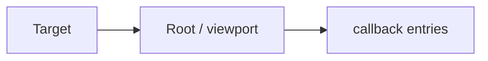

# Intersection Observer

<TopicMeta />

<Prerequisites />

::: tip Published
This page meets the handbook **published** bar: deep explanation, ≥10 common mistakes, and official references. Further engine-level errata welcome via PR.
:::

## Introduction

**IntersectionObserver** notifies when a target’s intersection with a root (viewport or element) crosses configured thresholds. It avoids scroll listeners that force layout thrashing.

## Why does it exist?

Lazy-loading images, infinite lists, and “in view” analytics need efficient visibility detection.

## Historical Background

Widely shipped to replace noisy scroll hacks; rootMargin and thresholds make it flexible.

## Mental Model

Observe targets; deliver batched async callbacks with `intersectionRatio`, `isIntersecting`, bounding rects. Roots default to viewport.

## Internal Workflow

1. Create observer with callback + options.
2. `observe` elements.
3. React to entries (load image, fetch page).
4. `unobserve`/`disconnect` on cleanup.

## Lifecycle



## Browser Perspective

Runs off scroll hot paths; delivery is async.

## JavaScript Engine Perspective

Not applicable.

## React Perspective

Create observer in effects; disconnect on unmount.

## Next.js Perspective

Not applicable.

## Server Perspective

Not applicable.

## Network Perspective

Not applicable.

## Memory Perspective

Not applicable.

## Performance

Major win vs scroll+getBoundingClientRect loops.

## Production Example

Product cards use IO to set `img.src` when near viewport (`rootMargin: 200px`) and send once-per-item impression beacons.

## Code Examples

```ts
const io = new IntersectionObserver(
  (entries) => {
    for (const e of entries) {
      if (e.isIntersecting) {
        const img = e.target as HTMLImageElement
        img.src = img.dataset.src!
        io.unobserve(img)
      }
    }
  },
  { rootMargin: '200px', threshold: 0.01 },
)
document.querySelectorAll('img[data-src]').forEach((img) => io.observe(img))
```

## Diagrams



## Common Mistakes

1. Forgetting disconnect on unmount (leaks)
2. Using scroll listeners instead without need
3. threshold misunderstanding (0 vs 1)
4. Observing permanently after lazyload done
5. Assuming synchronous delivery
6. Wrong root element for scrollable containers
7. Overlooking an edge case #1 specific to 09-browser-apis.intersection-observer in production traffic
8. Overlooking an edge case #2 specific to 09-browser-apis.intersection-observer in production traffic
9. Overlooking an edge case #3 specific to 09-browser-apis.intersection-observer in production traffic
10. Overlooking an edge case #4 specific to 09-browser-apis.intersection-observer in production traffic


## Best Practices

- rootMargin for prefetch
- unobserve after one-shot tasks
- One observer many targets when possible

## Anti-patterns

- New observer per list row without reuse

## Comparison

| Approach | Main-thread cost |
| --- | --- |
| IntersectionObserver | Low |
| scroll + measure | High |

## Interview Questions

### Easy

**Q:** What problem does IntersectionObserver solve?

**A:** Efficiently detecting when elements enter/leave a viewport/root without scroll thrashing.

### Medium

**Q:** What is `rootMargin` for?

**A:** To expand/shrink the root’s intersection box—e.g. preload before fully visible.

### Hard

**Q:** How do you observe inside a scrollable div, not the viewport?

**A:** Pass that element as `root` in the observer options.

## Summary

- Async visibility observations
- Ideal for lazyload/impressions
- Always clean up observers

## References

- [MDN: Intersection Observer](https://developer.mozilla.org/en-US/docs/Web/API/Intersection_Observer_API)

<RelatedTopics />


Prev: [`09-browser-apis.clipboard-api`](/09-browser-apis/clipboard-api/) · Next: [`09-browser-apis.mutation-observer`](/09-browser-apis/mutation-observer/)
