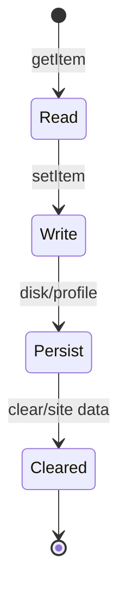
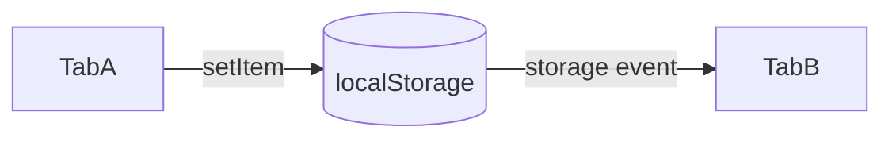

# localStorage

<TopicMeta />

<Prerequisites />

::: tip Published
This page meets the handbook **published** bar: deep explanation, ≥10 common mistakes, and official references. Further engine-level errata welcome via PR.
:::

## Introduction

**localStorage** is a synchronous key/value store (`Storage` interface) scoped to an origin. Data persists until cleared by the app, user, or storage policy.

Values are strings only—you serialize JSON yourself. Quota and privacy modes apply.

## Why does it exist?

Apps need cheap persistence for preferences, drafts, and caches without a backend. localStorage is the simplest Web Storage API—also the easiest to misuse for secrets or large blobs.

## Historical Background

Part of Web Storage (WHATWG), widely available since IE8-era. Modern guidance often prefers IndexedDB for structured/async data and cookies/server sessions for auth.

## Mental Model

One `Storage` map per origin (roughly scheme+host+port). `setItem`/`getItem`/`removeItem`/`clear`. Writes are sync on the main thread. `storage` events fire in **other** documents of the same origin, not the writer.

## Internal Workflow

1. Check availability (private mode quirks).
2. Serialize values to strings.
3. `setItem` / `getItem` with try/catch for quota.
4. Listen to `storage` for cross-tab sync if needed.
5. Never store tokens you cannot afford to leak to XSS.

## Lifecycle



## Browser Perspective

Stored in the browser profile; partitioned in some privacy scenarios. DevTools Application panel inspects it.

## JavaScript Engine Perspective

Sync IO-ish work on the main thread can jank if abused.

## React Perspective

Wrap access in effects/event handlers—not during SSR render. Hydration mismatches if HTML depends on localStorage.

## Next.js Perspective

localStorage is undefined on the server—gate with typeof window / client components.

## Server Perspective

Not applicable.

## Network Perspective

Not applicable.

## Memory Perspective

String values retained until removed; large JSON can cost memory when parsed.

## Performance

Sync API—avoid large writes in input handlers. Prefer debouncing and IndexedDB for big data.

## Production Example

Theme preference (`light`|`dark`|`system`) lives in localStorage; a small client bootstrap reads it before paint via an inline script to avoid flash, while React state stays the source after hydration.

## Code Examples

```ts
function readJson<T>(key: string, fallback: T): T {
  try {
    const raw = localStorage.getItem(key)
    if (raw == null) return fallback
    return JSON.parse(raw) as T
  } catch {
    return fallback
  }
}

function writeJson(key: string, value: unknown) {
  try {
    localStorage.setItem(key, JSON.stringify(value))
  } catch (e) {
    console.warn('localStorage write failed', e)
  }
}
```

## Diagrams



## Common Mistakes

1. Storing access tokens / secrets in localStorage (XSS exfiltration)
2. Assuming unlimited quota
3. JSON.parse without try/catch on corrupted data
4. Reading localStorage during SSR/hydration without a strategy
5. Expecting `storage` events in the same document that wrote
6. Saving megabytes and janking the main thread
7. Overlooking an edge case #1 specific to 09-browser-apis.localstorage in production traffic
8. Overlooking an edge case #2 specific to 09-browser-apis.localstorage in production traffic
9. Overlooking an edge case #3 specific to 09-browser-apis.localstorage in production traffic
10. Overlooking an edge case #4 specific to 09-browser-apis.localstorage in production traffic


## Best Practices

- Strings only—version your schemas
- try/catch quota errors
- Prefer httpOnly cookies/server sessions for auth
- Keep payloads small

## Anti-patterns

- Cache entire Redux stores forever
- Silent swallow of all errors

## Comparison

| API | Async? | Capacity | Structured |
| --- | --- | --- | --- |
| localStorage | No | ~5MB class | Strings |
| sessionStorage | No | Similar | Strings |
| IndexedDB | Yes | Larger | Yes |

## Interview Questions

### Easy

**Q:** Does localStorage persist after the tab closes?

**A:** Yes. It persists until cleared; sessionStorage does not survive the session the same way.

### Medium

**Q:** How do tabs sync localStorage changes?

**A:** Other documents receive a `storage` event; the writing document does not.

### Hard

**Q:** Why is localStorage a poor place for auth tokens?

**A:** Any XSS can read it via JS. httpOnly secure cookies (with CSRF protections) or hardened token architectures are safer.

## Summary

- Origin-scoped sync string map that persists
- Great for tiny prefs; bad for secrets and large data
- Mind SSR and quota

## References

- [MDN: localStorage](https://developer.mozilla.org/en-US/docs/Web/API/Window/localStorage)
- [MDN: Storage](https://developer.mozilla.org/en-US/docs/Web/API/Storage)
- [OWASP XSS](https://owasp.org/www-community/attacks/xss/)

<RelatedTopics />


Next: [`09-browser-apis.sessionstorage`](/09-browser-apis/sessionstorage/)
