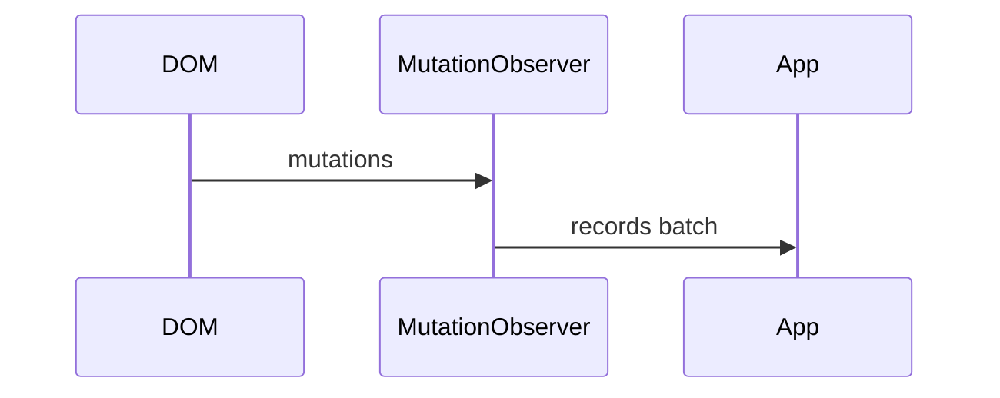
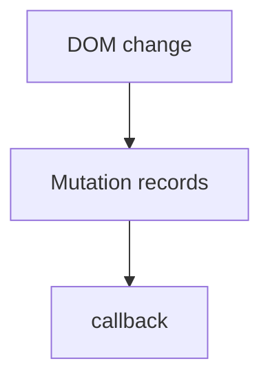

# Mutation Observer

<TopicMeta />

<Prerequisites />

::: tip Published
This page meets the handbook **published** bar: deep explanation, ≥10 common mistakes, and official references. Further engine-level errata welcome via PR.
:::

## Introduction

**MutationObserver** delivers batches of DOM mutations to a callback. Use it when integrating with external DOM changes—not as a substitute for reactive UI frameworks.

## Why does it exist?

Embeds, third-party widgets, and contenteditable need observation of DOM mutations without monkey-patching DOM APIs.

## Historical Background

Replaced deprecated Mutation Events which were sync and slow.

## Mental Model

Observe a node with options (`childList`, `subtree`, `attributes`, …). Callbacks are async microtask-ish batches of `MutationRecord`s.

## Internal Workflow

1. Create observer callback.
2. `observe` with precise options.
3. Process records; avoid infinite loops (your writes retrigger).
4. `disconnect` when done.

## Lifecycle



## Browser Perspective

Works across engines; still easy to create feedback loops.

## JavaScript Engine Perspective

Not applicable.

## React Perspective

Rare in React apps—React owns DOM. Useful at boundaries with non-React code.

## Next.js Perspective

Not applicable.

## Server Perspective

Not applicable.

## Network Perspective

Not applicable.

## Memory Perspective

Not applicable.

## Performance

Observe narrowly. `subtree: true` on large documents can be costly.

## Production Example

A syntax highlighter observes a code container managed by a legacy editor and re-runs highlighting when nodes change.

## Code Examples

```ts
const mo = new MutationObserver((records) => {
  for (const r of records) {
    console.log(r.type, r.target)
  }
})
mo.observe(document.getElementById('host')!, {
  childList: true,
  subtree: true,
})
```

## Diagrams



## Common Mistakes

1. Using MO instead of React state for your own UI
2. Feedback loops from writing DOM in the callback
3. Observing entire document subtree casually
4. Forgetting disconnect
5. Misreading attributeFilter options
6. Expecting synchronous delivery like old mutation events
7. Overlooking an edge case #1 specific to 09-browser-apis.mutation-observer in production traffic
8. Overlooking an edge case #2 specific to 09-browser-apis.mutation-observer in production traffic
9. Overlooking an edge case #3 specific to 09-browser-apis.mutation-observer in production traffic
10. Overlooking an edge case #4 specific to 09-browser-apis.mutation-observer in production traffic


## Best Practices

- Narrow targets/options
- Guard against re-entry
- Disconnect promptly

## Anti-patterns

- Global document observers in SPAs as architecture

## Comparison

| | MutationObserver | Mutation Events |
| --- | --- | --- |
| Delivery | Async batched | Sync (deprecated) |
| Perf | Better | Poor |

## Interview Questions

### Easy

**Q:** What does MutationObserver observe?

**A:** DOM mutations such as child list changes and attribute changes.

### Medium

**Q:** Why were Mutation Events replaced?

**A:** They fired synchronously and harmed performance; MutationObserver batches asynchronously.

### Hard

**Q:** How do you prevent observer feedback loops?

**A:** Ignore self-caused records, batch writes, or disconnect while mutating.

## Summary

- Async DOM mutation batches
- Use at integration boundaries
- Narrow observe + disconnect

## References

- [MDN: MutationObserver](https://developer.mozilla.org/en-US/docs/Web/API/MutationObserver)

<RelatedTopics />


Prev: [`09-browser-apis.intersection-observer`](/09-browser-apis/intersection-observer/) · Next: [`09-browser-apis.resize-observer`](/09-browser-apis/resize-observer/)
