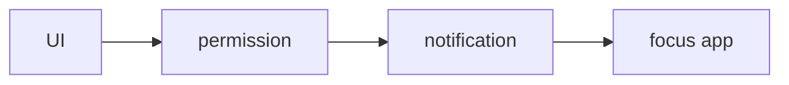

# Notifications

<TopicMeta />

<Prerequisites />

::: tip Published
This page meets the handbook **published** bar: deep explanation, ≥10 common mistakes, and official references. Further engine-level errata welcome via PR.
:::

## Introduction

The **Notifications API** shows OS-level notifications. Permission must be granted. Persistent notifications from push typically show via the service worker’s `registration.showNotification`.

## Why does it exist?

Timely alerts when the user is outside the tab—chat, ops incidents, shipping updates.

## Historical Background

Grew alongside Push API; browsers tightened permission UX (gesture requirements, quieter permissions).

## Mental Model

Request permission sparingly after value is clear. Display requires permission `granted`. Actions/clicks route back into pages or SW handlers.

## Internal Workflow

1. Explain value in UI first.
2. `Notification.requestPermission()` on gesture.
3. Show via `new Notification` or SW.
4. Handle click to focus/open deep link.

## Lifecycle

```mermaid
stateDiagram-v2
  [*] --> Default
  Default --> Granted: allow
  Default --> Denied: block
  Granted --> Shown: showNotification
```

## Browser Perspective

Permission UX varies; may be gated by engagement.

## JavaScript Engine Perspective

Not applicable.

## React Perspective

Not applicable.

## Next.js Perspective

Not applicable.

## Server Perspective

Not applicable.

## Network Perspective

Push needs backend + SW; local notifications do not.

## Memory Perspective

Not applicable.

## Performance

N/A beyond not spamming users (retention risk).

## Production Example

After a user enables “notify me when back in stock,” the app requests permission and stores a push subscription on the server.

## Code Examples

```ts
async function notify(title: string, body: string) {
  if (Notification.permission !== 'granted') {
    const perm = await Notification.requestPermission()
    if (perm !== 'granted') return
  }
  new Notification(title, { body })
}
```

## Diagrams



## Common Mistakes

1. Asking permission on first paint
2. Ignoring denied state forever without settings UX
3. Spamming notifications
4. Assuming window Notification works for background push (need SW)
5. Missing click handlers
6. Not using secure context
7. Overlooking an edge case #1 specific to 09-browser-apis.notifications in production traffic
8. Overlooking an edge case #2 specific to 09-browser-apis.notifications in production traffic
9. Overlooking an edge case #3 specific to 09-browser-apis.notifications in production traffic
10. Overlooking an edge case #4 specific to 09-browser-apis.notifications in production traffic


## Best Practices

- Contextual permission prompts
- Useful content only
- Deep link on click
- Respect OS quiet hours/user prefs

## Anti-patterns

- Permission popups as growth hacks

## Comparison

| Path | Context |
| --- | --- |
| `new Notification` | Page visible-ish |
| SW showNotification | Push/background |

## Interview Questions

### Easy

**Q:** What must happen before showing notifications?

**A:** The user must grant permission (and you need a secure context).

### Medium

**Q:** Why show notifications from a service worker for push?

**A:** Because the page may be closed; the SW receives push events and displays notifications.

### Hard

**Q:** How do you design permission UX that converts without annoying users?

**A:** Defer until a clear user intent moment, explain benefits, handle deny gracefully, and provide a settings entry point.

## Summary

- Permissioned OS notifications
- Pair with SW for push
- Never ambush users on load

## References

- [MDN: Notifications API](https://developer.mozilla.org/en-US/docs/Web/API/Notifications_API)

<RelatedTopics />


Prev: [`09-browser-apis.service-workers`](/09-browser-apis/service-workers/) · Next: [`09-browser-apis.geolocation`](/09-browser-apis/geolocation/)
