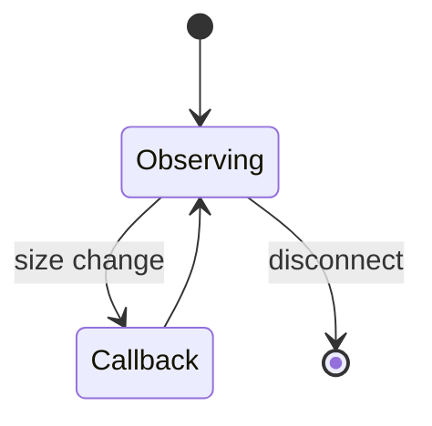
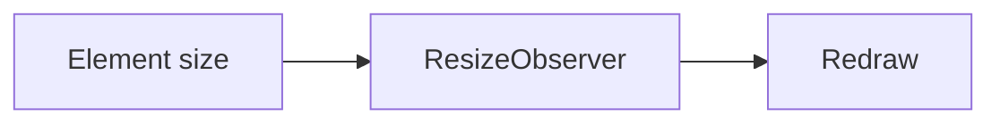

# Resize Observer

<TopicMeta />

<Prerequisites />

::: tip Published
This page meets the handbook **published** bar: deep explanation, ≥10 common mistakes, and official references. Further engine-level errata welcome via PR.
:::

## Introduction

**ResizeObserver** notifies when an observed element’s size changes. Essential for charts, virtualized lists, and responsive components sized by container, not only by viewport.

## Why does it exist?

`window.resize` misses container changes (sidebars, split panes). RO observes elements directly.

## Historical Background

Filled the gap left by window-centric resize events; now baseline in modern browsers.

## Mental Model

Observe elements; receive `contentRect` / box sizes. Callbacks can happen before paint; avoid layout loops (RO has error handling for infinite loop scenarios).

## Internal Workflow

1. Create ResizeObserver.
2. Observe containers.
3. Update layout/chart dimensions in callback (debounce if heavy).
4. Disconnect on unmount.

## Lifecycle



## Browser Perspective

Prefer over window resize for component-local layout.

## JavaScript Engine Perspective

Not applicable.

## React Perspective

Pair with refs; store width in state sparingly to avoid render storms.

## Next.js Perspective

Not applicable.

## Server Perspective

Not applicable.

## Network Perspective

Not applicable.

## Memory Perspective

Not applicable.

## Performance

Debounce heavy work; don’t setState every subpixel without need.

## Production Example

A chart component observes its wrapper and rerenders the canvas at device pixel ratio when width changes.

## Code Examples

```ts
const ro = new ResizeObserver((entries) => {
  for (const entry of entries) {
    const w = entry.contentRect.width
    console.log('width', w)
  }
})
ro.observe(document.querySelector('#chart')!)
```

## Diagrams



## Common Mistakes

1. Using window.resize for container-driven layout
2. setState on every notification causing loops
3. Forgetting disconnect
4. Ignoring devicePixelRatio for canvases
5. Observing wrong box (content vs border) for the layout model
6. Doing forced layout inside callbacks carelessly
7. Overlooking an edge case #1 specific to 09-browser-apis.resize-observer in production traffic
8. Overlooking an edge case #2 specific to 09-browser-apis.resize-observer in production traffic
9. Overlooking an edge case #3 specific to 09-browser-apis.resize-observer in production traffic
10. Overlooking an edge case #4 specific to 09-browser-apis.resize-observer in production traffic


## Best Practices

- Observe the element that actually sizes the widget
- Debounce expensive redraws
- Clean up on unmount

## Anti-patterns

- Global window resize bus for all components

## Comparison

| Tool | Observes |
| --- | --- |
| ResizeObserver | Element size |
| window resize | Viewport |
| Container queries | CSS-based |

## Interview Questions

### Easy

**Q:** Why use ResizeObserver instead of window resize?

**A:** Because component containers can change size without the window resizing.

### Medium

**Q:** What does `contentRect` represent?

**A:** The observed element’s content box dimensions delivered with the entry.

### Hard

**Q:** How can ResizeObserver cause infinite loops?

**A:** If the callback changes the observed element’s size repeatedly; browsers may error and stop delivery.

## Summary

- Element-level size observations
- Ideal for charts and container layouts
- Avoid render/layout loops

## References

- [MDN: Resize Observer](https://developer.mozilla.org/en-US/docs/Web/API/Resize_Observer_API)

<RelatedTopics />


Prev: [`09-browser-apis.mutation-observer`](/09-browser-apis/mutation-observer/) · Next: [`09-browser-apis.broadcast-channel`](/09-browser-apis/broadcast-channel/)
