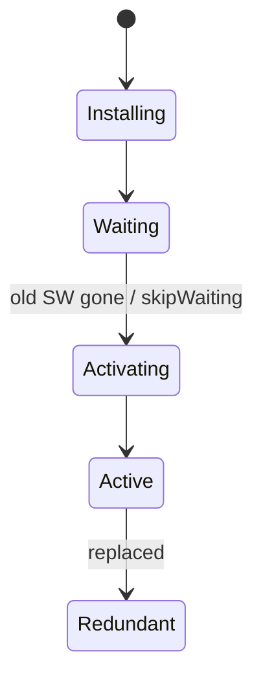
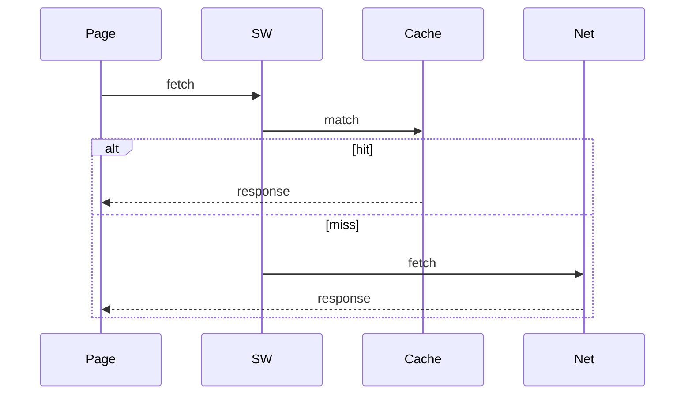

# Service Workers

<TopicMeta />

<Prerequisites />

::: tip Published
This page meets the handbook **published** bar: deep explanation, ≥10 common mistakes, and official references. Further engine-level errata welcome via PR.
:::

## Introduction

A **service worker** is an event-driven worker that sits between pages and the network. It can intercept `fetch`, cache responses, and enable offline UX and push notifications.

It has a strict lifecycle and HTTPS requirement.

## Why does it exist?

Reliable offline and performance need a versioned client-side proxy—not ad-hoc `localStorage` hacks.

## Historical Background

Replaced AppCache. Became the foundation of PWAs alongside Cache Storage and Web App Manifest.

## Mental Model

Register → install (precache) → waiting → activate (claim clients, delete old caches) → fetch/push events. Only one active SW per scope; updates wait until safe.

## Internal Workflow

1. Register `/sw.js` with scope.
2. Precache on `install`; `skipWaiting` carefully.
3. On `activate`, clean old caches; `clients.claim`.
4. On `fetch`, apply strategy.
5. Design update UX (reload prompt).

## Lifecycle



## Browser Perspective

HTTPS (or localhost). DevTools Application panel for lifecycle.

## JavaScript Engine Perspective

Not applicable.

## React Perspective

SW is outside React; communicate via postMessage.

## Next.js Perspective

Coordinate with framework asset hashes; misconfigured SW can pin stale apps.

## Server Perspective

Not applicable.

## Network Perspective

Can return cached responses without network.

## Memory Perspective

Not applicable.

## Performance

Huge win for repeat visits; bad strategies cause mysterious staleness.

## Production Example

Production deploys bump precache manifest hashes; activate deletes `vN-1`; users see an “Update available” toast that calls `skipWaiting` + reload.

## Code Examples

```js
self.addEventListener('install', (e) => {
  e.waitUntil(caches.open('v2').then((c) => c.addAll(['/', '/app.js'])))
})
self.addEventListener('fetch', (e) => {
  e.respondWith(caches.match(e.request).then((r) => r || fetch(e.request)))
})
```

## Diagrams



## Common Mistakes

1. Caching index.html cache-first forever (stuck deploys)
2. Broad fetch handlers breaking analytics/websockets incorrectly
3. Forgetting HTTPS
4. skipWaiting without update UX
5. Scope mistakes so SW never controls pages
6. Testing only on desktop while mobile Safari differs
7. Overlooking an edge case #1 specific to 09-browser-apis.service-workers in production traffic
8. Overlooking an edge case #2 specific to 09-browser-apis.service-workers in production traffic
9. Overlooking an edge case #3 specific to 09-browser-apis.service-workers in production traffic
10. Overlooking an edge case #4 specific to 09-browser-apis.service-workers in production traffic


## Best Practices

- Version caches; network-first for HTML
- Explicit update flow
- Fail closed on opaque errors
- Keep SW script small/debuggable

## Anti-patterns

- Copy-paste Workbox config you do not understand

## Comparison

| | Service Worker | Web Worker |
| --- | --- | --- |
| Fetch intercept | Yes | No |
| Lifetime | Event-driven longevity | Tied more to owner |
| DOM | No | No |

## Interview Questions

### Easy

**Q:** What can a service worker do on fetch?

**A:** Intercept requests and respond from cache or network (or generate responses).

### Medium

**Q:** Why do SW updates sometimes not apply immediately?

**A:** A new worker waits until existing clients release the old one unless `skipWaiting`/`clients.claim` patterns are used.

### Hard

**Q:** How do you prevent users from being stuck on an old bundle?

**A:** Network-first or short-cache HTML, hashed assets, versioned caches, and an update prompt that activates the new worker.

## Summary

- HTTPS network proxy worker for offline/PWA
- Lifecycle + cache strategies are the job
- Stale SW configs are a top production footgun

## References

- [MDN: Service Worker API](https://developer.mozilla.org/en-US/docs/Web/API/Service_Worker_API)
- [web.dev Service Workers](https://web.dev/learn/pwa/service-workers)

<RelatedTopics />


Prev: [`09-browser-apis.web-workers`](/09-browser-apis/web-workers/) · Next: [`09-browser-apis.notifications`](/09-browser-apis/notifications/)
