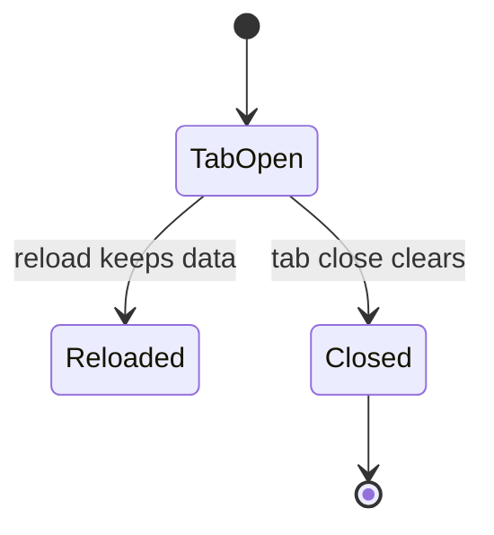
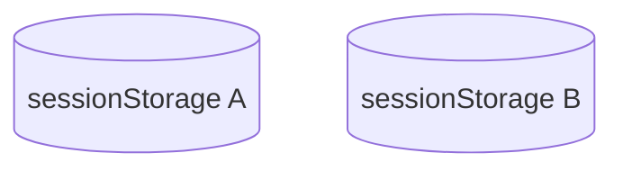

# sessionStorage

<TopicMeta />

<Prerequisites />

::: tip Published
This page meets the handbook **published** bar: deep explanation, ≥10 common mistakes, and official references. Further engine-level errata welcome via PR.
:::

## Introduction

**sessionStorage** matches localStorage’s API but lifetime is tied to the **page session** / tab. Data survives reloads but is isolated per tab and typically cleared when the tab closes.

## Why does it exist?

Useful for wizard drafts, per-tab UI state, and avoiding cross-tab leakage that localStorage would share.

## Historical Background

Sibling of localStorage in Web Storage. Semantics around duplicated tabs and privacy partitioning have been clarified over time.

## Mental Model

Same `Storage` methods; different scope/lifetime. Opening a link in a new tab usually starts a fresh sessionStorage.

## Internal Workflow

1. Decide if state should be tab-private.
2. Serialize small strings.
3. Clear when the flow completes.
4. Do not use for durable user data.

## Lifecycle



## Browser Perspective

DevTools shows sessionStorage per tab.

## JavaScript Engine Perspective

Not applicable.

## React Perspective

Same SSR caveats as localStorage.

## Next.js Perspective

Client-only access.

## Server Perspective

Not applicable.

## Network Perspective

Not applicable.

## Memory Perspective

Not applicable.

## Performance

Same sync caveats as localStorage.

## Production Example

A multi-step checkout keeps in-progress form data in sessionStorage so refresh does not lose the tab’s work, without sharing unfinished PII across tabs.

## Code Examples

```ts
sessionStorage.setItem('wizard.step', '2')
const step = sessionStorage.getItem('wizard.step')
```

## Diagrams



## Common Mistakes

1. Expecting data to appear in other tabs
2. Storing durable records that users expect next week
3. Secrets storage
4. SSR access
5. Quota ignorance
6. Assuming identical lifetime across all browsers/privacy modes
7. Overlooking an edge case #1 specific to 09-browser-apis.sessionstorage in production traffic
8. Overlooking an edge case #2 specific to 09-browser-apis.sessionstorage in production traffic
9. Overlooking an edge case #3 specific to 09-browser-apis.sessionstorage in production traffic
10. Overlooking an edge case #4 specific to 09-browser-apis.sessionstorage in production traffic


## Best Practices

- Tab-scoped ephemeral state only
- Clear on completion
- Version keys

## Anti-patterns

- Using sessionStorage as a global app database

## Comparison

| | localStorage | sessionStorage |
| --- | --- | --- |
| Cross-tab | Shared | Isolated |
| Lifetime | Long | Session/tab |

## Interview Questions

### Easy

**Q:** How does sessionStorage differ from localStorage?

**A:** Similar API, but sessionStorage is per-tab/session and not shared across tabs the same way.

### Medium

**Q:** Does reload clear sessionStorage?

**A:** No. Reload keeps it; closing the tab typically clears it.

### Hard

**Q:** When would you pick sessionStorage over React state alone?

**A:** When you need refresh resilience for a single tab flow without persisting across tabs or visits.

## Summary

- Tab-scoped sync storage
- Good for ephemeral flows
- Same string/security caveats

## References

- [MDN: sessionStorage](https://developer.mozilla.org/en-US/docs/Web/API/Window/sessionStorage)

<RelatedTopics />


Prev: [`09-browser-apis.localstorage`](/09-browser-apis/localstorage/) · Next: [`09-browser-apis.indexeddb`](/09-browser-apis/indexeddb/)
