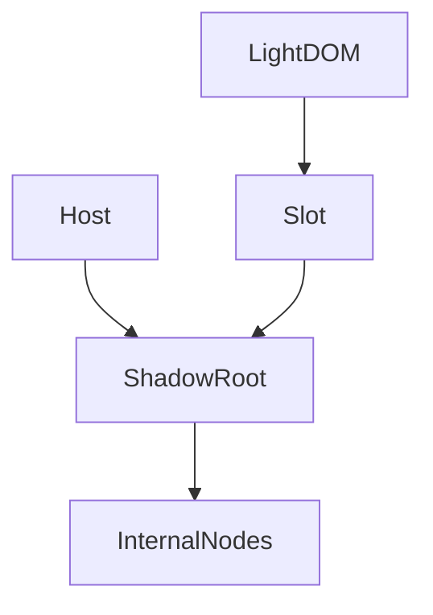
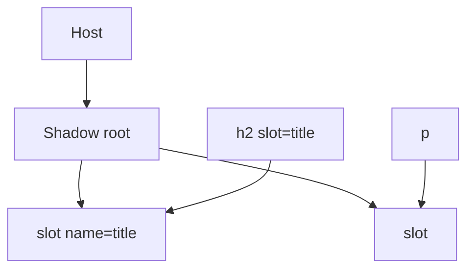

# Shadow DOM

<TopicMeta />

<Prerequisites />

::: tip Published
This page meets the handbook **published** bar: deep explanation, ≥10 common mistakes, and official references. Further engine-level errata welcome via PR.
:::

## Introduction

**Shadow DOM** attaches a hidden (from normal composition) DOM subtree to an element—the **shadow root**. Styles and nodes inside are encapsulated; `<slot>` projects light DOM children into shadow structure.

## Why does it exist?

Widgets need CSS isolation and DOM hiding so page styles don’t break internals (and vice versa, with caveats).

## Historical Background

Shadow DOM v1 stabilized after earlier experimental versions. Open vs closed mode controls `element.shadowRoot` access.

## Mental Model

Host element + shadow tree + light DOM. Slots are insertion points. CSS `::part`/`:host`/`::slotted` control styling surfaces. Events retarget across the boundary.

## Internal Workflow

1. `attachShadow({ mode: 'open' })`.
2. Fill with template markup/styles.
3. Define slots for consumer content.
4. Expose limited styling via CSS parts/variables.

## Lifecycle



## Browser Perspective

DevTools can pierce open shadow roots.

## JavaScript Engine Perspective

Not applicable.

## React Perspective

Children become light DOM; shadow internals managed by the element.

## Next.js Perspective

Not applicable.

## Server Perspective

Not applicable.

## Network Perspective

Not applicable.

## Memory Perspective

Not applicable.

## Performance

Extra trees cost a bit; usually fine vs global CSS wars.

## Production Example

A video player element hides complex DOM in shadow, exposes `::part(play-button)`, and slots captions into `<slot name="captions">`.

## Code Examples

```js
class Card extends HTMLElement {
  constructor() {
    super()
    const root = this.attachShadow({ mode: 'open' })
    root.innerHTML = `
      <style>
        :host { display: block; border: 1px solid #ccc; }
        ::slotted(h2) { margin: 0; }
      </style>
      <slot name="title"></slot>
      <div class="body"><slot></slot></div>
    `
  }
}
customElements.define('fancy-card', Card)
```

## Diagrams



## Common Mistakes

1. Closed mode by default making debugging painful
2. Assuming zero style leakage/inheritance surprises
3. Breaking a11y by hiding focusable content incorrectly
4. Not documenting CSS parts/variables
5. Event retargeting confusion when listening on host
6. Duplicating huge styles per instance without sharing
7. Overlooking an edge case #1 specific to 09-browser-apis.shadow-dom in production traffic
8. Overlooking an edge case #2 specific to 09-browser-apis.shadow-dom in production traffic
9. Overlooking an edge case #3 specific to 09-browser-apis.shadow-dom in production traffic
10. Overlooking an edge case #4 specific to 09-browser-apis.shadow-dom in production traffic


## Best Practices

- Open mode unless you must close
- CSS variables/parts as public style API
- Test keyboard/AT with slots
- Keep shadow trees lean

## Anti-patterns

- Shadow DOM purely to dodge learning CSS cascade

## Comparison

| Mode | `element.shadowRoot` |
| --- | --- |
| open | Accessible |
| closed | null to outsiders |

## Interview Questions

### Easy

**Q:** What does Shadow DOM encapsulate?

**A:** A DOM/CSS subtree attached to a host element, separate from the document’s flat tree composition.

### Medium

**Q:** What are slots for?

**A:** They project light DOM children into designated places in the shadow tree.

### Hard

**Q:** How do events behave across shadow boundaries?

**A:** They retarget so listeners outside see the host as the target (with composed paths available via `composedPath()` for deeper inspection).

## Summary

- Encapsulated DOM/CSS for components
- Slots project light DOM
- Style via :host, ::slotted, ::part, variables

## References

- [MDN: Using shadow DOM](https://developer.mozilla.org/en-US/docs/Web/API/Web_components/Using_shadow_DOM)
- [CSS Shadow Parts](https://developer.mozilla.org/en-US/docs/Web/CSS/::part)

<RelatedTopics />


Prev: [`09-browser-apis.custom-elements`](/09-browser-apis/custom-elements/)
