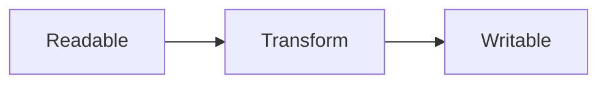
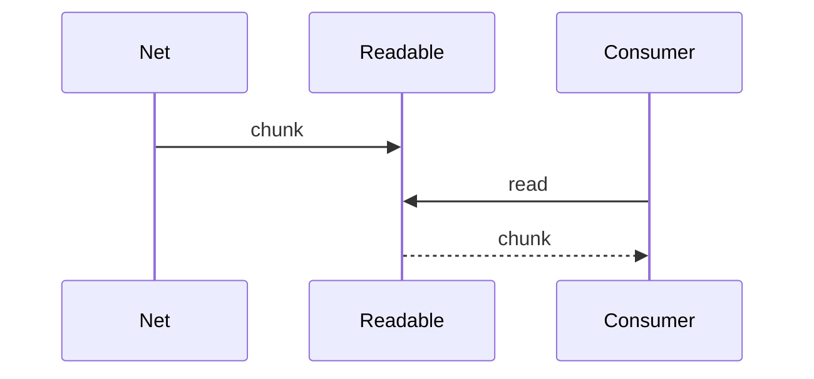

# Streams API

<TopicMeta />

<Prerequisites />

::: tip Published
This page meets the handbook **published** bar: deep explanation, ≥10 common mistakes, and official references. Further engine-level errata welcome via PR.
:::

## Introduction

The **Streams API** models data as chunk sequences with **backpressure**. `ReadableStream`, `WritableStream`, and `TransformStream` power fetch bodies, compression, and progressive processing without loading everything into memory.

## Why does it exist?

Large downloads/uploads and progressive transforms need chunking and flow control—classic promises of full Blobs don’t scale.

## Historical Background

WHATWG Streams underpin modern `fetch` body usage and Web platform pipelines (including some Node interop stories).

## Mental Model

Producers enqueue chunks; consumers read; backpressure pauses producers when queues fill. Pipe chains compose transforms.

## Internal Workflow

1. Get a readable (`response.body`).
2. `getReader` or `pipeThrough` transforms.
3. Respect backpressure (await writes).
4. Cancel on abort (`AbortSignal`).

## Lifecycle



## Browser Perspective

fetch bodies are readable streams.

## JavaScript Engine Perspective

Avoid buffering entire payloads.

## React Perspective

Feed progressive UI from chunk parsers carefully.

## Next.js Perspective

Not applicable.

## Server Perspective

Not applicable.

## Network Perspective

Streaming reduces TTFB-to-usable-bytes latency.

## Memory Perspective

Not applicable.

## Performance

Primary win is memory + time-to-first-chunk processing.

## Production Example

An export downloads a huge CSV via `response.body`, parses lines incrementally, and renders rows as they arrive.

## Code Examples

```ts
const res = await fetch('/large.txt')
const reader = res.body!.getReader()
const decoder = new TextDecoder()
let text = ''
for (;;) {
  const { value, done } = await reader.read()
  if (done) break
  text += decoder.decode(value, { stream: true })
}
```

## Diagrams



## Common Mistakes

1. Buffering entire stream into memory anyway
2. Ignoring backpressure in custom sinks
3. Forgetting cancel/abort
4. Parsing UTF-8 without stream-aware decoders
5. Assuming all environments support every stream feature equally
6. Deadlocking pipe chains
7. Overlooking an edge case #1 specific to 09-browser-apis.streams-api in production traffic
8. Overlooking an edge case #2 specific to 09-browser-apis.streams-api in production traffic
9. Overlooking an edge case #3 specific to 09-browser-apis.streams-api in production traffic
10. Overlooking an edge case #4 specific to 09-browser-apis.streams-api in production traffic


## Best Practices

- Prefer pipeThrough compositions
- Abortable readers
- Chunk-aware text decoding
- Measure memory on large fixtures

## Anti-patterns

- `await res.text()` for multi-hundred-MB payloads

## Comparison

| Approach | Memory |
| --- | --- |
| Full buffer | High |
| Streams | Bounded |

## Interview Questions

### Easy

**Q:** What problem do Streams solve?

**A:** Processing data in chunks with backpressure instead of loading everything at once.

### Medium

**Q:** What is backpressure?

**A:** A signal that the consumer is slower than the producer so the producer should pause/enqueue less.

### Hard

**Q:** How does fetch streaming help UX?

**A:** You can parse and render progressively as bytes arrive, improving time-to-interactive for large payloads.

## Summary

- Chunked backpressured pipelines
- Foundation for fetch body streaming
- Cancel and decode carefully

## References

- [MDN: Streams API](https://developer.mozilla.org/en-US/docs/Web/API/Streams_API)

<RelatedTopics />


Prev: [`09-browser-apis.web-sockets-api`](/09-browser-apis/web-sockets-api/) · Next: [`09-browser-apis.file-api`](/09-browser-apis/file-api/)
