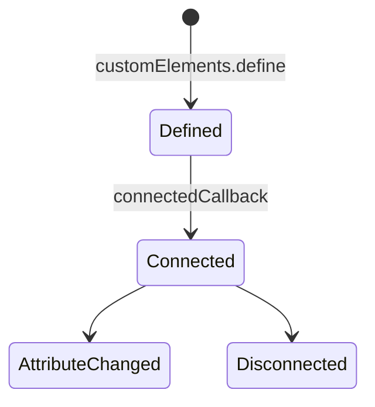
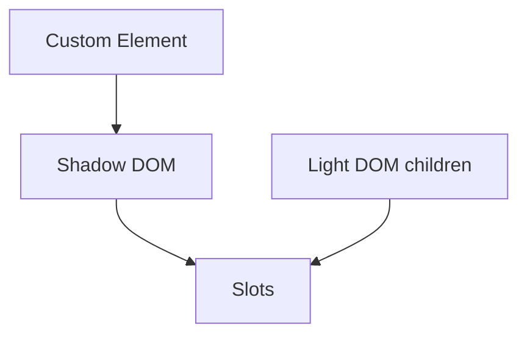

# Web Components

<TopicMeta />

<Prerequisites />

::: tip Published
This page meets the handbook **published** bar: deep explanation, ≥10 common mistakes, and official references. Further engine-level errata welcome via PR.
:::

## Introduction

**Web Components** are a suite of standards—primarily **Custom Elements**, **Shadow DOM**, and **HTML templates `<template>`/`<slot>`**—for reusable encapsulated widgets that work across frameworks.

## Why does it exist?

Design systems shared across React/Angular/Vue/legacy pages need a lowest common denominator runtime: the browser.

## Historical Background

Years of spec churn (v0→v1) settled into today’s Custom Elements v1 + Shadow DOM v1, now widely supported.

## Mental Model

Define a class extending `HTMLElement`, register with `customElements.define`, encapsulate markup/styles in shadow roots, project light DOM via slots.

## Internal Workflow

1. Author element class with lifecycle callbacks.
2. Attach open/closed shadow root.
3. Use template+slots for structure.
4. Publish as package; consume in frameworks via wrappers if needed.

## Lifecycle



## Browser Perspective

Native components; DevTools shows shadow trees.

## JavaScript Engine Perspective

Not applicable.

## React Perspective

React 19 improves property/event interop; historically refs/wrappers needed.

## Next.js Perspective

Client-only registration; watch SSR/custom element timing.

## Server Perspective

Not applicable.

## Network Perspective

Not applicable.

## Memory Perspective

Not applicable.

## Performance

Light vs heavy shadow trees; style encapsulation costs are usually fine.

## Production Example

A company embeds `<acme-chat>` on marketing (no React) and inside the React app with the same package.

## Code Examples

```js
class HelloWorld extends HTMLElement {
  connectedCallback() {
    const shadow = this.attachShadow({ mode: 'open' })
    shadow.innerHTML = `<style>:host{display:inline-block}</style><span><slot></slot></span>`
  }
}
customElements.define('hello-world', HelloWorld)
```

## Diagrams



## Common Mistakes

1. Defining elements twice
2. Assuming React props map to attributes automatically (legacy)
3. Closed shadow roots that are undebuggable without need
4. Heavy frameworks inside every leaf WC
5. Ignoring a11y in shadow trees
6. SSR mismatches when tags upgrade late
7. Overlooking an edge case #1 specific to 09-browser-apis.web-components in production traffic
8. Overlooking an edge case #2 specific to 09-browser-apis.web-components in production traffic
9. Overlooking an edge case #3 specific to 09-browser-apis.web-components in production traffic
10. Overlooking an edge case #4 specific to 09-browser-apis.web-components in production traffic


## Best Practices

- One responsibility per element
- Open shadow for debuggability unless secrecy needed
- ARIA + keyboard support
- Clear attribute/property reflection rules

## Anti-patterns

- Rewriting your whole app as WCs without a reason

## Comparison

| Piece | Role |
| --- | --- |
| Custom Elements | Behavior/lifecycle |
| Shadow DOM | Encapsulation |
| template/slot | Structure/projection |

## Interview Questions

### Easy

**Q:** Name the main technologies in Web Components.

**A:** Custom Elements, Shadow DOM, and HTML templates/slots.

### Medium

**Q:** What does `connectedCallback` mean?

**A:** It runs when the element is inserted into the document; good place to attach DOM/shadow content.

### Hard

**Q:** How do Web Components interoperate with React?

**A:** Prefer properties/events carefully; use wrappers or React 19 custom element support; avoid treating them like React components with implicit diffing of children incorrectly.

## Summary

- Native reusable components across stacks
- Custom elements + shadow + slots
- Mind framework interop and a11y

## References

- [MDN: Web Components](https://developer.mozilla.org/en-US/docs/Web/API/Web_components)
- [web.dev Custom Elements](https://web.dev/articles/custom-elements-v1)

<RelatedTopics />


Prev: [`09-browser-apis.file-api`](/09-browser-apis/file-api/) · Next: [`09-browser-apis.custom-elements`](/09-browser-apis/custom-elements/)
