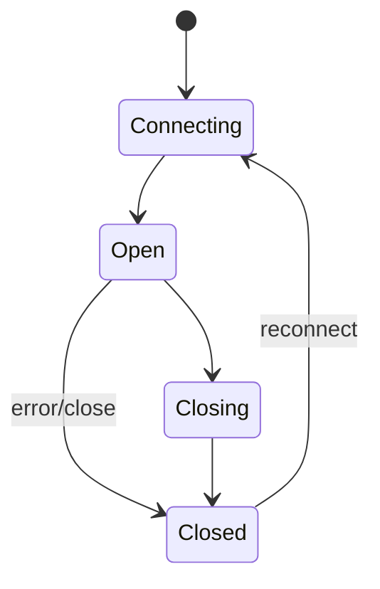
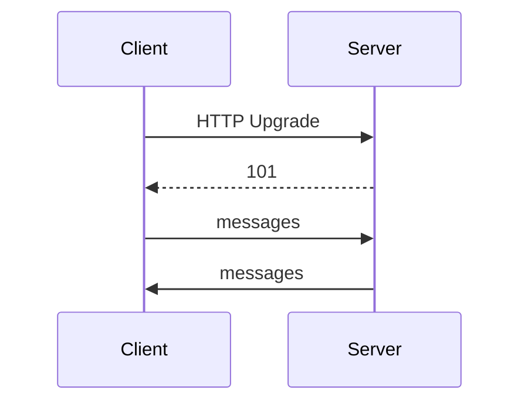

# WebSocket API

<TopicMeta />

<Prerequisites />

::: tip Published
This page meets the handbook **published** bar: deep explanation, ≥10 common mistakes, and official references. Further engine-level errata welcome via PR.
:::

## Introduction

**WebSocket** provides a persistent, full-duplex channel over a single TCP connection (upgraded from HTTP). The browser API is `new WebSocket(url)` with `send` and message events.

Ideal for chat, collaboration, and live feeds—not a replacement for all HTTP.

## Why does it exist?

HTTP request/response is awkward for high-frequency server push. Long polling wastes overhead; WS keeps a channel open.

## Historical Background

Standardized to replace comet hacks. HTTP/2/3 and SSE cover some push cases; WS remains king for bidirectional low-latency.

## Mental Model

Connecting → open → messages (text/binary) → close/error. Heartbeats and reconnect/backoff are app responsibilities. Auth often via first message or cookies on handshake.

## Internal Workflow

1. Connect to `wss://`.
2. Wait for `open`.
3. Define message schema; handle close codes.
4. Reconnect with exponential backoff + jitter.
5. Backpressure: don’t unbounded-queue sends.

## Lifecycle



## Browser Perspective

DevTools Network → WS frames.

## JavaScript Engine Perspective

Not applicable.

## React Perspective

One connection per app area; context/store owns lifecycle.

## Next.js Perspective

Connect from client components; server needs a WS-capable host.

## Server Perspective

Not applicable.

## Network Perspective

Proxies/load balancers must support Upgrade; idle timeouts need heartbeats.

## Memory Perspective

Not applicable.

## Performance

Great for many small messages; compress carefully; avoid mega JSON dumps.

## Production Example

Collaborative editor multiplexes presence and ops over one socket with heartbeat every 25s and resume tokens after reconnect.

## Code Examples

```ts
const ws = new WebSocket('wss://example.com/socket')
ws.addEventListener('open', () => ws.send(JSON.stringify({ type: 'hello' })))
ws.addEventListener('message', (e) => console.log(JSON.parse(String(e.data))))
ws.addEventListener('close', () => {
  /* schedule reconnect */
})
```

## Diagrams



## Common Mistakes

1. No reconnect strategy
2. ws:// on HTTPS pages (mixed content)
3. Unbounded message handlers updating React every frame
4. Assuming ordering across reconnects without sequence numbers
5. Auth tokens in query strings logged everywhere
6. Using WS for simple one-shot RPC without need
7. Overlooking an edge case #1 specific to 09-browser-apis.web-sockets-api in production traffic
8. Overlooking an edge case #2 specific to 09-browser-apis.web-sockets-api in production traffic
9. Overlooking an edge case #3 specific to 09-browser-apis.web-sockets-api in production traffic
10. Overlooking an edge case #4 specific to 09-browser-apis.web-sockets-api in production traffic


## Best Practices

- wss only in prod
- Backoff + heartbeat
- Typed message unions
- Server sticky/session awareness at LB

## Anti-patterns

- New WebSocket per React component mount without sharing

## Comparison

| Tech | Direction | Use |
| --- | --- | --- |
| WebSocket | Bidirectional | Chat/collab |
| SSE | Server→client | Streams |
| HTTP polling | Req/res | Simple rare updates |

## Interview Questions

### Easy

**Q:** What is a WebSocket?

**A:** A persistent full-duplex connection for bidirectional messaging after an HTTP upgrade.

### Medium

**Q:** Why use `wss`?

**A:** TLS encryption and to avoid mixed-content blocking on HTTPS sites.

### Hard

**Q:** How do you design reconnect without duplicating events?

**A:** Resume tokens / last sequence IDs, idempotent server events, and client-side dedupe.

## Summary

- Bidirectional persistent messaging
- You own heartbeat/reconnect
- Prefer wss; share connections thoughtfully

## References

- [MDN: WebSockets API](https://developer.mozilla.org/en-US/docs/Web/API/WebSockets_API)
- [RFC 6455](https://datatracker.ietf.org/doc/html/rfc6455)

<RelatedTopics />


Prev: [`09-browser-apis.geolocation`](/09-browser-apis/geolocation/) · Next: [`09-browser-apis.streams-api`](/09-browser-apis/streams-api/)
