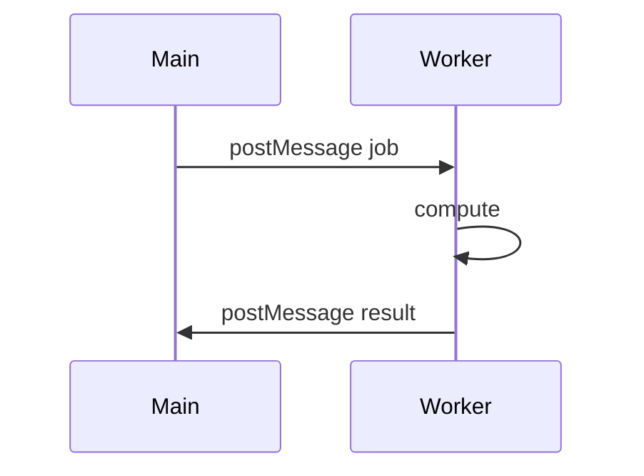

# Web Workers

<TopicMeta />

<Prerequisites />

::: tip Published
This page meets the handbook **published** bar: deep explanation, ≥10 common mistakes, and official references. Further engine-level errata welcome via PR.
:::

## Introduction

**Web Workers** run scripts in parallel threads with no DOM access. The main thread and worker communicate via `postMessage` (structured clone or transferables).

Use them for CPU-heavy work (parsing, crypto, image processing) that would otherwise jank UI.

## Why does it exist?

JavaScript on the main thread competes with input and rendering. Workers move compute off the critical path.

## Historical Background

Dedicated workers, shared workers, and service workers form the worker family. Module workers (`type: 'module'`) modernized imports.

## Mental Model

Separate global scope (no `window`). Message channels are the API. Transfer `ArrayBuffer`s to avoid copies. Errors don’t crash the page tab’s main thread.

## Internal Workflow

1. Spawn `new Worker(new URL('./x.ts', import.meta.url), { type: 'module' })`.
2. Define message protocol.
3. Transfer large buffers when possible.
4. `terminate` / handle `close`.

## Lifecycle



## Browser Perspective

True OS threads under the hood (implementation-dependent) with separate event loops.

## JavaScript Engine Perspective

Separate JS heaps; cloning costs matter.

## React Perspective

Keep React on main; send work out; setState from results.

## Next.js Perspective

Not applicable.

## Server Perspective

Not applicable.

## Network Perspective

Not applicable.

## Memory Perspective

Not applicable.

## Performance

Wins for CPU tasks; messaging overhead can dominate tiny jobs.

## Production Example

A CSV import parses multi‑MB files in a worker and streams row batches back for progressive table fill.

## Code Examples

```ts
// main
const worker = new Worker(new URL('./heavy.ts', import.meta.url), { type: 'module' })
worker.postMessage({ op: 'sum', values: [1, 2, 3] })
worker.onmessage = (e) => console.log(e.data)

// heavy.ts
self.onmessage = (e) => {
  const { values } = e.data
  self.postMessage(values.reduce((a: number, b: number) => a + b, 0))
}
```

## Diagrams


## Common Mistakes

1. Touching DOM from a worker
2. Posting huge objects without transfer
3. Spawning unbounded workers
4. Using workers for tiny sync work (overhead)
5. Forgetting to handle worker errors
6. Assuming SharedArrayBuffer is always available (COOP/COEP)
7. Overlooking an edge case #1 specific to 09-browser-apis.web-workers in production traffic
8. Overlooking an edge case #2 specific to 09-browser-apis.web-workers in production traffic
9. Overlooking an edge case #3 specific to 09-browser-apis.web-workers in production traffic
10. Overlooking an edge case #4 specific to 09-browser-apis.web-workers in production traffic


## Best Practices

- Module workers with bundler URL pattern
- Clear message types
- Transfer ArrayBuffers
- Pool workers for many jobs

## Anti-patterns

- One new worker per keystroke

## Comparison

| Worker kind | Scope |
| --- | --- |
| Dedicated | One owner |
| Shared | Multiple contexts |
| Service | Network proxy / offline |

## Interview Questions

### Easy

**Q:** Can Web Workers access the DOM?

**A:** No. They communicate with the main thread via messages.

### Medium

**Q:** What are transferables?

**A:** Objects like ArrayBuffer that can move ownership to avoid structured-clone copies.

### Hard

**Q:** When is a worker slower than main-thread work?

**A:** When tasks are tiny and messaging/clone costs exceed compute savings.

## Summary

- Background JS threads without DOM
- Message passing + transferables
- Use for real CPU-bound work

## References

- [MDN: Web Workers API](https://developer.mozilla.org/en-US/docs/Web/API/Web_Workers_API)

<RelatedTopics />


Prev: [`09-browser-apis.broadcast-channel`](/09-browser-apis/broadcast-channel/) · Next: [`09-browser-apis.service-workers`](/09-browser-apis/service-workers/)
