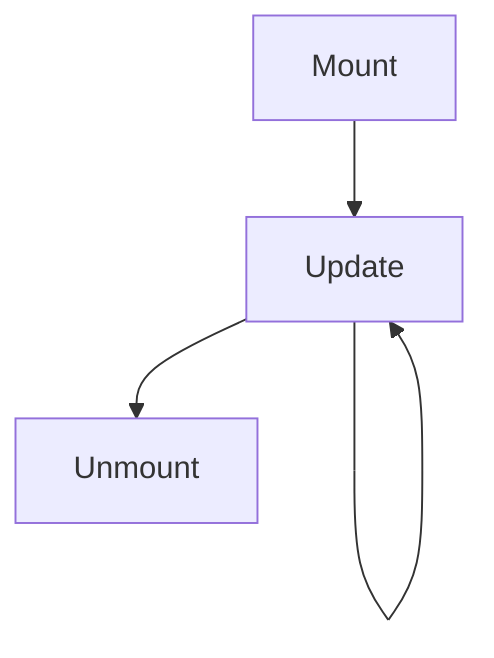
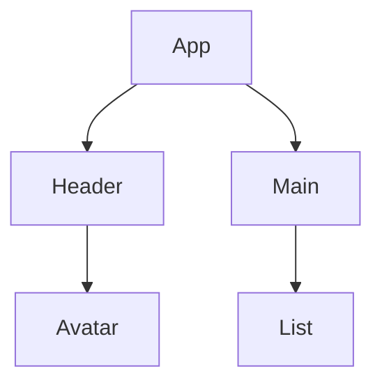

# Components

<TopicMeta />

<Prerequisites />

::: tip Published
This page meets the handbook **published** bar: deep explanation, ≥10 common mistakes, and official references. Further engine-level errata welcome via PR.
:::

## Introduction

A **component** is a reusable UI unit—today usually a function that accepts props and returns React elements. Components encapsulate structure, styling hooks, and state.

## Why does it exist?

UIs compose. Components are the composition boundary for reuse, testing, and data flow.

## Historical Background

Classes → functions + hooks. Server Components add a server/client split without abandoning composition.

## Mental Model

Components are like functions: inputs (props) in, elements out. Identity of the function (`type`) matters for reconciliation.

## Internal Workflow

1. Split UI by responsibility.
2. Pass data down via props.
3. Lift state to the nearest common owner.
4. Extract when JSX/logic hurts readability.

## Lifecycle



## Browser Perspective

Not applicable.

## JavaScript Engine Perspective

Not applicable.

## React Perspective

Function components + hooks are the default.

## Next.js Perspective

Mark client components with `"use client"` when needed.

## Server Perspective

Not applicable.

## Network Perspective

Not applicable.

## Memory Perspective

Not applicable.

## Performance

Too many tiny components is fine; unnecessary remounts (unstable types) are not.

## Production Example

Design system exports `Button`, `TextField`, `Dialog` as components with typed props and composition slots.

## Code Examples

```tsx
function Avatar({ name, src }: { name: string; src: string }) {
  return 
}
```

## Diagrams



## Common Mistakes

1. Defining components inside components (remounts)
2. God components with dozens of responsibilities
3. Mutating props
4. Using indexes as keys in component lists
5. Class components for new code without reason
6. Premature abstraction of one-off JSX
7. Missing a production edge case for 10-react.components (#1)
8. Missing a production edge case for 10-react.components (#2)
9. Missing a production edge case for 10-react.components (#3)
10. Missing a production edge case for 10-react.components (#4)


## Best Practices

- Stable component types at module scope
- Small focused components
- Typed props
- Composition over boolean prop explosion

## Anti-patterns

- `<Button isTableButton isModalFooter isDangerous />` prop soup

## Comparison

| Kind | Notes |
| --- | --- |
| Function | Default |
| Class | Legacy |
| Server Component | No hooks/DOM; data-capable |

## Interview Questions

### Easy

**Q:** What is a React component?

**A:** A function (or class) that returns a description of UI (elements) given props/state.

### Medium

**Q:** Why shouldn’t you define a component inside another during render?

**A:** Its identity changes every render, causing React to remount and reset state.

### Hard

**Q:** How do Server Components change the component model?

**A:** Some components render on the server and never ship to the client; client components remain the interactive islands.

## Summary

- Components compose UI
- Stable function identity matters
- Prefer focused function components

## References

- [React Documentation](https://react.dev/)
- [Your First Component](https://react.dev/learn/your-first-component)

<RelatedTopics />


Prev: [`10-react.philosophy`](/10-react/philosophy/) · Next: [`10-react.props`](/10-react/props/)
