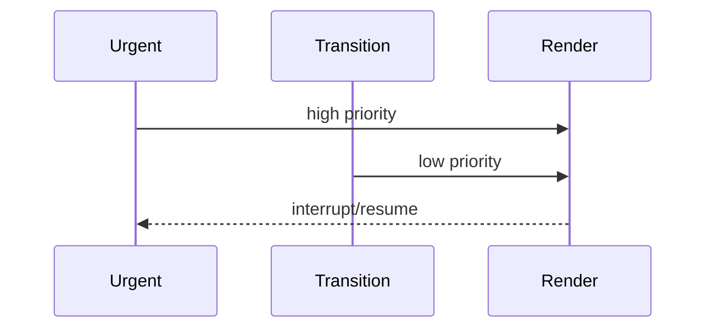
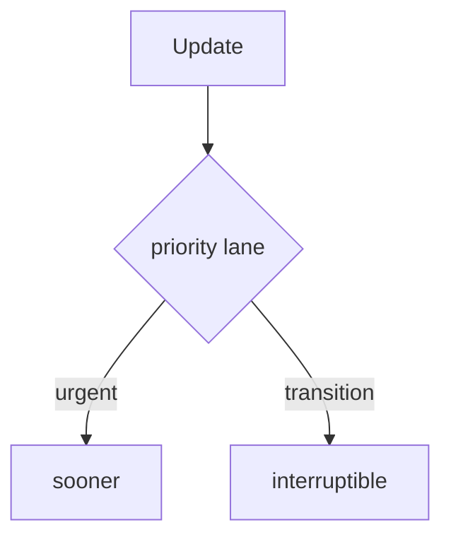

# Concurrent Rendering

<TopicMeta />

<Prerequisites />

::: tip Published
This page meets the handbook **published** bar: deep explanation, ≥10 common mistakes, and official references. Further engine-level errata welcome via PR.
:::

## Introduction

**Concurrent rendering** lets React prepare updates in the background, interrupt them for more urgent work, and discard abandoned work—enabled by Fiber. APIs like `startTransition` and Suspense opt into concurrent behaviors.

## Why does it exist?

Large updates used to block input. Concurrent features keep typing/clicks snappy while heavy UI catches up.

## Historical Background

Fiber (16) → concurrent opt-in (18) → broader default behaviors and transitions.

## Mental Model

Updates have **lanes** (priorities). Urgent updates (typing) preempt non-urgent transitions. Render can restart; commit remains consistent.

## Internal Workflow

1. Mark heavy UI updates as transitions.
2. Keep urgent state separate (input value).
3. Provide Suspense fallbacks for deferred content.
4. Avoid render side effects.

## Lifecycle



## Browser Perspective

Yielding lets the browser handle input/paint.

## JavaScript Engine Perspective

More render attempts possible—purity required.

## React Perspective

Scheduling model on Fiber.

## Next.js Perspective

Not applicable.

## Server Perspective

Not applicable.

## Network Perspective

Not applicable.

## Memory Perspective

Not applicable.

## Performance

Responsiveness ≠ less total work; it is better scheduling.

## Production Example

Search boxes update the text urgently and filter a huge list inside `startTransition`.

## Code Examples

```tsx
const [text, setText] = useState('')
const [query, setQuery] = useState('')
const [isPending, startTransition] = useTransition()
onChange={(e) => {
  const v = e.target.value
  setText(v)
  startTransition(() => setQuery(v))
}}
```

## Diagrams



## Common Mistakes

1. Side effects during render under concurrency
2. Putting urgent and non-urgent state in one update
3. Expecting transitions to reduce CPU cost magically
4. Misusing Suspense without boundaries
5. Reading unfinished UI without `isPending` cues
6. Blocking main thread inside commit/layout effects
7. Missing a production edge case for 10-react.concurrent-rendering (#1)
8. Missing a production edge case for 10-react.concurrent-rendering (#2)
9. Missing a production edge case for 10-react.concurrent-rendering (#3)
10. Missing a production edge case for 10-react.concurrent-rendering (#4)


## Best Practices

- Separate urgent vs transition state
- Pure render
- Pending UX affordances
- Profile interactions

## Anti-patterns

- startTransition around everything including typing into controlled inputs incorrectly

## Comparison

| Update kind | Example |
| --- | --- |
| Urgent | Keystrokes |
| Transition | Filtering large lists |

## Interview Questions

### Easy

**Q:** What problem does concurrent rendering solve?

**A:** It keeps the UI responsive by allowing React to interrupt and prioritize updates.

### Medium

**Q:** What is a transition?

**A:** A non-urgent state update that React may interrupt if more urgent work arrives.

### Hard

**Q:** Why must render be pure for concurrency?

**A:** React may invoke render multiple times / restart WIP trees; impure render causes duplicated or lost side effects.

## Summary

- Interruptible render via Fiber lanes
- Transitions mark non-urgent work
- Purity is mandatory

## References

- [React Documentation](https://react.dev/)
- [startTransition](https://react.dev/reference/react/startTransition)
- [Render and Commit](https://react.dev/learn/render-and-commit)

<RelatedTopics />


Prev: [`10-react.portals`](/10-react/portals/) · Next: [`10-react.transitions`](/10-react/transitions/)
