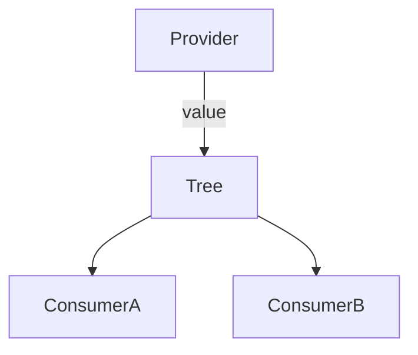
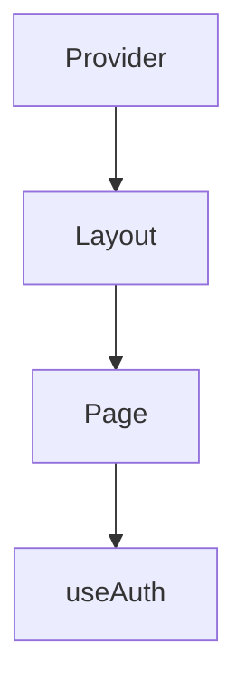

# Context

<TopicMeta />

<Prerequisites />

::: tip Published
This page meets the handbook **published** bar: deep explanation, ≥10 common mistakes, and official references. Further engine-level errata welcome via PR.
:::

## Introduction

**Context** passes a value from a Provider to any consumer below without threading props. Useful for theme, auth, i18n, and dependency injection—not as a full app store by default.

## Why does it exist?

Prop drilling through many pure layout layers is noisy. Context skips those layers.

## Historical Background

Legacy context → new context API (16.3) → `useContext`. Concurrent features require bailouts/selectors patterns carefully.

## Mental Model

A context value change re-renders all consumers that read it (unless you split contexts / use other libraries). Providers should keep value identities stable when content doesn’t change.

## Internal Workflow

1. Create context with meaningful default/null.
2. Provide near the real owner.
3. Consume via `useContext` wrapped in a safe hook.
4. Split contexts if values change at different rates.

## Lifecycle



## Browser Perspective

Not applicable.

## JavaScript Engine Perspective

Not applicable.

## React Perspective

Built-in dependency injection for the tree.

## Next.js Perspective

Client context providers need `"use client"`; don’t expect server components to read client context.

## Server Perspective

Not applicable.

## Network Perspective

Not applicable.

## Memory Perspective

Not applicable.

## Performance

Huge values changing often re-render large consumer sets—split or colocate.

## Production Example

`AuthProvider` exposes `user` + `login`/`logout`; theme is a separate context so theme toggles don’t re-render auth-heavy trees unnecessarily.

## Code Examples

```tsx
const AuthCtx = createContext<User | null>(null)
export function useAuth() {
  const v = useContext(AuthCtx)
  if (!v) throw new Error('AuthProvider missing')
  return v
}
```

## Diagrams



## Common Mistakes

1. Using context as Redux for all state
2. New object value inline every render without need
3. Missing provider → silent defaults
4. One mega context for unrelated data
5. Putting unstable callbacks without care into value
6. Consuming context in overly broad components
7. Missing a production edge case for 10-react.context (#1)
8. Missing a production edge case for 10-react.context (#2)
9. Missing a production edge case for 10-react.context (#3)
10. Missing a production edge case for 10-react.context (#4)


## Best Practices

- Null context + throwing hook
- Split high-churn values
- Memoize provider value when appropriate
- Prefer props for local parent/child

## Anti-patterns

- Context for every prop to “future-proof”

## Comparison

| Tool | Best for |
| --- | --- |
| Props | Local explicit data |
| Context | Cross-cutting stable-ish values |
| Store libs | Complex shared client state |

## Interview Questions

### Easy

**Q:** What problem does Context solve?

**A:** Passing data through the tree without prop drilling every level.

### Medium

**Q:** Why can Context hurt performance?

**A:** All consumers re-render when the provider value changes identity/content.

### Hard

**Q:** How do you optimize a high-frequency context?

**A:** Split contexts, narrow consumers, memoize values, or use external stores with `useSyncExternalStore`/selectors.

## Summary

- Tree-wide dependency injection
- Watch value identity and consumer breadth
- Not a default global store

## References

- [React Documentation](https://react.dev/)
- [Passing Data Deeply with Context](https://react.dev/learn/passing-data-deeply-with-context)

<RelatedTopics />


Prev: [`10-react.rules-of-hooks`](/10-react/rules-of-hooks/) · Next: [`10-react.reducer`](/10-react/reducer/)
