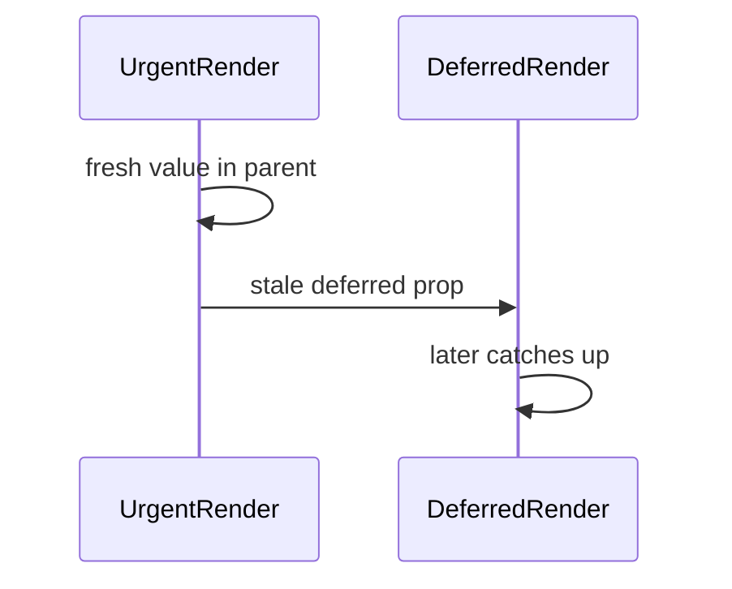
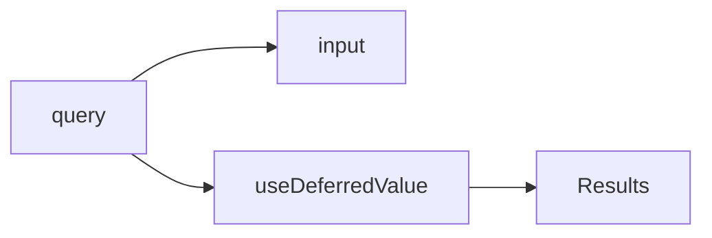

# useDeferredValue

<TopicMeta />

<Prerequisites />

::: tip Published
This page meets the handbook **published** bar: deep explanation, ≥10 common mistakes, and official references. Further engine-level errata welcome via PR.
:::

## Introduction

**`useDeferredValue(value)`** returns a deferred version of `value` that may lag behind during urgent updates. Useful when you cannot split state but can let a heavy child receive a delayed prop.

## Why does it exist?

Sometimes you only have one value (from props) yet still need concurrent deferral for expensive consumers.

## Historical Background

React 18 concurrent companion to transitions.

## Mental Model

During urgent renders, deferred value may still be the previous one; later React re-renders with the fresh value at lower priority.

## Internal Workflow

1. Identify expensive consumers of a fast-changing value.
2. Pass `useDeferredValue(value)` to them.
3. Optionally detect lag (`value !== deferred`) for pending UI.

## Lifecycle



## Browser Perspective

Not applicable.

## JavaScript Engine Perspective

Not applicable.

## React Perspective

Value-level deferral vs transition’s update-level deferral.

## Next.js Perspective

Not applicable.

## Server Perspective

Not applicable.

## Network Perspective

Not applicable.

## Memory Perspective

Not applicable.

## Performance

Same caveats as transitions—scheduling, not magic speedups.

## Production Example

Typeahead keeps the input controlled by `query` but the results list receives `deferredQuery`.

## Code Examples

```tsx
const deferredQuery = useDeferredValue(query)
return (
  <>
    <input value={query} onChange={...} />
    <Results query={deferredQuery} />
  </>
)
```

## Diagrams



## Common Mistakes

1. Deferring the input value itself
2. Expecting fewer renders overall always
3. Using instead of memo/virtualization for huge lists alone
4. No pending indicator when lagging
5. Deferring everything
6. Confusing with debounce timers (different mechanism)
7. Missing a production edge case for 10-react.deferred-value (#1)
8. Missing a production edge case for 10-react.deferred-value (#2)
9. Missing a production edge case for 10-react.deferred-value (#3)
10. Missing a production edge case for 10-react.deferred-value (#4)


## Best Practices

- Defer props into heavy children
- Show isStale UI when value !== deferred
- Combine with memoized/virtualized lists

## Anti-patterns

- DIY setTimeout debounce reimplemented as “deferred” incorrectly

## Comparison

| | useDeferredValue | startTransition |
| --- | --- | --- |
| Defers | A value | A state update |
| Typical | Props from parent | setState you control |

## Interview Questions

### Easy

**Q:** What does useDeferredValue return?

**A:** A version of the value that may lag behind during urgent updates.

### Medium

**Q:** How is it different from debouncing?

**A:** Debouncing is time-based filtering of events; deferred values are React scheduling of renders/priorities.

### Hard

**Q:** When prefer useDeferredValue over splitting state + transition?

**A:** When you do not own the urgent/non-urgent split as separate states—e.g. a single prop from above feeding a heavy child.

## Summary

- Defer expensive consumers of fast values
- Scheduling tool, not debounce
- Signal pending when stale

## References

- [React Documentation](https://react.dev/)
- [useDeferredValue](https://react.dev/reference/react/useDeferredValue)

<RelatedTopics />


Prev: [`10-react.transitions`](/10-react/transitions/) · Next: [`10-react.strict-mode`](/10-react/strict-mode/)
