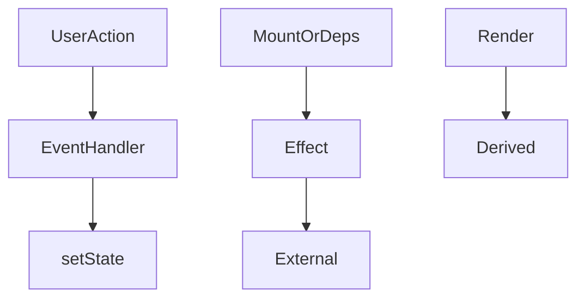
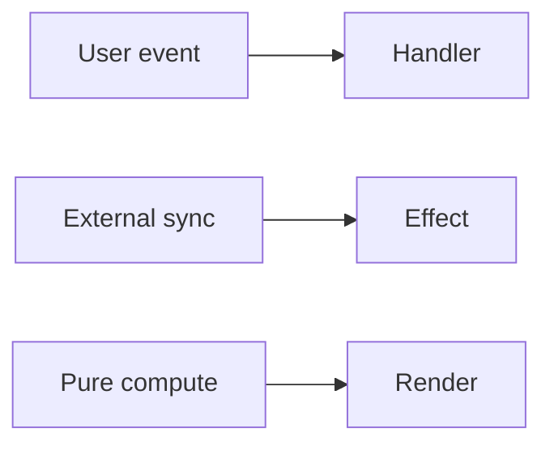

# Effects vs Events

<TopicMeta />

<Prerequisites />

::: tip Published
This page meets the handbook **published** bar: deep explanation, ≥10 common mistakes, and official references. Further engine-level errata welcome via PR.
:::

## Introduction

**Events** respond to something that happened (click, submit) and may update state or talk to external systems immediately. **Effects** synchronize React state with external systems when the component is displayed / deps change.

Most bugs labeled “effect hell” are events modeled as effects.

## Why does it exist?

Wrong placement causes double-firing, race conditions, and unreadable data flows—especially under Strict Mode.

## Historical Background

React docs sharpened this distinction as hooks matured (“You Might Not Need an Effect”).

## Mental Model

If a user did it → event. If the component needs to stay in sync while mounted → effect. If you can compute it → render.

## Internal Workflow

1. Write the happy path as events + state.
2. Derive values in render.
3. Add effects only for subscriptions/widgets/ Imperative APIs.
4. Delete prop-sync effects.

## Lifecycle



## Browser Perspective

Not applicable.

## JavaScript Engine Perspective

Not applicable.

## React Perspective

Core design rule for maintainable hooks code.

## Next.js Perspective

Server actions/events on client still follow the same split.

## Server Perspective

Not applicable.

## Network Perspective

Not applicable.

## Memory Perspective

Not applicable.

## Performance

Fewer effects → fewer waterfalls and loops.

## Production Example

Analytics “product viewed” fires in an effect keyed by product id; “Add to cart clicked” fires in the click handler—not in an effect watching cart length.

## Code Examples

```tsx
// Event — user intent
function BuyButton({ id }: { id: string }) {
  return (
    <button
      onClick={() => {
        track('buy_click', { id })
        addToCart(id)
      }}
    >
      Buy
    </button>
  )
}

// Effect — sync while viewing
useEffect(() => {
  const sub = store.subscribe(id, setData)
  return () => sub.unsubscribe()
}, [id])
```

## Diagrams



## Common Mistakes

1. useEffect on button click via flag state
2. Fetching from props with effect chains instead of routers/loaders
3. Transforming data in effects
4. Resetting state in effects instead of keys
5. Notifying parent in effects causing loops
6. Strict Mode double-fire surprises from event-as-effect
7. Missing a production edge case for 10-react.effects-vs-events (#1)
8. Missing a production edge case for 10-react.effects-vs-events (#2)
9. Missing a production edge case for 10-react.effects-vs-events (#3)
10. Missing a production edge case for 10-react.effects-vs-events (#4)


## Best Practices

- Events for intent
- Effects for sync
- Render for derivation
- Keys to reset state

## Anti-patterns

- `const [clicked, setClicked] = useState(false)` + effect on clicked

## Comparison

| Kind | Trigger | Examples |
| --- | --- | --- |
| Event | User/system action | click, submit |
| Effect | Mount/deps | subscriptions, widgets |
| Render | Each render | derived values |

## Interview Questions

### Easy

**Q:** Should a button click be handled in useEffect?

**A:** No. Handle it in the click event handler.

### Medium

**Q:** Give an example of a justified effect.

**A:** Subscribing to a WebSocket or connecting a non-React map widget when the component mounts, with cleanup on unmount.

### Hard

**Q:** How do you reset state when a `userId` prop changes without an effect?

**A:** Set `key={userId}` on the component so React remounts a fresh state tree.

## Summary

- Events = intent; effects = external sync; render = derive
- Most effect bugs are misplaced events
- Prefer keys and derivation over sync effects

## References

- [React Documentation](https://react.dev/)
- [You Might Not Need an Effect](https://react.dev/learn/you-might-not-need-an-effect)
- [Responding to Events](https://react.dev/learn/responding-to-events)

<RelatedTopics />


Prev: [`10-react.server-components-overview`](/10-react/server-components-overview/)
