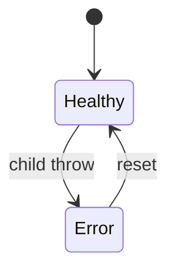
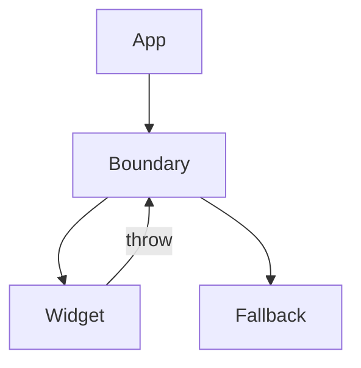

# Error Boundaries

<TopicMeta />

<Prerequisites />

::: tip Published
This page meets the handbook **published** bar: deep explanation, ≥10 common mistakes, and official references. Further engine-level errata welcome via PR.
:::

## Introduction

**Error boundaries** are components that catch render/lifecycle/effect errors in their child tree and render a fallback. Today they are still class-based (`getDerivedStateFromError` / `componentDidCatch`) or framework helpers.

They do not catch event handler errors, async errors outside render, or errors in the boundary itself.

## Why does it exist?

Unhandled render errors unmount large trees. Boundaries isolate failure and preserve the rest of the app.

## Historical Background

Introduced in React 16. Concurrent/SSR stories integrate with specialized boundaries in frameworks.

## Mental Model

Think try/catch for the declarative tree. Place boundaries around risky subtrees (widgets, panes), not necessarily the entire app only.

## Internal Workflow

1. Implement a boundary with fallback UI.
2. Log via `componentDidCatch` / reporting.
3. Wrap fragile features.
4. Handle events/async with local try/catch too.

## Lifecycle



## Browser Perspective

Not applicable.

## JavaScript Engine Perspective

Not applicable.

## React Perspective

Tree isolation for render errors.

## Next.js Perspective

error.js / global-error conventions map to boundaries.

## Server Perspective

Not applicable.

## Network Perspective

Not applicable.

## Memory Perspective

Not applicable.

## Performance

N/A—reliability feature.

## Production Example

Each dashboard widget is wrapped so one chart’s bad data doesn’t blank the whole console.

## Code Examples

```tsx
class Boundary extends React.Component<
  { fallback: React.ReactNode; children: React.ReactNode },
  { error: Error | null }
> {
  state = { error: null as Error | null }
  static getDerivedStateFromError(error: Error) {
    return { error }
  }
  render() {
    if (this.state.error) return this.props.fallback
    return this.props.children
  }
}
```

## Diagrams



## Common Mistakes

1. Expecting boundaries to catch event handler errors
2. One giant boundary only—poor UX granularity
3. Not logging errors
4. Swallowing errors without recovery UI
5. Throwing inside the boundary’s render of fallback carelessly
6. Assuming async fetch errors auto-catch without rethrow patterns
7. Missing a production edge case for 10-react.error-boundaries (#1)
8. Missing a production edge case for 10-react.error-boundaries (#2)
9. Missing a production edge case for 10-react.error-boundaries (#3)
10. Missing a production edge case for 10-react.error-boundaries (#4)


## Best Practices

- Granular boundaries
- Report to observability
- Reset keys / retry buttons
- Pair with Suspense for loading vs error

## Anti-patterns

- empty catch in componentDidCatch

## Comparison

| Error kind | Caught by boundary? |
| --- | --- |
| Render throw | Yes |
| Event handler | No |
| setTimeout | No |

## Interview Questions

### Easy

**Q:** What do error boundaries catch?

**A:** Errors during rendering and in lifecycles/constructors of children below them (not everything).

### Medium

**Q:** Name something error boundaries do not catch.

**A:** Errors in event handlers, asynchronous code outside React’s render, and SSR in some cases without framework support.

### Hard

**Q:** How do you reset an error boundary after a recoverable failure?

**A:** Change a `key` on the boundary/child, or provide a reset callback that clears error state after fixing inputs.

## Summary

- Isolate render failures
- Still mostly class API
- Not a substitute for try/catch in events

## References

- [React Documentation](https://react.dev/)
- [Error Boundaries](https://react.dev/reference/react/Component#catching-rendering-errors-with-an-error-boundary)

<RelatedTopics />


Prev: [`10-react.lazy-loading`](/10-react/lazy-loading/) · Next: [`10-react.portals`](/10-react/portals/)
