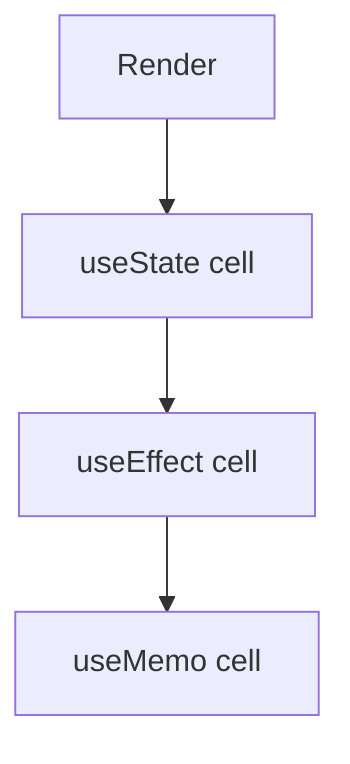
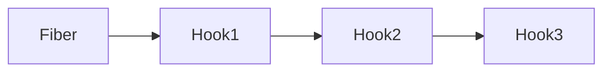

# Hooks

<TopicMeta />

<Prerequisites />

::: tip Published
This page meets the handbook **published** bar: deep explanation, ≥10 common mistakes, and official references. Further engine-level errata welcome via PR.
:::

## Introduction

**Hooks** let function components tap into React features—state, context, refs, effects—without classes. They must be called in the same order every render (Rules of Hooks).

Internally, each hook call corresponds to a cell in a linked list on the fiber.

## Why does it exist?

Classes mixed lifecycle concerns awkwardly and discouraged reuse. Hooks recompose behavior by calls, not inheritance.

## Historical Background

Introduced in React 16.8 (2019). Ecosystem rebuilt around them. React 19 adds `use` and further refinements.

## Mental Model

Hooks are **ordered slots**. First render mounts the list; later renders walk the same list. Conditional hook calls desynchronize slots—hence the rules.

## Internal Workflow

1. Call hooks at top level only.
2. Prefer built-ins before custom hooks.
3. Encapsulate reusable stateful logic in custom hooks.
4. Keep effect dependencies honest.

## Lifecycle



## Browser Perspective

Not applicable.

## JavaScript Engine Perspective

Hook cells are ordinary JS objects on the fiber.

## React Perspective

Primary programming model for client components.

## Next.js Perspective

Hooks only in Client Components.

## Server Perspective

Not applicable.

## Network Perspective

Not applicable.

## Memory Perspective

Not applicable.

## Performance

Hooks themselves are cheap; wasted work inside them is not.

## Production Example

`useCheckout()` custom hook centralizes cart mutation + analytics so pages stay thin.

## Code Examples

```tsx
function useToggle(init = false) {
  const [on, setOn] = useState(init)
  const toggle = () => setOn((v) => !v)
  return [on, toggle] as const
}
```

## Diagrams



## Common Mistakes

1. Hooks in conditions/loops
2. Hooks in class components
3. Custom hooks that hide necessary deps
4. Copy-pasting effects instead of extracting hooks
5. Calling hooks from event handlers
6. Assuming hook call order can be dynamic
7. Calling hooks conditionally or in loops
8. Putting derived state into useState + syncing with effects
9. Over-using Context causing broad rerenders
10. Ignoring Rules of Hooks eslint plugin in a shared codebase


## Best Practices

- Top-level hooks only
- ESLint `rules-of-hooks` + `exhaustive-deps`
- Name custom hooks `useX`
- Return stable APIs from custom hooks

## Anti-patterns

- Mega `useApp()` that pulls all contexts

## Comparison

| Before | After |
| --- | --- |
| lifecycle methods | useEffect family |
| this.state | useState/useReducer |
| HOCs/render props | custom hooks |

## Interview Questions

### Easy

**Q:** What are hooks?

**A:** Functions like `useState` that let function components use React state and features.

### Medium

**Q:** Why must hooks be called in the same order?

**A:** React associates hook state by call order in a linked list; conditionals break the mapping.

### Hard

**Q:** How does React store hook state?

**A:** Each fiber has a linked list of hook objects; on update, a dispatcher walks/creates nodes matching the call sequence.

## Summary

- Hooks are ordered fiber state cells
- Top-level only; custom hooks share logic
- Client Components in RSC apps

## References

- [React Documentation](https://react.dev/)
- [Hooks at a Glance](https://react.dev/reference/react)

<RelatedTopics />


Prev: [`10-react.state`](/10-react/state/) · Next: [`10-react.rules-of-hooks`](/10-react/rules-of-hooks/)
