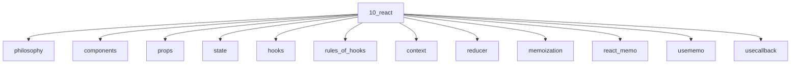

# React

## Scope

React as a UI runtime: components, hooks, concurrent features, and compiler

## Prerequisites

See the learning paths and each topic's prerequisites in the registry.

## Topics in order

- [React Philosophy](/10-react/philosophy/) — junior, ~25 min
- [Components](/10-react/components/) — beginner, ~30 min
- [Props](/10-react/props/) — beginner, ~25 min
- [State](/10-react/state/) — junior, ~35 min
- [Hooks](/10-react/hooks/) — junior, ~35 min
- [Rules of Hooks](/10-react/rules-of-hooks/) — junior, ~25 min
- [Context](/10-react/context/) — junior, ~35 min
- [Reducer](/10-react/reducer/) — junior, ~30 min
- [Memoization in React](/10-react/memoization/) — mid, ~30 min
- [React.memo](/10-react/react-memo/) — mid, ~25 min
- [useMemo](/10-react/usememo/) — mid, ~25 min
- [useCallback](/10-react/usecallback/) — mid, ~25 min
- [useRef](/10-react/useref/) — junior, ~25 min
- [useEffect](/10-react/useeffect/) — junior, ~45 min
- [useLayoutEffect](/10-react/uselayouteffect/) — mid, ~30 min
- [useImperativeHandle](/10-react/useimperativehandle/) — mid, ~20 min
- [useId](/10-react/useid/) — junior, ~15 min
- [use](/10-react/use/) — mid, ~30 min
- [Suspense](/10-react/suspense/) — mid, ~40 min
- [Lazy Loading](/10-react/lazy-loading/) — junior, ~25 min
- [Error Boundaries](/10-react/error-boundaries/) — mid, ~30 min
- [Portals](/10-react/portals/) — junior, ~20 min
- [Concurrent Rendering](/10-react/concurrent-rendering/) — senior, ~45 min
- [Transitions](/10-react/transitions/) — mid, ~30 min
- [useDeferredValue](/10-react/deferred-value/) — mid, ~25 min
- [Strict Mode](/10-react/strict-mode/) — junior, ~25 min
- [React Compiler](/10-react/react-compiler/) — senior, ~40 min
- [Server Components Overview](/10-react/server-components-overview/) — mid, ~30 min
- [Effects vs Events](/10-react/effects-vs-events/) — mid, ~30 min

## Module knowledge graph

## Suggested learning paths

Browse [Learning Paths](/learning-paths/).
