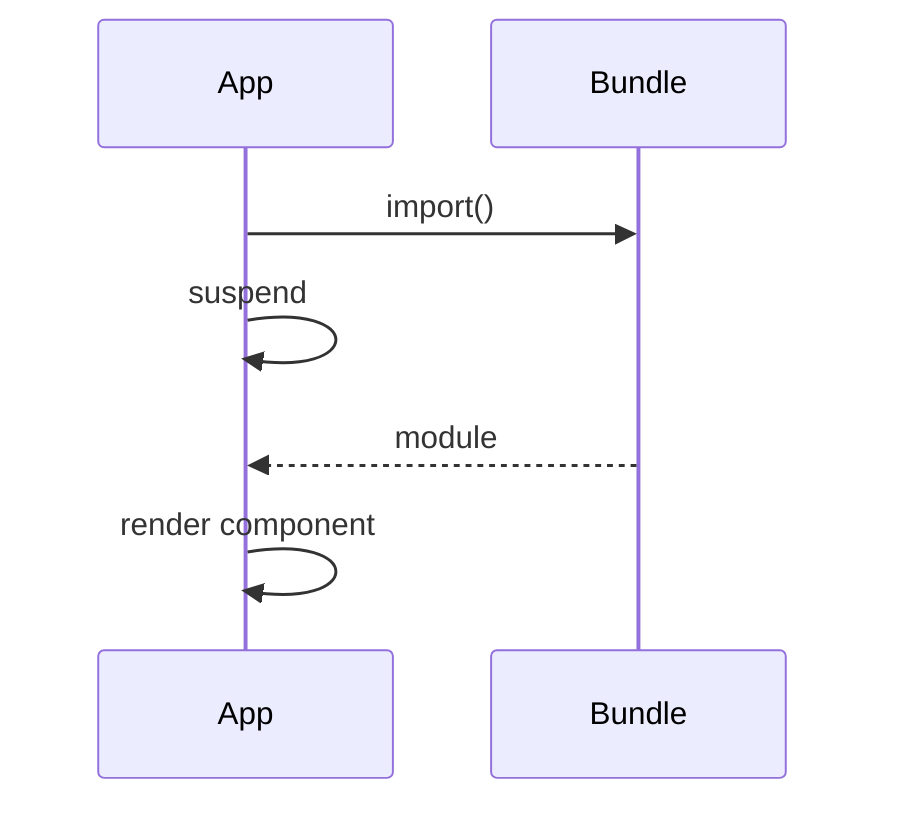

# Lazy Loading

<TopicMeta />

<Prerequisites />

::: tip Published
This page meets the handbook **published** bar: deep explanation, ≥10 common mistakes, and official references. Further engine-level errata welcome via PR.
:::

## Introduction

**Lazy loading** splits bundles so code loads on demand. `React.lazy(() => import('./X'))` returns a component that suspends until the module loads—wrap with Suspense.

## Why does it exist?

Smaller initial JS improves TTI. Route-level and heavy-widget splitting are classic wins.

## Historical Background

`React.lazy` + Suspense for client; RSC/Next have their own code-splitting stories too.

## Mental Model

Dynamic `import()` returns a promise of a module with `default` export. Lazy component suspends on first render until resolved; then behaves normally.

## Internal Workflow

1. Identify heavy/rarely used screens.
2. `lazy` import them.
3. Wrap routes/widgets in Suspense.
4. Prefetch on intent (hover) when helpful.

## Lifecycle



## Browser Perspective

Network waterfall for chunks—name chunks well.

## JavaScript Engine Perspective

Not applicable.

## React Perspective

Not applicable.

## Next.js Perspective

File-based routing splits automatically; still lazy client islands.

## Server Perspective

Not applicable.

## Network Perspective

Not applicable.

## Memory Perspective

Not applicable.

## Performance

Don’t over-split tiny files (extra RTTs). Measure with coverage.

## Production Example

Admin charts route is lazy-loaded; hovering the nav link prefetches the chunk.

## Code Examples

```tsx
const Editor = lazy(() => import('./Editor'))
function Page() {
  return (
    <Suspense fallback={<p>Loading editor…</p>}>
      <Editor />
    </Suspense>
  )
}
```

## Diagrams


## Common Mistakes

1. Forgetting Suspense
2. Named exports without adapting import
3. Lazy loading everything including critical path
4. No error handling for failed chunks
5. Layout shift from empty fallbacks
6. Importing lazy modules statically too (defeating split)
7. Missing a production edge case for 10-react.lazy-loading (#1)
8. Missing a production edge case for 10-react.lazy-loading (#2)
9. Missing a production edge case for 10-react.lazy-loading (#3)
10. Missing a production edge case for 10-react.lazy-loading (#4)


## Best Practices

- Split routes and heavy widgets
- Good fallbacks
- Prefetch on intent
- Monitor chunk failures

## Anti-patterns

- Hundreds of 1KB chunks

## Comparison

| Technique | Layer |
| --- | --- |
| React.lazy | Component |
| Next dynamic | Framework |
| Import on interaction | Manual |

## Interview Questions

### Easy

**Q:** What does React.lazy need around it?

**A:** A Suspense boundary to show fallback while the import resolves.

### Medium

**Q:** Why must the import resolve to a default export?

**A:** `React.lazy` expects the module’s `default` to be the component (or map named exports manually).

### Hard

**Q:** How do you recover when a chunk fails to load after deploy?

**A:** Error boundary with reload/retry—old HTML may request hashed chunks that no longer exist.

## Summary

- Code-split with lazy + Suspense
- Split the heavy/rare paths
- Handle failed chunks in production

## References

- [React Documentation](https://react.dev/)
- [lazy](https://react.dev/reference/react/lazy)

<RelatedTopics />


Prev: [`10-react.suspense`](/10-react/suspense/) · Next: [`10-react.error-boundaries`](/10-react/error-boundaries/)
