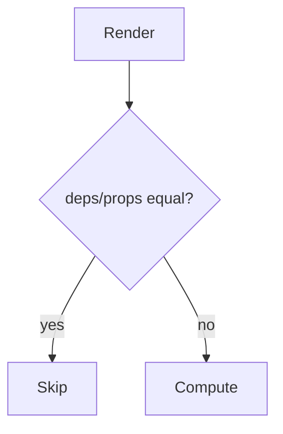

# Memoization in React

<TopicMeta />

<Prerequisites />

::: tip Published
This page meets the handbook **published** bar: deep explanation, ≥10 common mistakes, and official references. Further engine-level errata welcome via PR.
:::

## Introduction

**Memoization** caches previous results so React can skip re-rendering or recomputing when inputs are unchanged (`Object.is`). Tools: `React.memo`, `useMemo`, `useCallback`, and now the React Compiler.

## Why does it exist?

Re-renders are normal; sometimes child trees are expensive. Memoization is a scalpel, not a default seasoning.

## Historical Background

Class `PureComponent` / `shouldComponentUpdate` → memo hooks → compiler auto-memo research landed as React Compiler.

## Mental Model

Equality of props/deps decides bailout. Unstable identities (`{}`/`() => {}` each render) defeat memo. Prefer reducing state scope first.

## Internal Workflow

1. Profile with React Profiler.
2. Colocate state / split components.
3. Memoize expensive pure calcs or heavy children intentionally.
4. Prefer compiler when enabled.

## Lifecycle



## Browser Perspective

Not applicable.

## JavaScript Engine Perspective

Memo trades memory for CPU.

## React Perspective

Correctness first; memo for measured costs.

## Next.js Perspective

Not applicable.

## Server Perspective

Not applicable.

## Network Perspective

Not applicable.

## Memory Perspective

Not applicable.

## Performance

Wrong memo adds overhead. Measure.

## Production Example

A data grid cells component is `memo`’d after Profiler shows list rerenders on unrelated parent state; cell props are primitives.

## Code Examples

```tsx
const Row = memo(function Row({ id, label }: { id: string; label: string }) {
  return <div>{label}</div>
})
```

## Diagrams


## Common Mistakes

1. memo everywhere
2. Unstable props into memo components
3. useMemo for trivial math
4. useCallback wrapped around every function
5. Memoizing without profiling
6. Expecting memo to deep-compare objects
7. Missing a production edge case for 10-react.memoization (#1)
8. Missing a production edge case for 10-react.memoization (#2)
9. Missing a production edge case for 10-react.memoization (#3)
10. Missing a production edge case for 10-react.memoization (#4)


## Best Practices

- Profile first
- Stabilize props or pass primitives
- Memo expensive pure computations
- Consider React Compiler

## Anti-patterns

- Cargo-cult dependency arrays as performance strategy

## Comparison

| API | Skips |
| --- | --- |
| React.memo | Child render |
| useMemo | Recompute |
| useCallback | Function identity |

## Interview Questions

### Easy

**Q:** Does React.memo deep compare props?

**A:** No. Shallow compare by default (`Object.is` per prop).

### Medium

**Q:** Why might memo not help?

**A:** If props change every render due to new object/function identities, the child still re-renders.

### Hard

**Q:** What should you try before memoization?

**A:** Move state down, split components, avoid derived-state effects, and fix unnecessary context updates.

## Summary

- Memo is opt-in skipping of work
- Identity equality matters
- Measure; prefer architecture fixes

## References

- [React Documentation](https://react.dev/)
- [React.memo](https://react.dev/reference/react/memo)

<RelatedTopics />


Prev: [`10-react.reducer`](/10-react/reducer/) · Next: [`10-react.react-memo`](/10-react/react-memo/)
