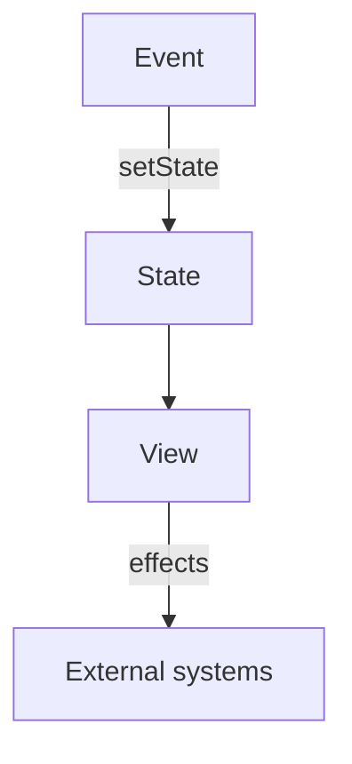

# React Philosophy

<TopicMeta />

<Prerequisites />

::: tip Published
This page meets the handbook **published** bar: deep explanation, ≥10 common mistakes, and official references. Further engine-level errata welcome via PR.
:::

## Introduction

**React’s philosophy** is that UI is a projection of state: `UI = f(state)`. You describe what the UI should look like for the current state; React updates the host tree to match.

Effects, events, and concurrent features are escape hatches and scheduling tools around that core.

## Why does it exist?

Imperative DOM code does not scale: every feature dual-writes UI and state. React centralizes state→view so reasoning stays local.

## Historical Background

From “the V in MVC” to hooks (2019) to concurrent rendering and Server Components—the declarative core remained while the runtime gained scheduling power.

## Mental Model

**State** is the source of truth. **Render** must be pure/idempotent. **Events** update state. **Effects** sync with external systems. Avoid deriving from the DOM as truth.

## Internal Workflow

1. Model state minimally.
2. Derive values during render.
3. Handle user intent in event handlers.
4. Sync externals in effects only when necessary.
5. Measure before memoizing.

## Lifecycle


## Browser Perspective

Commit applies DOM; browser paints.

## JavaScript Engine Perspective

Not applicable.

## React Perspective

This is the product’s north star—every API should be judged against it.

## Next.js Perspective

RSC extends the model: some components run on the server as part of the tree.

## Server Perspective

Not applicable.

## Network Perspective

Not applicable.

## Memory Perspective

Not applicable.

## Performance

Purity enables concurrent rendering and memoization. Side effects in render break the model and the runtime.

## Production Example

A team bans “sync props to state in effects” patterns in review, preferring derived render values—bug rate for stale UI drops.

## Code Examples

```tsx
function Cart({ items }: { items: { price: number }[] }) {
  const total = items.reduce((s, i) => s + i.price, 0) // derive in render
  return <p>Total: {total}</p>
}
```

## Diagrams



## Common Mistakes

1. Treating React as a DOM library with extras
2. Derived state duplicated into useState
3. Side effects during render
4. Overusing effects for event-like logic
5. Prop drilling panic → context everywhere without need
6. Memoizing by default “for performance”
7. Missing a production edge case for 10-react.philosophy (#1)
8. Missing a production edge case for 10-react.philosophy (#2)
9. Missing a production edge case for 10-react.philosophy (#3)
10. Missing a production edge case for 10-react.philosophy (#4)


## Best Practices

- Minimal state; derive the rest
- Events for user intent; effects for sync
- Keep render pure
- Read react.dev “You Might Not Need an Effect”

## Anti-patterns

- Two sources of truth for one fact

## Comparison

| Approach | Model |
| --- | --- |
| React | Declarative UI from state |
| jQuery-style | Imperative DOM edits |

## Interview Questions

### Easy

**Q:** What does UI = f(state) mean?

**A:** The view is computed from state; you update state and let React reconcile the UI.

### Medium

**Q:** Why must render be pure?

**A:** So React can render multiple times, interrupt, and retry safely (especially with concurrent features).

### Hard

**Q:** Where do effects fit in the philosophy?

**A:** They synchronize React state with external systems after commit—not as the primary way to compute UI.

## Summary

- Declarative UI from state
- Pure render; effects as sync
- Derive, don’t duplicate

## References

- [React Documentation](https://react.dev/)
- [Thinking in React](https://react.dev/learn/thinking-in-react)
- [You Might Not Need an Effect](https://react.dev/learn/you-might-not-need-an-effect)

<RelatedTopics />


Next: [`10-react.components`](/10-react/components/)
