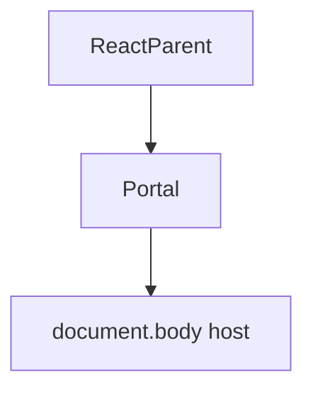
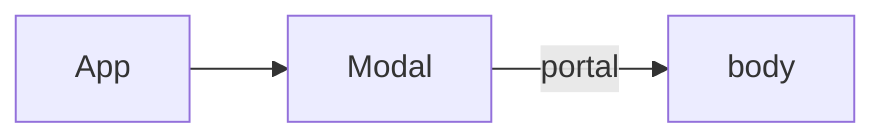

# Portals

<TopicMeta />

<Prerequisites />

::: tip Published
This page meets the handbook **published** bar: deep explanation, ≥10 common mistakes, and official references. Further engine-level errata welcome via PR.
:::

## Introduction

**Portals** (`createPortal(child, container)`) render children into a DOM node outside the parent hierarchy while preserving React context and event bubbling in the React tree.

## Why does it exist?

Modals, tooltips, and toasts often must escape `overflow: hidden` / stacking contexts but still read the same React providers.

## Historical Background

Stable API for years; still the right tool for overlay hosts.

## Mental Model

React parent ≠ DOM parent. Events propagate through the React tree, which surprises people expecting DOM-only bubbling.

## Internal Workflow

1. Create/find a DOM host (`#modal-root`).
2. Portal the overlay.
3. Manage focus/a11y.
4. Keep context via React tree (not DOM).

## Lifecycle



## Browser Perspective

DOM node location changes stacking/overflow.

## JavaScript Engine Perspective

Not applicable.

## React Perspective

Context still from React ancestors.

## Next.js Perspective

Not applicable.

## Server Perspective

Not applicable.

## Network Perspective

Not applicable.

## Memory Perspective

Not applicable.

## Performance

Cheap; a11y focus traps matter more.

## Production Example

Modal dialogs portal to `document.body` with focus trap and Esc handling while reading theme context.

## Code Examples

```tsx
return createPortal(
  <div role="dialog" className="modal">{children}</div>,
  document.getElementById('modal-root')!,
)
```

## Diagrams



## Common Mistakes

1. Forgetting a11y (focus, Esc, aria)
2. Assuming context is lost
3. Z-index wars without a host strategy
4. SSR accessing document without guards
5. Portaling when CSS alone suffices
6. Event bubbling confusion debugging
7. Missing a production edge case for 10-react.portals (#1)
8. Missing a production edge case for 10-react.portals (#2)
9. Missing a production edge case for 10-react.portals (#3)
10. Missing a production edge case for 10-react.portals (#4)


## Best Practices

- Dedicated overlay roots
- Focus management
- Client-only portals when needed

## Anti-patterns

- Nested portals randomly across the app

## Comparison

| | Normal render | Portal |
| --- | --- | --- |
| DOM parent | React parent | Chosen container |
| React context | Ancestors | Ancestors |

## Interview Questions

### Easy

**Q:** What is a portal?

**A:** A way to render React children into a different DOM node while keeping the React tree relationship.

### Medium

**Q:** Do portals break context?

**A:** No. Context still comes from React ancestors, not the DOM ancestor.

### Hard

**Q:** How do events behave with portals?

**A:** React event propagation follows the React tree, so a click in a portaled modal can bubble to React parents even if DOM parents differ.

## Summary

- DOM escape hatch preserving React tree
- Ideal for overlays
- Mind a11y and SSR

## References

- [React Documentation](https://react.dev/)
- [createPortal](https://react.dev/reference/react-dom/createPortal)

<RelatedTopics />


Prev: [`10-react.error-boundaries`](/10-react/error-boundaries/) · Next: [`10-react.concurrent-rendering`](/10-react/concurrent-rendering/)
