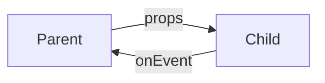
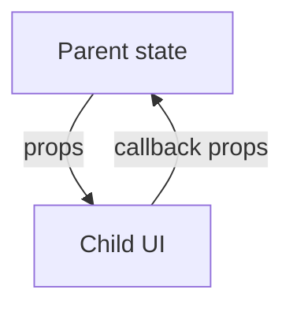

# Props

<TopicMeta />

<Prerequisites />

::: tip Published
This page meets the handbook **published** bar: deep explanation, ≥10 common mistakes, and official references. Further engine-level errata welcome via PR.
:::

## Introduction

**Props** are the inputs passed from parent to child. They are read-only from the child’s perspective. `children` is a prop. Data flows down; events flow up via callbacks.

## Why does it exist?

Explicit inputs make components reusable and testable. Mutating props breaks the unidirectional model.

## Historical Background

Props existed since early React; `propTypes` gave way to TypeScript. Spreading and composition patterns matured.

## Mental Model

Props are a snapshot for this render. Changing props triggers re-render. Defaults via destructuring. Don’t sync props into state unless you intentionally want local divergence.

## Internal Workflow

1. Decide owned vs passed data.
2. Type props.
3. Pass callbacks for child→parent communication.
4. Prefer composition (`children`/`slots`) over endless booleans.

## Lifecycle



## Browser Perspective

Not applicable.

## JavaScript Engine Perspective

Not applicable.

## React Perspective

Core data-flow mechanism.

## Next.js Perspective

Server→Client props must be serializable.

## Server Perspective

Not applicable.

## Network Perspective

Not applicable.

## Memory Perspective

Not applicable.

## Performance

New object/array/function identities each render can break memo; fix with structure/compiler/memo carefully.

## Production Example

Form fields receive `value` + `onChange` (controlled) so the parent owns submission state.

## Code Examples

```tsx
type Props = {
  label: string
  onSave: () => void
  children?: React.ReactNode
}
function Panel({ label, onSave, children }: Props) {
  return (
    <section>
      <h2>{label}</h2>
      {children}
      <button onClick={onSave}>Save</button>
    </section>
  )
}
```

## Diagrams



## Common Mistakes

1. Mutating props
2. Copying props to state unnecessarily
3. Deep prop drilling without composition/context when truly needed
4. Passing unstable inline objects into memo children blindly
5. Using props as two-way binding without callbacks
6. Non-serializable RSC props
7. Missing a production edge case for 10-react.props (#1)
8. Missing a production edge case for 10-react.props (#2)
9. Missing a production edge case for 10-react.props (#3)
10. Missing a production edge case for 10-react.props (#4)


## Best Practices

- Treat props as immutable
- Controlled components for forms when parent needs values
- Compose with children
- Type public props

## Anti-patterns

- `useEffect(() => setX(props.x), [props.x])` by default

## Comparison

| Pattern | Direction |
| --- | --- |
| Props | Parent → child |
| Callbacks | Child → parent |
| Context | Cross-cutting down-tree |

## Interview Questions

### Easy

**Q:** Are props mutable inside a child?

**A:** No. Treat them as read-only; ask the parent to update via callbacks/state.

### Medium

**Q:** What is a controlled component?

**A:** A component whose value is driven by props and notifies changes upward—parent state is source of truth.

### Hard

**Q:** When is mirroring props into state justified?

**A:** When the child needs a draft/edit buffer that intentionally diverges until save/reset—document the reset key/`userId` pattern.

## Summary

- Props are immutable inputs
- Data down, events up
- Avoid reflexive props→state sync

## References

- [React Documentation](https://react.dev/)
- [Passing Props](https://react.dev/learn/passing-props-to-a-component)

<RelatedTopics />


Prev: [`10-react.components`](/10-react/components/) · Next: [`10-react.state`](/10-react/state/)
