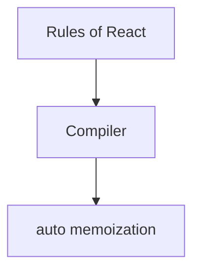

# React Compiler

<TopicMeta />

<Prerequisites />

::: tip Published
This page meets the handbook **published** bar: deep explanation, ≥10 common mistakes, and official references. Further engine-level errata welcome via PR.
:::

## Introduction

The **React Compiler** (formerly React Forget) automatically memoizes components and values by analyzing your code, aiming to preserve referential stability and skip redundant work without hand-written `useMemo`/`useCallback`/`memo` everywhere.

## Why does it exist?

Manual memoization is error-prone and noisy. A compiler can apply consistent optimizations when rules of React are followed.

## Historical Background

Research → open compiler → adoption path via Babel plugin / build integrations. Rules of React become more important as compile-time assumptions.

## Mental Model

Write idiomatic pure React; compiler inserts memoization. Escape hatches exist for incompatible patterns. Still measure—compilers aren’t magic for algorithmic waste.

## Internal Workflow

1. Ensure code follows Rules of React.
2. Enable compiler in the build toolchain.
3. Remove redundant manual memos gradually.
4. Fix purity violations the compiler flags.

## Lifecycle


## Browser Perspective

Not applicable.

## JavaScript Engine Perspective

Not applicable.

## React Perspective

Build-time optimization aligned with runtime semantics.

## Next.js Perspective

Framework templates may offer enablement flags—follow current Next/React docs.

## Server Perspective

Not applicable.

## Network Perspective

Not applicable.

## Memory Perspective

Not applicable.

## Performance

Cuts re-render waste; does not fix bad data structures or huge lists alone.

## Production Example

A design system enables the compiler, deletes many useCallbacks, and validates with Profiler that list interactions stay smooth.

## Code Examples

```tsx
// Idiomatic code the compiler can optimize
function Profile({ user }: { user: User }) {
  const label = user.firstName + ' ' + user.lastName
  return <Badge label={label} />
}
```

## Diagrams



## Common Mistakes

1. Expecting compiler to fix impure renders
2. Leaving conflicting hand memos forever without review
3. Enabling without a test/Profiler plan
4. Mutating props/state and blaming the compiler
5. Assuming zero bundle/tooling cost
6. Using unsupported patterns silently
7. Missing a production edge case for 10-react.react-compiler (#1)
8. Missing a production edge case for 10-react.react-compiler (#2)
9. Missing a production edge case for 10-react.react-compiler (#3)
10. Missing a production edge case for 10-react.react-compiler (#4)


## Best Practices

- Stay pure and idiomatic
- Adopt with measurement
- Follow official setup for your bundler
- Treat compiler diagnostics seriously

## Anti-patterns

- Disabling purity to “make it work”

## Comparison

| | Manual memo | Compiler |
| --- | --- | --- |
| Effort | High | Lower |
| Consistency | Variable | Systematic |

## Interview Questions

### Easy

**Q:** What does the React Compiler aim to do?

**A:** Automatically memoize eligible components/values to avoid unnecessary re-renders and unstable identities.

### Medium

**Q:** Why do the Rules of React matter more with a compiler?

**A:** The compiler assumes purity and the rules to safely insert memoization; violations make optimization incorrect or impossible.

### Hard

**Q:** Does the compiler replace virtualization for huge lists?

**A:** No. It reduces redundant React work but does not change the need to render fewer DOM nodes for very large lists.

## Summary

- Auto-memoization compiler for idiomatic React
- Purity/rules are prerequisites
- Measure; still design good data/UI boundaries

## References

- [React Documentation](https://react.dev/)
- [React Compiler](https://react.dev/learn/react-compiler)

<RelatedTopics />


Prev: [`10-react.strict-mode`](/10-react/strict-mode/) · Next: [`10-react.server-components-overview`](/10-react/server-components-overview/)
