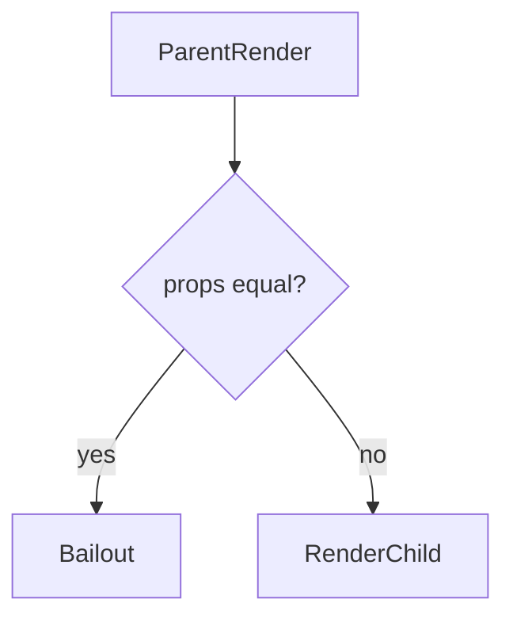
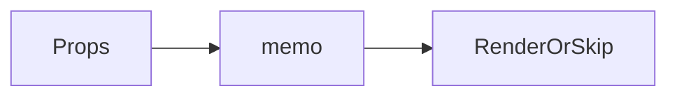

# React.memo

<TopicMeta />

<Prerequisites />

::: tip Published
This page meets the handbook **published** bar: deep explanation, ≥10 common mistakes, and official references. Further engine-level errata welcome via PR.
:::

## Introduction

**`memo(Component)`** wraps a component so React skips re-rendering when props are shallowly equal to the previous render. Custom comparators are possible but rare.

## Why does it exist?

Leaf-heavy lists and pure presentational components can be expensive to re-render when parents update for unrelated reasons.

## Historical Background

Function-component analogue to `PureComponent`.

## Mental Model

Bailout compares props only—not context. If context changes, memoized consumers still re-render.

## Internal Workflow

1. Confirm with Profiler.
2. Wrap pure components.
3. Ensure props are stable/primitive.
4. Avoid custom compare unless proven.

## Lifecycle



## Browser Perspective

Not applicable.

## JavaScript Engine Perspective

Not applicable.

## React Perspective

Render optimization tool.

## Next.js Perspective

Not applicable.

## Server Perspective

Not applicable.

## Network Perspective

Not applicable.

## Memory Perspective

Not applicable.

## Performance

Helps when prop stability holds; otherwise wasted.

## Production Example

Avatar and Icon components are memoized in a message list to cut CPU on typing in a composer sibling.

## Code Examples

```tsx
const Icon = memo(function Icon({ name }: { name: string }) {
  return <span className={'icon-' + name} />
})
```

## Diagrams



## Common Mistakes

1. memo on components reading frequently changing context
2. Custom deep equal comparators that are slower than render
3. Wrapping everything
4. Passing children as always-new elements unexpectedly
5. Expecting memo to block state updates inside the child
6. Forgetting displayName in wrappers for DevTools
7. Missing a production edge case for 10-react.react-memo (#1)
8. Missing a production edge case for 10-react.react-memo (#2)
9. Missing a production edge case for 10-react.react-memo (#3)
10. Missing a production edge case for 10-react.react-memo (#4)


## Best Practices

- Use on pure leaves
- Stable props
- Profile before/after

## Anti-patterns

- memo + new props object every time

## Comparison

| | memo | useMemo |
| --- | --- | --- |
| Targets | Component render | Value compute |

## Interview Questions

### Easy

**Q:** What does React.memo do?

**A:** It skips re-rendering a component when its props are shallow-equal.

### Medium

**Q:** Does memo stop context-driven renders?

**A:** No. Context changes still re-render consumers.

### Hard

**Q:** When is a custom comparison function justified?

**A:** Rarely—when profiling shows shallow compare fails for a known prop shape and a cheaper custom equality exists.

## Summary

- Shallow prop bailout HOC
- Context still updates
- Stable props required

## References

- [React Documentation](https://react.dev/)
- [memo](https://react.dev/reference/react/memo)

<RelatedTopics />


Prev: [`10-react.memoization`](/10-react/memoization/) · Next: [`10-react.usememo`](/10-react/usememo/)
