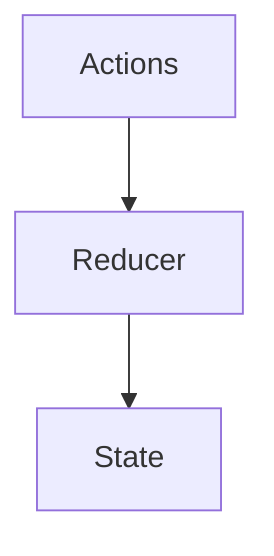

# Reducer

<TopicMeta />

<Prerequisites />

::: tip Published
This page meets the handbook **published** bar: deep explanation, ≥10 common mistakes, and official references. Further engine-level errata welcome via PR.
:::

## Introduction

**`useReducer(reducer, init)`** stores state updated by dispatching actions to a pure reducer `(state, action) => nextState`. Ideal when next state depends on complex prior state or many event types.

## Why does it exist?

Scattered `setState` calls become inconsistent. Reducers centralize transitions and ease testing.

## Historical Background

Inspired by Redux patterns, brought into core hooks for local/component scope.

## Mental Model

Dispatch enqueues an action; React applies the reducer during the next render computation. Reducers must be pure.

## Internal Workflow

1. List actions as a discriminated union.
2. Write pure reducer with exhaustiveness.
3. Dispatch from events.
4. Optionally pass dispatch via context.

## Lifecycle


## Browser Perspective

Not applicable.

## JavaScript Engine Perspective

Not applicable.

## React Perspective

Same hook list machinery as useState.

## Next.js Perspective

Not applicable.

## Server Perspective

Not applicable.

## Network Perspective

Not applicable.

## Memory Perspective

Not applicable.

## Performance

Similar to useState; clarity is the win. Avoid giant global reducers without need.

## Production Example

Checkout funnel uses a reducer for steps/validation errors so transitions are reviewable in one function.

## Code Examples

```tsx
type State = { count: number }
type Action = { type: 'inc' } | { type: 'add'; n: number }
function reducer(state: State, action: Action): State {
  switch (action.type) {
    case 'inc':
      return { count: state.count + 1 }
    case 'add':
      return { count: state.count + action.n }
  }
}
```

## Diagrams



## Common Mistakes

1. Side effects inside reducers
2. Mutating state in reducer
3. Stringly-typed actions without unions
4. Using reducer when two useStates are clearer
5. Dispatching during render accidentally
6. Giant app-wide reducer reinventing Redux poorly
7. Missing a production edge case for 10-react.reducer (#1)
8. Missing a production edge case for 10-react.reducer (#2)
9. Missing a production edge case for 10-react.reducer (#3)
10. Missing a production edge case for 10-react.reducer (#4)


## Best Practices

- Pure reducers
- Discriminated actions
- Init functions for heavy initial state
- Test reducers as pure functions

## Anti-patterns

- fetch() inside reducer

## Comparison

| | useState | useReducer |
| --- | --- | --- |
| Simple toggles | Better | Overkill |
| Many transitions | Messy | Better |

## Interview Questions

### Easy

**Q:** What does useReducer return?

**A:** A `[state, dispatch]` pair where dispatch sends actions to the reducer.

### Medium

**Q:** Why keep reducers pure?

**A:** React may call them multiple times (Strict Mode / concurrent); impure reducers cause bugs.

### Hard

**Q:** When prefer useReducer over multiple useStates?

**A:** When updates involve multiple fields with shared invariants or when action logging/testing clarity matters.

## Summary

- Pure action→state transitions
- Great for complex local state
- No side effects in reducers

## References

- [React Documentation](https://react.dev/)
- [useReducer](https://react.dev/reference/react/useReducer)

<RelatedTopics />


Prev: [`10-react.context`](/10-react/context/) · Next: [`10-react.memoization`](/10-react/memoization/)
