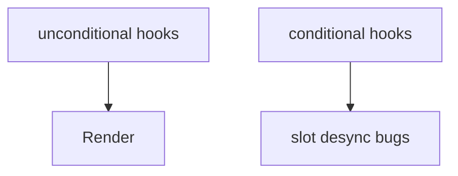
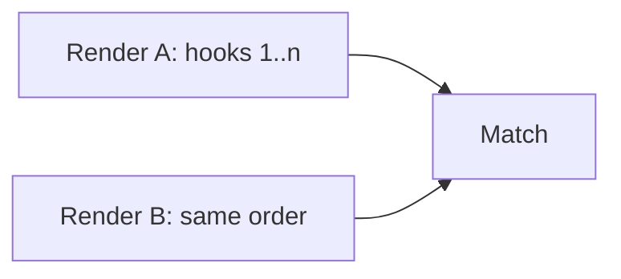

# Rules of Hooks

<TopicMeta />

<Prerequisites />

::: tip Published
This page meets the handbook **published** bar: deep explanation, ≥10 common mistakes, and official references. Further engine-level errata welcome via PR.
:::

## Introduction

The **Rules of Hooks**: (1) only call hooks at the top level (no loops/conditions/nested functions), (2) only call hooks from React function components or custom hooks.

These rules protect the fiber hook list’s correspondence across renders.

## Why does it exist?

Hook state is positional. Violating order causes silent state bugs that look “random.”

## Historical Background

Published with hooks; enforced by `eslint-plugin-react-hooks`.

## Mental Model

Imagine an array of slots. Slot 0 is always the first `useState`. Skipping it on some renders shifts every later slot.

## Internal Workflow

1. Enable the ESLint plugin.
2. Extract conditionally needed logic into child components or custom hooks called unconditionally.
3. Prefer `if (!ready) return null` after hooks, not before.

## Lifecycle



## Browser Perspective

Not applicable.

## JavaScript Engine Perspective

Not applicable.

## React Perspective

Non-negotiable for correctness.

## Next.js Perspective

Not applicable.

## Server Perspective

Not applicable.

## Network Perspective

Not applicable.

## Memory Perspective

Not applicable.

## Performance

N/A—correctness rule.

## Production Example

CI fails on react-hooks/rules-of-hooks violations; no exceptions in app code.

## Code Examples

```tsx
// ❌ bad
if (cond) useEffect(() => {}, [])

// ✅ good
useEffect(() => {
  if (!cond) return
}, [cond])
```

## Diagrams



## Common Mistakes

1. Hooks after conditional returns
2. Hooks in loops
3. Hooks in event handlers
4. Disabling the lint rule
5. Conditional custom hook calls
6. Dynamic hook lists via factories
7. Missing a production edge case for 10-react.rules-of-hooks (#1)
8. Missing a production edge case for 10-react.rules-of-hooks (#2)
9. Missing a production edge case for 10-react.rules-of-hooks (#3)
10. Missing a production edge case for 10-react.rules-of-hooks (#4)


## Best Practices

- Lint as error
- Early return after hooks
- Split components for conditional mounting

## Anti-patterns

- // eslint-disable-next-line react-hooks/rules-of-hooks

## Comparison

| Pattern | Allowed? |
| --- | --- |
| Top-level useState | Yes |
| useEffect inside if | No |
| Custom hook at top | Yes |

## Interview Questions

### Easy

**Q:** Can you call useState inside an if?

**A:** No. Hooks must be called unconditionally at the top level.

### Medium

**Q:** How do you run an effect only sometimes?

**A:** Call `useEffect` always; return early inside, or conditionally mount a child component that has the effect.

### Hard

**Q:** What breaks if call order changes?

**A:** Later hooks read the wrong cells—state/effects attach to the wrong logic, often without a clear error.

## Summary

- Top-level, React functions only
- Order is identity
- Enforce with ESLint

## References

- [React Documentation](https://react.dev/)
- [Rules of Hooks](https://react.dev/reference/rules/rules-of-hooks)

<RelatedTopics />


Prev: [`10-react.hooks`](/10-react/hooks/) · Next: [`10-react.context`](/10-react/context/)
