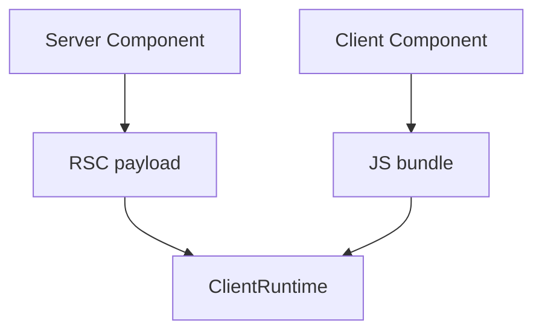
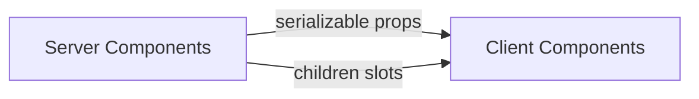

# Server Components Overview

<TopicMeta />

<Prerequisites />

::: tip Published
This page meets the handbook **published** bar: deep explanation, ≥10 common mistakes, and official references. Further engine-level errata welcome via PR.
:::

## Introduction

**Server Components (RSC)** render on the server (or at build time) and send a serialized UI payload to the client. They can access data/backends directly and ship zero client JS for themselves. Interactive pieces become Client Components behind a boundary.

## Why does it exist?

SPAs shipped too much JS for mostly static data UI. RSC keeps data-heavy leaves on the server while preserving composition.

## Historical Background

Introduced by the React team; Next.js App Router popularized production usage. The model continues to evolve.

## Mental Model

Default to server. Add `"use client"` at the edge where hooks/DOM/browser APIs are required. Props crossing the boundary must be serializable. Children can interleave server and client nodes carefully.

## Internal Workflow

1. Fetch data in Server Components.
2. Pass serializable props down.
3. Isolate interactivity into client leaves.
4. Use Suspense for streaming.
5. Don’t import server-only modules into client files.

## Lifecycle



## Browser Perspective

Hydrates client islands; server output is not “HTML-only” in the old sense alone.

## JavaScript Engine Perspective

Not applicable.

## React Perspective

Composition model spanning server and client.

## Next.js Perspective

App Router is the main production vehicle today.

## Server Perspective

Not applicable.

## Network Perspective

Streaming RSC payloads improve TTFB-to-UI.

## Memory Perspective

Not applicable.

## Performance

Less client JS + server data access proximity. Watch waterfalls and over-fetching.

## Production Example

Product page server component fetches product + recommendations; the add-to-cart button is a small client component.

## Code Examples

```tsx
// Server Component (no useState)
async function Product({ id }: { id: string }) {
  const product = await db.product.find(id)
  return (
    <div>
      <h1>{product.title}</h1>
      <AddToCart id={product.id} />{/* client */}
    </div>
  )
}
```

## Diagrams



## Common Mistakes

1. Using hooks in Server Components
2. Passing functions/classes across the boundary
3. Marking huge trees `"use client"` unnecessarily
4. Importing server-only secrets into client modules
5. Ignoring caching semantics in the framework
6. Treating RSC as “SSR of SPA” only
7. Missing a production edge case for 10-react.server-components-overview (#1)
8. Missing a production edge case for 10-react.server-components-overview (#2)
9. Missing a production edge case for 10-react.server-components-overview (#3)
10. Missing a production edge case for 10-react.server-components-overview (#4)


## Best Practices

- Server by default
- Small client islands
- Serializable props
- Suspense streaming zones

## Anti-patterns

- `"use client"` on the root layout always

## Comparison

| | Server Component | Client Component |
| --- | --- | --- |
| Hooks/DOM | No | Yes |
| Bundle JS | No (itself) | Yes |
| Data access | Direct server | Via APIs/props |

## Interview Questions

### Easy

**Q:** What is a Server Component?

**A:** A component that renders on the server and does not ship its code to the client as interactive JS.

### Medium

**Q:** What cannot be passed from server to client components as props?

**A:** Non-serializable values like functions, class instances, and complex cyclic objects.

### Hard

**Q:** How do children let server and client compose?

**A:** A client component can accept `children` rendered by a server parent, keeping server output inside client wrappers without exporting server code into the client bundle.

## Summary

- Server-first composition with client islands
- Serializable boundary is sacred
- Less client JS for data-heavy UI

## References

- [React Documentation](https://react.dev/)
- [Server Components](https://react.dev/reference/rsc/server-components)
- [Next.js App Router](https://nextjs.org/docs/app)

<RelatedTopics />


Prev: [`10-react.react-compiler`](/10-react/react-compiler/) · Next: [`10-react.effects-vs-events`](/10-react/effects-vs-events/)
