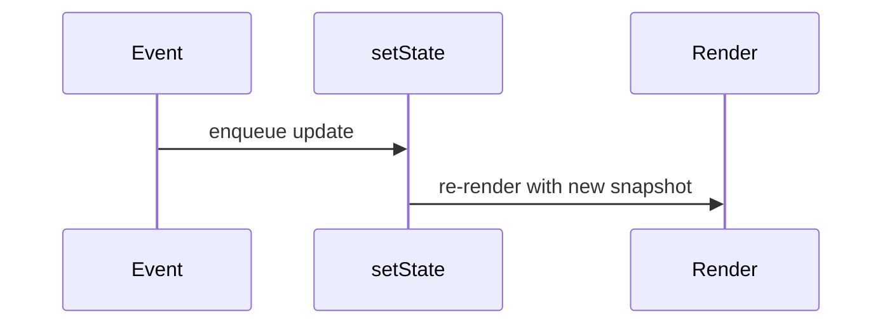
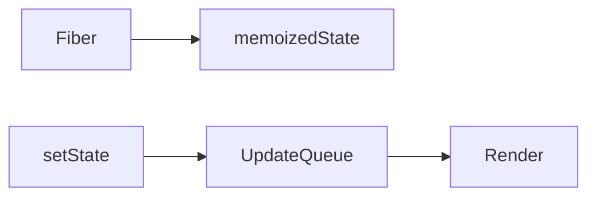

# State

<TopicMeta />

<Prerequisites />

::: tip Published
This page meets the handbook **published** bar: deep explanation, ≥10 common mistakes, and official references. Further engine-level errata welcome via PR.
:::

## Introduction

**State** is data that changes over time and triggers re-renders. In function components, `useState`/`useReducer` store state on the fiber. Updates enqueue and are processed according to React’s batching/scheduling rules.

## Why does it exist?

UI is interactive. Local component memory must survive renders without living in the DOM.

## Historical Background

Class `this.state` → hooks. Automatic batching expanded in React 18. Transitions add non-urgent state updates.

## Mental Model

State is a snapshot per render. `setState` schedules an update; the next render sees the new snapshot. Mutating existing objects/arrays silently fails to update.

## Internal Workflow

1. Identify minimal state.
2. Update immutably.
3. Use functional updates when depending on previous state.
4. Lift/share when siblings need the same data.
5. Prefer reducers for complex transitions.

## Lifecycle



## Browser Perspective

State is not DOM value unless you bind it (controlled inputs).

## JavaScript Engine Perspective

New object identities matter for memo compares.

## React Perspective

Stored on fiber memoizedState lists for hooks.

## Next.js Perspective

Not applicable.

## Server Perspective

Not applicable.

## Network Perspective

Not applicable.

## Memory Perspective

Not applicable.

## Performance

Too much state high in the tree re-renders large subtrees—colocate state.

## Production Example

Cart state lives in a reducer near the checkout layout; leaf rows receive item props and dispatch intents.

## Code Examples

```tsx
const [n, setN] = useState(0)
setN((v) => v + 1) // functional update
setItems((items) => items.map((x) => (x.id === id ? { ...x, done: true } : x)))
```

## Diagrams



## Common Mistakes

1. Mutating arrays/objects in state
2. Stale closures without functional updates
3. Duplicating derived data
4. Storing half of server cache ad hoc without a plan
5. Infinite loops: setState during render
6. Assuming setState is synchronous
7. Missing a production edge case for 10-react.state (#1)
8. Missing a production edge case for 10-react.state (#2)
9. Missing a production edge case for 10-react.state (#3)
10. Missing a production edge case for 10-react.state (#4)


## Best Practices

- Immutable updates
- Functional setState when needed
- Colocate state
- Reducers for multi-step transitions

## Anti-patterns

- One giant global state object for everything

## Comparison

| Tool | Use |
| --- | --- |
| useState | Simple local state |
| useReducer | Complex transitions |
| External store | Shared cross-tree (with useSyncExternalStore) |

## Interview Questions

### Easy

**Q:** Why shouldn’t you mutate state objects?

**A:** React compares by identity/snapshot; mutations may not schedule updates and break purity assumptions.

### Medium

**Q:** What is a functional update?

**A:** `setN(n => n+1)` reads the latest queued state, avoiding stale closures.

### Hard

**Q:** Where does hook state live?

**A:** On the fiber’s linked list of hook cells (`memoizedState`), ordered by call order across renders.

## Summary

- State snapshots drive renders
- Update immutably; batching applies
- Colocate and minimize state

## References

- [React Documentation](https://react.dev/)
- [State: A Component’s Memory](https://react.dev/learn/state-a-components-memory)

<RelatedTopics />


Prev: [`10-react.props`](/10-react/props/) · Next: [`10-react.hooks`](/10-react/hooks/)
