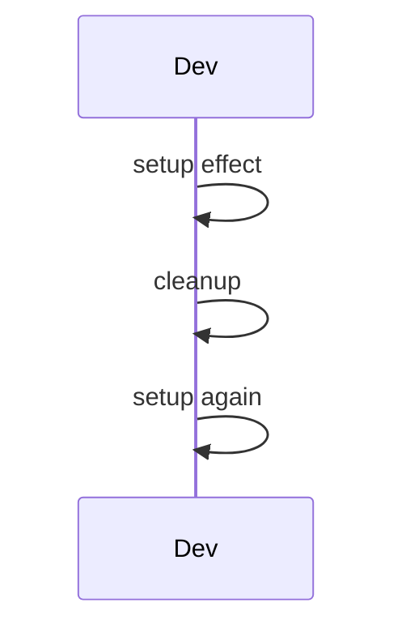
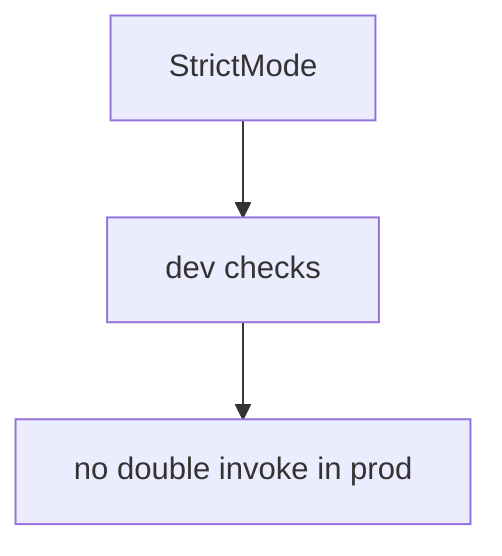

# Strict Mode

<TopicMeta />

<Prerequisites />

::: tip Published
This page meets the handbook **published** bar: deep explanation, ≥10 common mistakes, and official references. Further engine-level errata welcome via PR.
:::

## Introduction

**Strict Mode** is a development helper that highlights unsafe lifecycle patterns and, in React 18+, intentionally double-invokes render/effects setup+cleanup to surface missing cleanups and impure renders.

It does not activate extra checks in production builds.

## Why does it exist?

Concurrent React reuses/restarts work. Impure patterns that “worked” once fail under concurrency. Strict Mode makes those bugs obvious early.

## Historical Background

Long-standing; effect double-invoke behavior expanded with concurrent features.

## Mental Model

Dev-only stress test: mount → unmount → remount for effects; render twice. Your cleanups must make setup idempotent.

## Internal Workflow

1. Keep StrictMode on in root.
2. Fix impure renders and effect cleanups.
3. Don’t disable it to “stop double fetch” without fixing abort/cleanup.
4. Know production runs once.

## Lifecycle



## Browser Perspective

Not applicable.

## JavaScript Engine Perspective

Not applicable.

## React Perspective

Quality gate for concurrent readiness.

## Next.js Perspective

Often enabled by default in scaffolds.

## Server Perspective

Not applicable.

## Network Perspective

Not applicable.

## Memory Perspective

Not applicable.

## Performance

Dev-only overhead; not a prod cost.

## Production Example

Team keeps StrictMode; fetches abort on cleanup so double-invoke doesn’t double-apply mutations.

## Code Examples

```tsx
createRoot(el).render(
  <StrictMode>
    <App />
  </StrictMode>,
)
```

## Diagrams



## Common Mistakes

1. Removing StrictMode to hide bugs
2. Assuming double effects happen in production
3. Non-idempotent effect setups without cleanup
4. Logging confusion about “why twice”
5. Impure render (Math.random in render for IDs)
6. Mutating external stores during render
7. Missing a production edge case for 10-react.strict-mode (#1)
8. Missing a production edge case for 10-react.strict-mode (#2)
9. Missing a production edge case for 10-react.strict-mode (#3)
10. Missing a production edge case for 10-react.strict-mode (#4)


## Best Practices

- Keep it enabled
- Idempotent effects + cleanup
- Pure render functions

## Anti-patterns

- Global flags to skip second run

## Comparison

| Environment | Double-invoke effects? |
| --- | --- |
| Dev + StrictMode | Yes (React 18+) |
| Production | No |

## Interview Questions

### Easy

**Q:** Does Strict Mode run in production?

**A:** The extra strict checks/double-invokes are for development; production builds do not behave that way.

### Medium

**Q:** Why does my effect run twice in development?

**A:** Strict Mode remounts to ensure your cleanup/setup is resilient under concurrent rendering.

### Hard

**Q:** How should data fetching adapt to Strict Mode?

**A:** Use AbortController/ignore flags in cleanup so the abandoned run cannot commit results; don’t disable Strict Mode.

## Summary

- Dev-only concurrent readiness checks
- Double-invoke exposes missing cleanups
- Keep it on; fix root causes

## References

- [React Documentation](https://react.dev/)
- [Strict Mode](https://react.dev/reference/react/StrictMode)

<RelatedTopics />


Prev: [`10-react.deferred-value`](/10-react/deferred-value/) · Next: [`10-react.react-compiler`](/10-react/react-compiler/)
