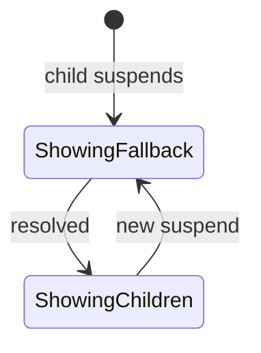
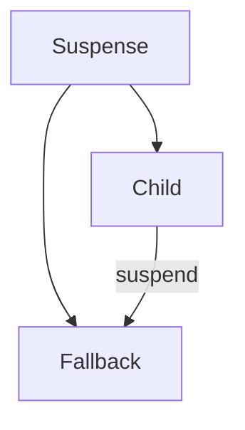

# Suspense

<TopicMeta />

<Prerequisites />

::: tip Published
This page meets the handbook **published** bar: deep explanation, ≥10 common mistakes, and official references. Further engine-level errata welcome via PR.
:::

## Introduction

**Suspense** lets a parent declare a fallback while descendants suspend (lazy components, `use` promises, framework data). React shows the nearest fallback until children are ready.

## Why does it exist?

Loading states used to be ad hoc boolean soup. Suspense coordinates async trees declaratively.

## Historical Background

First for `React.lazy` (code splitting); later expanded toward data with concurrent features and RSC streaming.

## Mental Model

A boundary catches suspend signals from below and shows `fallback`. Multiple children can coordinate under concurrent rules. Error boundaries catch errors separately.

## Internal Workflow

1. Place boundaries where UX should swap to fallback.
2. Keep fallbacks lightweight.
3. Pair with error boundaries.
4. Avoid nesting chaos—design intentional zones.

## Lifecycle



## Browser Perspective

Not applicable.

## JavaScript Engine Perspective

Not applicable.

## React Perspective

Core concurrency UX primitive.

## Next.js Perspective

Streaming SSR/RSC heavily uses Suspense.

## Server Perspective

Not applicable.

## Network Perspective

Not applicable.

## Memory Perspective

Not applicable.

## Performance

Granular boundaries improve perceived performance; too coarse blocks large regions.

## Production Example

Product page wraps reviews in Suspense so the hero/buy box stream first while reviews load.

## Code Examples

```tsx
<Suspense fallback={<Spinner />}>
  <LazyPanel />
</Suspense>
```

## Diagrams



## Common Mistakes

1. No error boundary with data Suspense
2. Enormous boundaries causing blank pages
3. Using Suspense for non-suspending waits incorrectly
4. Forgetting lazy needs default export
5. Fallback layout shift disasters
6. Nested boundaries without UX plan
7. Missing a production edge case for 10-react.suspense (#1)
8. Missing a production edge case for 10-react.suspense (#2)
9. Missing a production edge case for 10-react.suspense (#3)
10. Missing a production edge case for 10-react.suspense (#4)


## Best Practices

- Intentional boundary placement
- Stable fallback sizes
- Error boundaries nearby
- Stream critical UI first

## Anti-patterns

- One Suspense at the root for the whole app always

## Comparison

| Concern | Tool |
| --- | --- |
| Loading | Suspense |
| Errors | Error boundary |
| Lazy code | React.lazy + Suspense |

## Interview Questions

### Easy

**Q:** What does Suspense display while waiting?

**A:** Its `fallback` UI until children no longer suspend.

### Medium

**Q:** How does Suspense differ from an error boundary?

**A:** Suspense handles waiting/loading; error boundaries handle thrown errors.

### Hard

**Q:** How does Suspense help streaming SSR?

**A:** Server can emit shell + fallbacks and stream resolved chunks as async server work finishes.

## Summary

- Declarative async loading boundaries
- Pair with error boundaries
- Place boundaries for UX, not convenience only

## References

- [React Documentation](https://react.dev/)
- [Suspense](https://react.dev/reference/react/Suspense)

<RelatedTopics />


Prev: [`10-react.use`](/10-react/use/) · Next: [`10-react.lazy-loading`](/10-react/lazy-loading/)
