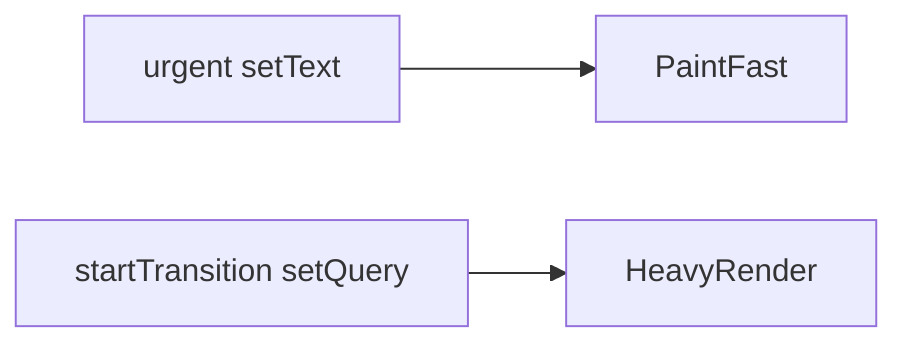
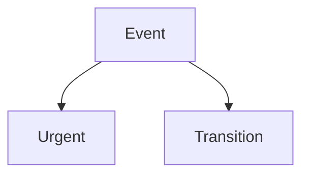

# Transitions

<TopicMeta />

<Prerequisites />

::: tip Published
This page meets the handbook **published** bar: deep explanation, ≥10 common mistakes, and official references. Further engine-level errata welcome via PR.
:::

## Introduction

**Transitions** wrap state updates that can lag without breaking interaction. `startTransition(fn)` / `useTransition()` return `isPending` so you can show pending UI while keeping inputs snappy.

## Why does it exist?

Not all updates are equal. Filtering, route-like local navigations, and heavy re-renders should not block typing.

## Historical Background

React 18 concurrent feature set.

## Mental Model

Updates inside transition are lower priority. React may show previous UI longer (or pending states) while preparing the next view.

## Internal Workflow

1. Identify non-urgent setStates.
2. Wrap them in startTransition.
3. Keep controlled input state outside.
4. Surface `isPending`.

## Lifecycle



## Browser Perspective

Not applicable.

## JavaScript Engine Perspective

Not applicable.

## React Perspective

Priority API over Fiber lanes.

## Next.js Perspective

Not applicable.

## Server Perspective

Not applicable.

## Network Perspective

Not applicable.

## Memory Perspective

Not applicable.

## Performance

Improves INP-ish responsiveness; total CPU may be similar.

## Production Example

Tab switches that remount heavy panels use transitions with a dimmed pending state.

## Code Examples

```tsx
const [isPending, startTransition] = useTransition()
startTransition(() => setTab(next))
```

## Diagrams



## Common Mistakes

1. Transitioning the controlled input value itself incorrectly
2. No pending UI
3. Nesting transitions without understanding
4. Assuming it fixes O(n²) renders
5. Using for tiny updates needlessly
6. Side effects relying on immediate state flush
7. Missing a production edge case for 10-react.transitions (#1)
8. Missing a production edge case for 10-react.transitions (#2)
9. Missing a production edge case for 10-react.transitions (#3)
10. Missing a production edge case for 10-react.transitions (#4)


## Best Practices

- Urgent input + transition derived view
- Show pending affordance
- Measure interactions

## Anti-patterns

- startTransition(fetch) instead of proper async patterns

## Comparison

| API | Pending flag |
| --- | --- |
| useTransition | Yes |
| startTransition | No built-in |

## Interview Questions

### Easy

**Q:** What does startTransition do?

**A:** Marks the state updates inside its callback as non-urgent.

### Medium

**Q:** Why keep input state outside the transition?

**A:** So keystrokes remain urgent and the field stays responsive while the heavy view catches up.

### Hard

**Q:** How do transitions interact with Suspense?

**A:** React can keep showing old UI during a transition even if new content suspends, avoiding unwanted fallback flashes (per concurrent rules).

## Summary

- Non-urgent updates API
- Pair with urgent input state
- Use isPending for UX

## References

- [React Documentation](https://react.dev/)
- [useTransition](https://react.dev/reference/react/useTransition)

<RelatedTopics />


Prev: [`10-react.concurrent-rendering`](/10-react/concurrent-rendering/) · Next: [`10-react.deferred-value`](/10-react/deferred-value/)
