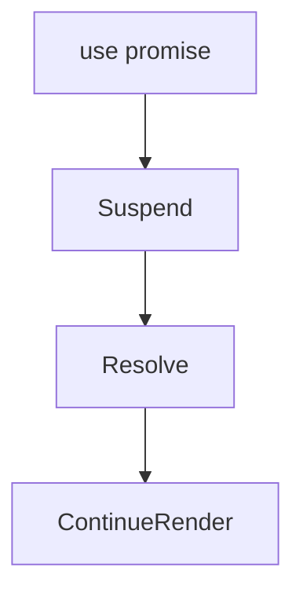
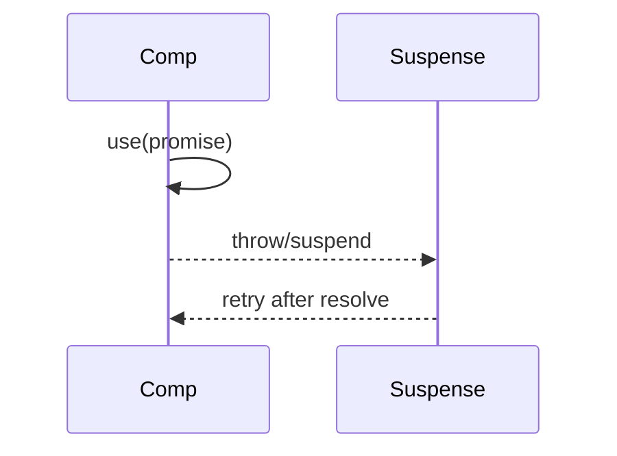

# use

<TopicMeta />

<Prerequisites />

::: tip Published
This page meets the handbook **published** bar: deep explanation, ≥10 common mistakes, and official references. Further engine-level errata welcome via PR.
:::

## Introduction

**`use(resource)`** is a React API that reads a promise or context during render. With promises, it integrates with Suspense/error boundaries—React suspends until the promise resolves (with caching/identity rules).

## Why does it exist?

Lets frameworks and libraries express async dependencies without `useEffect` fetch waterfalls in some designs.

## Historical Background

Introduced with the React 19 family of features alongside improved Suspense/RSC stories.

## Mental Model

`use(promise)` unwraps or suspends. Promise identity matters—create promises in stable caches, not ad hoc each render. `use(Context)` can be conditional unlike `useContext` in some ways—follow current docs.

## Internal Workflow

1. Prefer framework data APIs when available.
2. Pass cached promises from parents/loaders.
3. Wrap with Suspense boundaries.
4. Don’t invent per-render promises.

## Lifecycle



## Browser Perspective

Not applicable.

## JavaScript Engine Perspective

Not applicable.

## React Perspective

Render-time resource reading.

## Next.js Perspective

Often paired with RSC; client `use` still needs care.

## Server Perspective

Not applicable.

## Network Perspective

Not applicable.

## Memory Perspective

Not applicable.

## Performance

Bad promise identity → infinite suspend loops.

## Production Example

A client child receives a cached promise from a server parent / loader and unwraps with `use` under a Suspense boundary showing a skeleton.

## Code Examples

```tsx
function Notes({ notesPromise }: { notesPromise: Promise<Note[]> }) {
  const notes = use(notesPromise)
  return <ul>{notes.map((n) => <li key={n.id}>{n.title}</li>)}</ul>
}
```

## Diagrams



## Common Mistakes

1. Creating new promises every render
2. Using use as a replacement for all data fetching without cache
3. Missing Suspense boundaries
4. Ignoring error boundaries for rejected promises
5. Calling use outside supported environments
6. Confusing use with useEffect
7. Missing a production edge case for 10-react.use (#1)
8. Missing a production edge case for 10-react.use (#2)
9. Missing a production edge case for 10-react.use (#3)
10. Missing a production edge case for 10-react.use (#4)


## Best Practices

- Stable cached promises
- Suspense + error boundaries
- Prefer platform/framework patterns

## Anti-patterns

- use(fetch(...)) inline in component body without cache

## Comparison

| | use(promise) | useEffect fetch |
| --- | --- | --- |
| Timing | During render/Suspense | After paint |
| Waterfalls | Framework-dependent | Easy to create |

## Interview Questions

### Easy

**Q:** What can `use` read?

**A:** Currently promises and context values (per React docs), integrating with Suspense for promises.

### Medium

**Q:** Why must promise identity be stable?

**A:** A new promise each render looks unresolved forever / retriggers suspend incorrectly.

### Hard

**Q:** How does `use` relate to Server Components?

**A:** RSC can await on the server; client `use` unwraps promises passed across/created for Suspense—different layers, complementary tools.

## Summary

- Render-time unwrap with Suspense
- Stable resources only
- Not a silver bullet fetch hook

## References

- [React Documentation](https://react.dev/)
- [use](https://react.dev/reference/react/use)

<RelatedTopics />


Prev: [`10-react.useid`](/10-react/useid/) · Next: [`10-react.suspense`](/10-react/suspense/)
