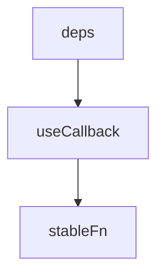

# useCallback

<TopicMeta />

<Prerequisites />

::: tip Published
This page meets the handbook **published** bar: deep explanation, ≥10 common mistakes, and official references. Further engine-level errata welcome via PR.
:::

## Introduction

**`useCallback(fn, deps)`** returns a stable function reference until dependencies change. Equivalent to `useMemo(() => fn, deps)` for functions.

## Why does it exist?

Memoized children and effect deps often need stable handlers to avoid thrashing.

## Historical Background

Paired with memo since hooks launch; compiler reduces manual need.

## Mental Model

Identity tool, not magic performance. If nothing cares about identity, skip it.

## Internal Workflow

1. Identify consumers that depend on referential equality.
2. Wrap those callbacks.
3. Keep deps honest.
4. Don’t wrap every handler.

## Lifecycle



## Browser Perspective

Not applicable.

## JavaScript Engine Perspective

Not applicable.

## React Perspective

Often paired with memoized children.

## Next.js Perspective

Not applicable.

## Server Perspective

Not applicable.

## Network Perspective

Not applicable.

## Memory Perspective

Not applicable.

## Performance

Useless alone without consumers that bail out on identity.

## Production Example

Virtualized list row handlers are `useCallback`’d with row id deps so `memo` rows bail out while typing elsewhere.

## Code Examples

```tsx
const onSelect = useCallback((id: string) => {
  setSelected(id)
}, [])
```

## Diagrams


## Common Mistakes

1. useCallback on all functions
2. Missing deps
3. Expecting speedups without memo consumers
4. Unstable deps defeating the cache
5. useCallback instead of fixing state locality
6. Stale closures from empty deps incorrectly
7. Missing a production edge case for 10-react.usecallback (#1)
8. Missing a production edge case for 10-react.usecallback (#2)
9. Missing a production edge case for 10-react.usecallback (#3)
10. Missing a production edge case for 10-react.usecallback (#4)


## Best Practices

- Only when identity matters
- Pair with memo/effects thoughtfully
- Prefer compiler

## Anti-patterns

- useCallback + inline object props still breaking memo

## Comparison

| | useCallback | useMemo |
| --- | --- | --- |
| Caches | Function | Any value |

## Interview Questions

### Easy

**Q:** What does useCallback return?

**A:** A memoized function that changes only when dependencies change.

### Medium

**Q:** When is useCallback useful?

**A:** When passing callbacks to memoized children or listing them in effect dependencies where identity matters.

### Hard

**Q:** How does React Compiler change useCallback usage?

**A:** The compiler can auto-memoize so many manual useCallbacks become unnecessary—follow project guidance.

## Summary

- Stable function identities on demand
- Needs consumers that care
- Honest dependency arrays

## References

- [React Documentation](https://react.dev/)
- [useCallback](https://react.dev/reference/react/useCallback)

<RelatedTopics />


Prev: [`10-react.usememo`](/10-react/usememo/) · Next: [`10-react.useref`](/10-react/useref/)
