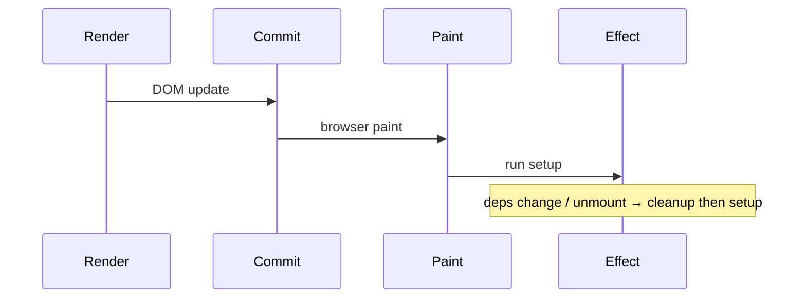
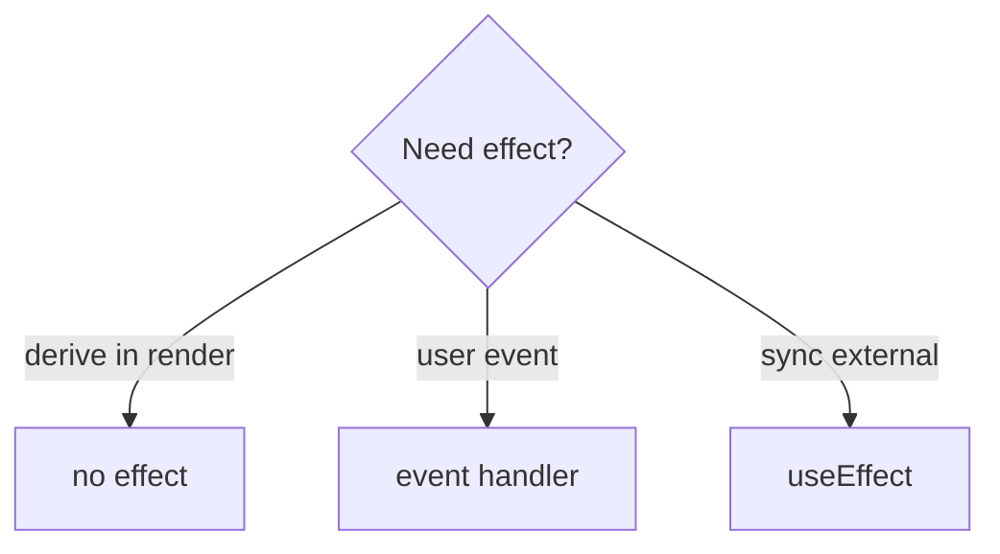
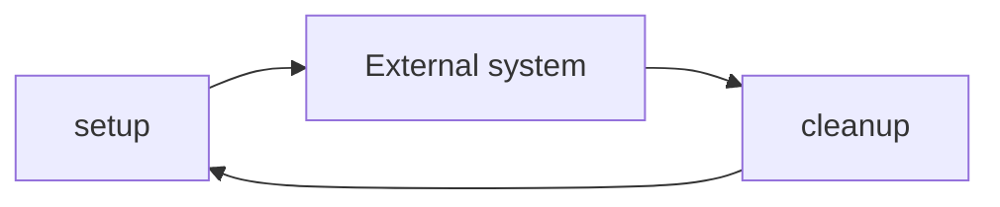

# useEffect

<TopicMeta />

<Prerequisites />

::: tip Published
This page meets the handbook **published** bar: deep explanation, ≥10 common mistakes, and official references. Further engine-level errata welcome via PR.
:::

## Introduction

**`useEffect(setup, deps?)`** runs `setup` after commit/paint to synchronize React with **external systems** (network, subscriptions, non-React widgets). It returns an optional cleanup.

It is not for computing render output or handling pure user events.

## Why does it exist?

Render must stay pure. The world outside React (DOM APIs, servers, buses) needs lifecycle-aware sync with cleanup.

## Historical Background

Replaced many class lifecycles. React 18 Strict Mode double-invokes effects in dev to surface missing cleanups. Docs emphasize “You Might Not Need an Effect.”

## Mental Model

Effects are **reactive synchronization**: when deps change, cleanup previous then run setup. Empty deps ≈ mount/unmount sync. Missing deps ≈ stale sync. After paint by default (non-blocking).

## Internal Workflow

1. Ask if it should be an event handler or derived value instead.
2. Write setup + cleanup.
3. List reactive deps honestly.
4. Use AbortController for fetches.
5. Avoid chaining effects to mimic props→state.

## Lifecycle



Fiber stores effect lists; passive effects flush after paint.

## Browser Perspective

Runs on main thread after paint; heavy work still janks—defer/web workers.

## JavaScript Engine Perspective

Closures capture render snapshots—deps keep them fresh.

## React Perspective

Passive effect phase distinct from layout effects.

## Next.js Perspective

Client-only; do not expect effects on the server.

## Server Perspective

Not applicable.

## Network Perspective

Not applicable.

## Memory Perspective

Leaks = forgotten subscriptions/timers without cleanup.

## Performance

Too many effects waterfalls. Prefer rendering data you already have; batch server work higher (RSC/loaders).

## Production Example

A chart library mounts in an effect, updates on data deps, and destroys the instance on cleanup—Strict Mode proves cleanup works locally.

## Code Examples

```tsx
useEffect(() => {
  const ac = new AbortController()
  fetch('/api/items/' + id, { signal: ac.signal })
    .then((r) => r.json())
    .then(setData)
    .catch((e) => {
      if (e.name !== 'AbortError') setError(e)
    })
  return () => ac.abort()
}, [id])
```

```tsx
// NOT an effect — derive
const fullName = first + ' ' + last
```

## Diagrams





## Common Mistakes

1. Using effects to compute derived state
2. Fetching without abort/ignore flag
3. Empty deps with stale closures accidentally
4. Omitting deps / disabling exhaustive-deps blindly
5. setState loops from bad deps
6. Treating effects as lifecycle componentDidMount-only mindset without cleanup
7. Implementing event logic in effects (somethingHappen flags)
8. Using effects to transform data for render instead of calculating during render
9. Omitting cleanup for subscriptions/timers
10. Empty dependency arrays “to run once” while closing over changing props


## Best Practices

- Effects for external sync only
- Cleanup subscriptions/fetches
- Honest dependency arrays
- Read “You Might Not Need an Effect”
- Prefer events for user-triggered logic

## Anti-patterns

- Props → state sync effects by default
- Effect chains that should be one data flow

## Comparison

| API | Timing | Use |
| --- | --- | --- |
| useEffect | After paint | External sync |
| useLayoutEffect | Before paint | Measure/mutate DOM before paint |
| Event handler | Sync with user | User intent |

## Interview Questions

### Easy

**Q:** When should you use useEffect?

**A:** To synchronize with an external system after render—subscriptions, non-React widgets, imperative APIs—not to calculate UI.

### Medium

**Q:** Why return a cleanup function?

**A:** To undo the previous setup (unsubscribe, abort, destroy) when deps change or the component unmounts, preventing leaks/races.

### Hard

**Q:** Why does Strict Mode run effects twice in development?

**A:** To surface missing cleanups and non-idempotent setups by mounting, cleaning up, and mounting again—so production behaves more reliably.

## Summary

- After-paint sync with externals
- Setup + cleanup; deps define reactivity
- Most “effect smells” should be events or derived render values

## References

- [React Documentation](https://react.dev/)
- [useEffect](https://react.dev/reference/react/useEffect)
- [Synchronizing with Effects](https://react.dev/learn/synchronizing-with-effects)
- [You Might Not Need an Effect](https://react.dev/learn/you-might-not-need-an-effect)

<RelatedTopics />


Prev: [`10-react.useref`](/10-react/useref/) · Next: [`10-react.uselayouteffect`](/10-react/uselayouteffect/)
