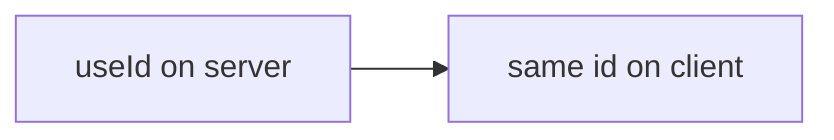
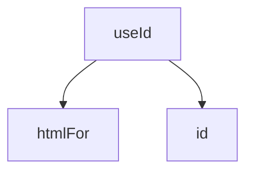

# useId

<TopicMeta />

<Prerequisites />

::: tip Published
This page meets the handbook **published** bar: deep explanation, ≥10 common mistakes, and official references. Further engine-level errata welcome via PR.
:::

## Introduction

**`useId`** returns a unique ID string stable across server render and client hydration. Use it to associate labels/inputs (`htmlFor`/`id`) and ARIA relationships without hydration mismatches.

## Why does it exist?

Hardcoded IDs collide; `Math.random()` breaks SSR hydration. `useId` is the supported solution.

## Historical Background

Added in React 18 specifically for SSR-safe IDs (hooks-era apps previously used counters/context hacks).

## Mental Model

One or more IDs per component instance. Not for list keys. Format is opaque—don’t depend on its shape.

## Internal Workflow

1. Call `useId` in the component needing IDs.
2. Bind label/input/ARIA.
3. Don’t use as React `key`.

## Lifecycle



## Browser Perspective

Not applicable.

## JavaScript Engine Perspective

Not applicable.

## React Perspective

Accessibility plumbing.

## Next.js Perspective

Critical for RSC/SSR forms and dialogs.

## Server Perspective

Not applicable.

## Network Perspective

Not applicable.

## Memory Perspective

Not applicable.

## Performance

Trivial.

## Production Example

A shared `TextField` uses `useId` so multiple instances on a page never clash label associations.

## Code Examples

```tsx
function TextField({ label }: { label: string }) {
  const id = useId()
  return (
    <>
      <label htmlFor={id}>{label}</label>
      <input id={id} />
    </>
  )
}
```

## Diagrams



## Common Mistakes

1. Using useId for list keys
2. Math.random IDs with SSR
3. Assuming ID format is stable across React versions for parsing
4. Generating IDs in render with module counters that diverge SSR/client
5. One global hard-coded id in a reusable component
6. Using useId to key CSS that expects specific strings
7. Missing a production edge case for 10-react.useid (#1)
8. Missing a production edge case for 10-react.useid (#2)
9. Missing a production edge case for 10-react.useid (#3)
10. Missing a production edge case for 10-react.useid (#4)


## Best Practices

- Accessibility associations
- Multiple ids via suffixes if needed
- Keep opaque

## Anti-patterns

- useId as a database primary key

## Comparison

| Approach | SSR safe? |
| --- | --- |
| useId | Yes |
| Math.random | No |
| Hardcoded | Collides |

## Interview Questions

### Easy

**Q:** What is useId for?

**A:** Generating unique IDs that stay consistent between server HTML and client hydration—often for a11y.

### Medium

**Q:** Why not use useId as a key?

**A:** Keys should come from data identity; useId is for DOM accessibility linkages, not list reconciliation.

### Hard

**Q:** How does useId prevent hydration mismatches?

**A:** React’s SSR runtime allocates IDs deterministically for the tree so the client generates the same strings during hydration.

## Summary

- SSR-safe unique DOM ids
- For a11y associations
- Not for keys

## References

- [React Documentation](https://react.dev/)
- [useId](https://react.dev/reference/react/useId)

<RelatedTopics />


Prev: [`10-react.useimperativehandle`](/10-react/useimperativehandle/) · Next: [`10-react.use`](/10-react/use/)
