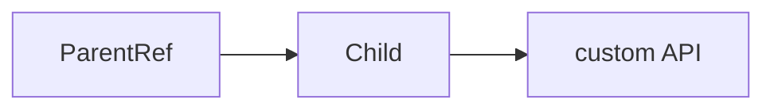
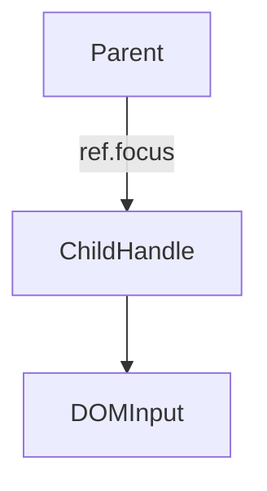

# useImperativeHandle

<TopicMeta />

<Prerequisites />

::: tip Published
This page meets the handbook **published** bar: deep explanation, ≥10 common mistakes, and official references. Further engine-level errata welcome via PR.
:::

## Introduction

**`useImperativeHandle(ref, createHandle, deps)`** lets a child define a custom imperative API on a ref (e.g. `focus()`, `scrollTo()`) instead of exposing the raw DOM node.

Always a last resort—prefer declarative props.

## Why does it exist?

Design-system inputs sometimes must expose focus/select without leaking internal DOM structure.

## Historical Background

Paired historically with `forwardRef`; React 19 makes `ref` a normal prop more often, but the imperative handle pattern remains.

## Mental Model

Parent holds a ref; child writes a handle object. Keep the surface tiny and stable.

## Internal Workflow

1. Exhaust declarative options.
2. Expose minimal methods.
3. Memoize handle via deps.
4. Document the imperative API.

## Lifecycle



## Browser Perspective

Not applicable.

## JavaScript Engine Perspective

Not applicable.

## React Perspective

Escape hatch for imperative parent control.

## Next.js Perspective

Not applicable.

## Server Perspective

Not applicable.

## Network Perspective

Not applicable.

## Memory Perspective

Not applicable.

## Performance

Negligible if rare.

## Production Example

`<SearchBox ref={ref} />` exposes `focus()` used by a shortcut handler in the shell layout.

## Code Examples

```tsx
function SearchBox({ ref }: { ref?: React.Ref<{ focus: () => void }> }) {
  const inputRef = useRef<HTMLInputElement>(null)
  useImperativeHandle(ref, () => ({
    focus: () => inputRef.current?.focus(),
  }), [])
  return <input ref={inputRef} />
}
```

## Diagrams



## Common Mistakes

1. Exposing entire component internals
2. Using imperative handles for data flow
3. Unstable handle identities causing loops
4. Forgetting deps when handle closes over props
5. Preferring refs over controlled props routinely
6. Leaking mutable internal state via handle
7. Missing a production edge case for 10-react.useimperativehandle (#1)
8. Missing a production edge case for 10-react.useimperativehandle (#2)
9. Missing a production edge case for 10-react.useimperativehandle (#3)
10. Missing a production edge case for 10-react.useimperativehandle (#4)


## Best Practices

- Tiny API surface
- Document methods
- Prefer props/state first

## Anti-patterns

- ref-driven architecture across the app

## Comparison

| Approach | Style |
| --- | --- |
| Props/callbacks | Declarative |
| useImperativeHandle | Imperative escape |

## Interview Questions

### Easy

**Q:** What does useImperativeHandle do?

**A:** It customizes the value a parent receives when holding a ref to the child.

### Medium

**Q:** Why is it an escape hatch?

**A:** React prefers declarative data flow; imperative handles break that for special cases like focus management.

### Hard

**Q:** How do you keep handles from becoming a second props system?

**A:** Limit to DOM-like commands (focus/scroll/open), never for business data; keep declarative props as the source of truth.

## Summary

- Customize ref handles sparingly
- Tiny imperative APIs
- Declarative props first

## References

- [React Documentation](https://react.dev/)
- [useImperativeHandle](https://react.dev/reference/react/useImperativeHandle)

<RelatedTopics />


Prev: [`10-react.uselayouteffect`](/10-react/uselayouteffect/) · Next: [`10-react.useid`](/10-react/useid/)
