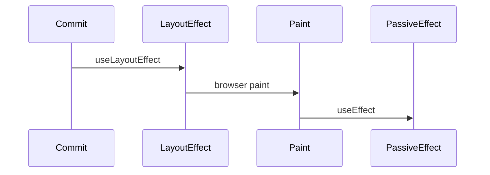
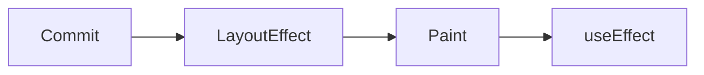

# useLayoutEffect

<TopicMeta />

<Prerequisites />

::: tip Published
This page meets the handbook **published** bar: deep explanation, ≥10 common mistakes, and official references. Further engine-level errata welcome via PR.
:::

## Introduction

**`useLayoutEffect`** fires after DOM mutations but **before paint**. Use it when you must measure layout or imperatively adjust the DOM to avoid a visible flicker.

It blocks paint—prefer `useEffect` unless you need pre-paint sync.

## Why does it exist?

Some UI needs sizes/positions immediately (tooltips, caret restore, scroll position) without flashing intermediate states.

## Historical Background

Class `componentDidMount`/`DidUpdate` timing analogue for layout. SSR warns because layout effects need a DOM.

## Mental Model

Same dependency/cleanup model as `useEffect`, earlier phase (layout). Keep work tiny.

## Internal Workflow

1. Try `useEffect` first.
2. Switch to layout effect only for measure→mutate before paint.
3. Cleanup similarly.
4. Guard SSR (`typeof window` patterns / client-only components).

## Lifecycle



## Browser Perspective

Delays paint—jank if heavy.

## JavaScript Engine Perspective

Not applicable.

## React Perspective

Layout effect phase in commit.

## Next.js Perspective

Avoid in SSR paths; client components only.

## Server Perspective

Not applicable.

## Network Perspective

Not applicable.

## Memory Perspective

Not applicable.

## Performance

Treat as expensive. Measure once, batch DOM writes.

## Production Example

A dropdown measures trigger rect in layout effect and positions the menu before first paint to avoid a jump.

## Code Examples

```tsx
useLayoutEffect(() => {
  const rect = ref.current?.getBoundingClientRect()
  if (!rect) return
  setBox({ width: rect.width, height: rect.height })
}, [deps])
```

## Diagrams



## Common Mistakes

1. Using layout effect for data fetching
2. Heavy computation in layout effect
3. Ignoring SSR warnings
4. Forcing layout thrashing loops
5. Using it by default “to be safe”
6. Missing cleanup for observers created there
7. Missing a production edge case for 10-react.uselayouteffect (#1)
8. Missing a production edge case for 10-react.uselayouteffect (#2)
9. Missing a production edge case for 10-react.uselayouteffect (#3)
10. Missing a production edge case for 10-react.uselayouteffect (#4)


## Best Practices

- Prefer useEffect
- Keep layout work minimal
- Client-only for DOM measurement

## Anti-patterns

- Animating via layout effects instead of CSS/WAAPI

## Comparison

| | useEffect | useLayoutEffect |
| --- | --- | --- |
| Paint | Before effect | After effect |
| Use | External sync | Measure/mutate pre-paint |

## Interview Questions

### Easy

**Q:** When does useLayoutEffect run relative to paint?

**A:** After DOM updates but before the browser paints.

### Medium

**Q:** Why can useLayoutEffect hurt performance?

**A:** It blocks painting while your callback runs, so heavy work causes jank.

### Hard

**Q:** How do you handle useLayoutEffect with SSR?

**A:** Keep it in client components only; provide fallbacks or defer measurement until mounted to avoid server/client mismatches.

## Summary

- Pre-paint layout synchronization
- Blocks paint—use sparingly
- Same cleanup/deps model as useEffect

## References

- [React Documentation](https://react.dev/)
- [useLayoutEffect](https://react.dev/reference/react/useLayoutEffect)

<RelatedTopics />


Prev: [`10-react.useeffect`](/10-react/useeffect/) · Next: [`10-react.useimperativehandle`](/10-react/useimperativehandle/)
