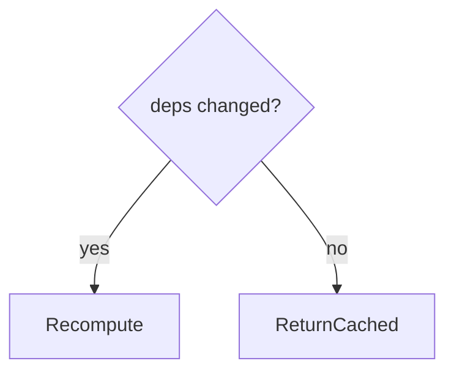

# useMemo

<TopicMeta />

<Prerequisites />

::: tip Published
This page meets the handbook **published** bar: deep explanation, ≥10 common mistakes, and official references. Further engine-level errata welcome via PR.
:::

## Introduction

**`useMemo(() => value, deps)`** recomputes `value` only when dependencies change (`Object.is`). Use for expensive pure calculations or to stabilize object identities intentionally.

## Why does it exist?

Some derived data (filter/sort large lists, graph layout) is costly every render.

## Historical Background

Hooks-era memoization; React Compiler may auto-memo many cases.

## Mental Model

Not a semantic guarantee for correctness—React may theoretically discard and recompute. Don’t put side effects inside.

## Internal Workflow

1. Write correct code without useMemo.
2. Profile.
3. Wrap expensive pure compute.
4. Keep deps accurate.

## Lifecycle



## Browser Perspective

Not applicable.

## JavaScript Engine Perspective

Not applicable.

## React Perspective

Render-phase cache.

## Next.js Perspective

Not applicable.

## Server Perspective

Not applicable.

## Network Perspective

Not applicable.

## Memory Perspective

Not applicable.

## Performance

Overuse adds memory/bookkeeping.

## Production Example

A search page memos filtered rows from a 20k catalog when query/sort deps change.

## Code Examples

```tsx
const filtered = useMemo(
  () => items.filter((i) => i.name.includes(q)),
  [items, q],
)
```

## Diagrams


## Common Mistakes

1. useMemo for cheap operations
2. Side effects inside useMemo
3. Wrong deps
4. Using useMemo to “run once” instead of useState init
5. Stabilizing everything blindly
6. Depending on unstable objects
7. Missing a production edge case for 10-react.usememo (#1)
8. Missing a production edge case for 10-react.usememo (#2)
9. Missing a production edge case for 10-react.usememo (#3)
10. Missing a production edge case for 10-react.usememo (#4)


## Best Practices

- Expensive pure calcs only
- Correct deps
- Prefer compiler when available

## Anti-patterns

- useMemo(() => ({})", []) as cargo cult

## Comparison

| | useMemo | useEffect |
| --- | --- | --- |
| Phase | Render | After commit |
| Side effects | No | Yes |

## Interview Questions

### Easy

**Q:** When do you use useMemo?

**A:** To avoid recalculating an expensive pure value until dependencies change.

### Medium

**Q:** Can you perform side effects in useMemo?

**A:** No. Keep it pure; use effects/events for side effects.

### Hard

**Q:** Why might React docs say not to rely on useMemo for correctness?

**A:** It is a performance optimization; theoretically React could recompute, so don’t use it as a place for required side effects.

## Summary

- Cache expensive pure values
- Accurate deps; no side effects
- Profile-driven

## References

- [React Documentation](https://react.dev/)
- [useMemo](https://react.dev/reference/react/useMemo)

<RelatedTopics />


Prev: [`10-react.react-memo`](/10-react/react-memo/) · Next: [`10-react.usecallback`](/10-react/usecallback/)
