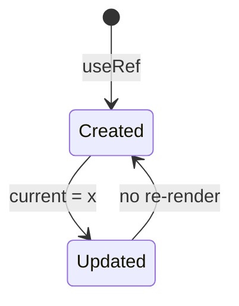
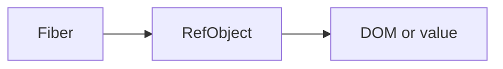

# useRef

<TopicMeta />

<Prerequisites />

::: tip Published
This page meets the handbook **published** bar: deep explanation, ≥10 common mistakes, and official references. Further engine-level errata welcome via PR.
:::

## Introduction

**`useRef(initial)`** returns `{ current: initial }` that persists for the component’s lifetime. Updating `current` does **not** trigger a re-render. Common uses: DOM refs and storing timeouts/previous values.

## Why does it exist?

Some values are not UI state—imperative handles, IDs, mutable boxes—without scheduling renders.

## Historical Background

Callback refs and string refs → `createRef`/`useRef` + `forwardRef` patterns; React 19 allows `ref` as a regular prop more often.

## Mental Model

A mutable box React keeps. Same object identity across renders. Don’t read/write refs during render for logic that should be reactive (except narrow patterns).

## Internal Workflow

1. `const ref = useRef<HTMLInputElement | null>(null)`.
2. Attach via `ref={ref}`.
3. Read in events/effects.
4. Use refs for mutable non-UI fields.

## Lifecycle



## Browser Perspective

DOM refs point at host instances after commit.

## JavaScript Engine Perspective

Not applicable.

## React Perspective

Also used by imperative handles.

## Next.js Perspective

Not applicable.

## Server Perspective

Not applicable.

## Network Perspective

Not applicable.

## Memory Perspective

Not applicable.

## Performance

Cheap; avoid replacing reactive state with refs that starve UI updates.

## Production Example

Focus management moves cursor into an input via `ref.current?.focus()` after opening a dialog (in an effect).

## Code Examples

```tsx
const inputRef = useRef<HTMLInputElement | null>(null)
useEffect(() => {
  inputRef.current?.focus()
}, [])
return <input ref={inputRef} />
```

## Diagrams



## Common Mistakes

1. Using ref when state is needed for UI
2. Reading ref during render to branch UI inconsistently
3. Forgetting null checks
4. Callback ref identity pitfalls
5. Storing new objects in ref.current every render unnecessarily
6. Assuming changing ref re-renders
7. Missing a production edge case for 10-react.useref (#1)
8. Missing a production edge case for 10-react.useref (#2)
9. Missing a production edge case for 10-react.useref (#3)
10. Missing a production edge case for 10-react.useref (#4)


## Best Practices

- DOM + imperative handles
- Null-safe access after commit
- Prefer state for anything on screen

## Anti-patterns

- Shadow state in refs that should drive render

## Comparison

| | useState | useRef |
| --- | --- | --- |
| Triggers render | Yes | No |
| UI data | Yes | No |

## Interview Questions

### Easy

**Q:** Does updating a ref re-render?

**A:** No. Changing `ref.current` does not schedule a render.

### Medium

**Q:** When do DOM refs become available?

**A:** After commit—typically read them in effects or event handlers, not during SSR/first render assumptions.

### Hard

**Q:** How do callback refs differ from object refs?

**A:** Callback refs run with the node on attach/detach; be careful with inline identities causing extra calls unless memoized/stabilized.

## Summary

- Mutable box without re-renders
- DOM handles and imperative values
- Not a substitute for UI state

## References

- [React Documentation](https://react.dev/)
- [useRef](https://react.dev/reference/react/useRef)

<RelatedTopics />


Prev: [`10-react.usecallback`](/10-react/usecallback/) · Next: [`10-react.useeffect`](/10-react/useeffect/)
