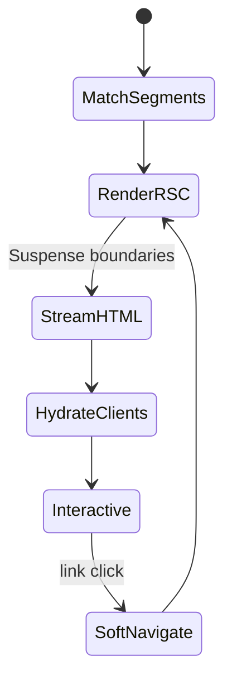
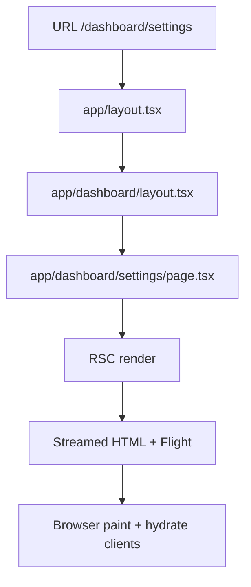

# App Router

<TopicMeta />

<Prerequisites />

::: tip Published
This page meets the handbook **published** bar: deep explanation, ≥10 common mistakes, and official references. Further engine-level errata welcome via PR.
:::

## Introduction

The **App Router** is Next.js’s modern routing system rooted in the `app/` directory. Routes are folders; special files (`page.tsx`, `layout.tsx`, `loading.tsx`, `error.tsx`, `route.ts`) define UI and behavior. Components are **React Server Components by default**; interactivity requires `"use client"`. Soft navigation preserves layouts and can stream incomplete UI.

## Why does it exist?

Pages Router mixed data fetching, layouts, and client bundles in ways that forced too much JavaScript to the browser. App Router exists to colocate routing with RSC, nested layouts that do not remount on child navigations, streaming with Suspense, and first-class loading/error UI—so apps ship less client JS and compose UI by segment.

## Historical Background

Next.js 13 introduced the App Router (stable in later 13.x/14). It builds on React Server Components, the React Flight protocol, and lessons from frameworks that treated folders as routes. Pages Router remains supported for migration; new greenfield apps should prefer `app/`.

## Mental Model

Think in **route segments**. Each folder under `app/` is a segment. A segment may contribute a layout (persistent shell), a page (leaf UI), and optional loading/error boundaries. The URL is the path of segments. Server Components run on the server (or at build time); only Client Component subtrees hydrate. Caches (Full Route Cache, Data Cache, Router Cache) decide freshness—see [/11-nextjs/caching/](/11-nextjs/caching/).

## Internal Workflow

1. Request hits a URL → Next matches the `app/` segment tree.
2. Layouts from root to leaf wrap the page (outer layouts stay mounted on soft nav).
3. Server Components render; async children can suspend → streamed HTML + RSC payload.
4. Client Components’ JS is downloaded and hydrated where marked.
5. Client navigations fetch the next RSC flight payload, reuse shared layouts, update the leaf.

## Lifecycle



Hard reload rebuilds the full tree; soft navigation reuses layout state.

## Browser Perspective

The browser paints streamed HTML early, then hydrates Client Components. Soft navigations update the DOM from the RSC payload without a full document reload.

## JavaScript Engine Perspective

Not applicable.

## React Perspective

App Router is the primary host for RSC in production React apps today. Server Components never run in the browser; Client Components are the hydration islands.

## Next.js Perspective

Next owns routing conventions, caching defaults, `next/link` prefetch, and the bundler integration (Turbopack/webpack) that splits server vs client graphs.

## Server Perspective

Node or Edge runtimes execute RSC renders and Route Handlers. Cold start, CPU, and upstream I/O dominate TTFB.

## Network Perspective

Prefetch may pull RSC payloads for visible links. CDN caching of full routes depends on static vs dynamic rendering.

## Memory Perspective

Router Cache on the client retains previously visited segment payloads; unbounded client state in layouts survives navigations and can feel like a “memory leak” if you stash large data there.

## Performance

Prefer Server Components for data-heavy UI; push `"use client"` to leaves. Streaming improves LCP/TTFB perception. Avoid dynamic APIs (`cookies()`, `headers()`) at the root layout unless necessary—they opt the route into dynamic rendering.

## Production Example

A SaaS dashboard uses a root layout (nav + auth shell as Server Component + small client menu), feature routes under `app/(dashboard)/`, and `loading.tsx` skeletons per section. Marketing pages stay static; account pages use dynamic rendering with tagged cache revalidation.

## Code Examples

```tsx
// app/layout.tsx — Server Component (default)
export default function RootLayout({ children }: { children: React.ReactNode }) {
  return (
    <html lang="en">
      <body>
        <header>Acme</header>
        {children}
      </body>
    </html>
  )
}

// app/dashboard/page.tsx
async function getMetrics() {
  const res = await fetch('https://api.example.com/metrics', {
    next: { revalidate: 60, tags: ['metrics'] },
  })
  return res.json()
}

export default async function DashboardPage() {
  const metrics = await getMetrics()
  return <pre>{JSON.stringify(metrics, null, 2)}</pre>
}
```

## Diagrams



## Common Mistakes

1. Marking entire pages `"use client"` and losing RSC benefits
2. Calling `cookies()`/`headers()` in a shared layout and accidentally dynamizing every child route
3. Expecting layout state to reset on navigation (layouts persist; use `template.tsx` when you need remount)
4. Duplicating `fetch` without understanding Data Cache / request memoization
5. Treating App Router like Pages Router `getServerSideProps` with identical mental models
6. Putting secrets in Client Components or importing server-only modules into client graphs
7. Overlooking an edge case #1 specific to 11-nextjs.app-router in production traffic
8. Overlooking an edge case #2 specific to 11-nextjs.app-router in production traffic
9. Overlooking an edge case #3 specific to 11-nextjs.app-router in production traffic
10. Overlooking an edge case #4 specific to 11-nextjs.app-router in production traffic


## Best Practices

- Default to Server Components; add `"use client"` only for state, effects, or browser APIs
- Colocate `loading.tsx` / `error.tsx` with slow or flaky segments
- Use route groups `(marketing)` / `(shop)` for layout variants without URL segments
- Measure TTFB and hydration cost separately when tuning

## Anti-patterns

- Giant client providers wrapping the whole tree “just in case”
- Fetching in Client Components what a Server Component could have streamed
- Manual SPA routers fighting App Router instead of using `next/navigation`

## Comparison

| Aspect | App Router | Pages Router |
| --- | --- | --- |
| Default components | Server Components | Client bundle pages |
| Layouts | Nested, persistent | `_app` / `_document` |
| Data fetching | `async` RSC + `fetch` cache | `getServerSideProps` / `getStaticProps` |
| Streaming | Built-in Suspense | Limited |
| Migration | Prefer for new apps | Stable legacy |

## Interview Questions

### Easy

**Q:** What is the App Router in Next.js?

**A:** File-system routing under `app/` where folders are segments and special files define UI. Components are Server Components by default; Client Components opt in with `"use client"`.

### Medium

**Q:** What happens on a soft navigation between two pages that share a layout?

**A:** Next fetches the RSC payload for the new segments, keeps the shared layout mounted (state preserved), swaps the page segment, and hydrates any new Client Components. Loading UI can show for suspending segments.

### Hard

**Q:** How do dynamic functions and caching interact with App Router rendering?

**A:** Using `cookies()`, `headers()`, or uncached `fetch` can force dynamic rendering and skip the Full Route Cache. Static segments can still be cached; tagged revalidation (`revalidateTag`) invalidates the Data Cache. Explain which layer you intend to hit before changing defaults.

## Summary

- App Router maps folders to nested route segments with RSC by default
- Layouts persist across child navigations; templates remount
- Streaming + Suspense improve perceived performance
- Caching layers decide static vs dynamic—learn [/11-nextjs/caching/](/11-nextjs/caching/)

## References

- [Next.js — App Router](https://nextjs.org/docs/app)
- [React — Server Components](https://react.dev/reference/rsc/server-components)

<RelatedTopics />


Next: [`11-nextjs.pages-router`](/11-nextjs/pages-router/)
