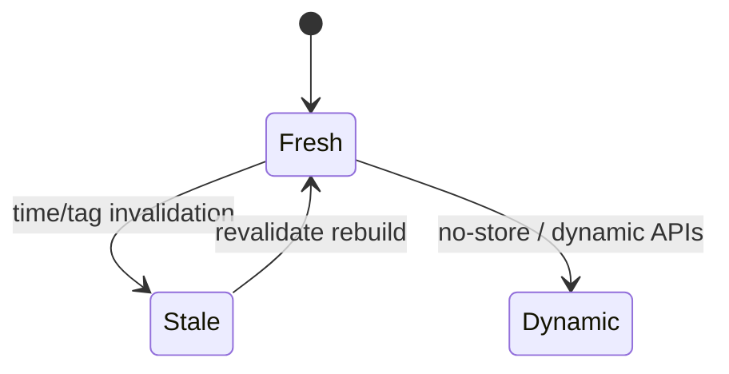
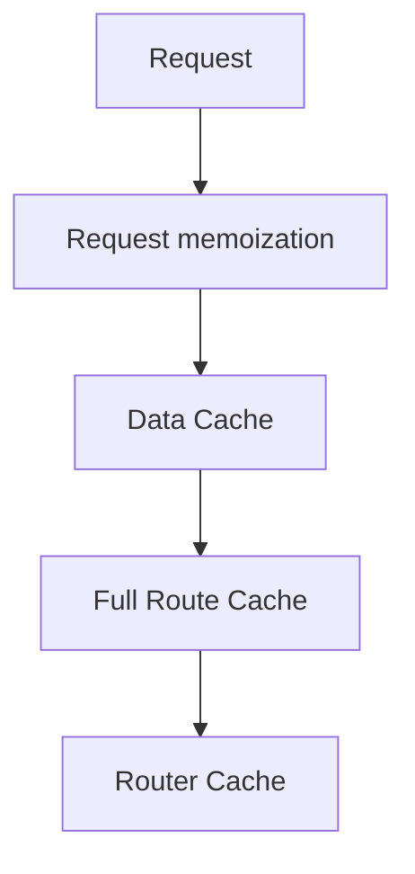

# Caching

<TopicMeta />

<Prerequisites />

::: tip Published
This page meets the handbook **published** bar: deep explanation, ≥10 common mistakes, and official references. Further engine-level errata welcome via PR.
:::

## Introduction

Next App Router caching is **multi-layered**. Understanding which layer you hit—React request memoization, the Data Cache around `fetch`, the Full Route Cache for static RSC/HTML, and the client Router Cache—is essential to debugging “why is this stale?”.

## Why does it exist?

Without structured caching, every navigation and render rehits origin databases. With opaque caching, teams ship stale dashboards. The model exists to make freshness explicit.

## Historical Background

Evolved rapidly across Next 13–15; APIs like `revalidateTag`, `unstable_cache`, and default fetch caching semantics shifted—always verify current docs for your version.

## Mental Model

Four layers:
1. **Request Memoization** — dedupe identical `fetch` during one server request
2. **Data Cache** — persistent server cache for `fetch`/`unstable_cache`
3. **Full Route Cache** — static render output at build/revalidate
4. **Router Cache** — client-side session cache of visited segments

## Internal Workflow

1. Decide static vs dynamic per segment.
2. Tag fetches (`next: { tags }`).
3. On mutation, `revalidateTag`/`revalidatePath`.
4. For client freshness, `router.refresh()` when needed.
5. Use `cache: 'no-store'` deliberately for live data.

## Lifecycle



## Browser Perspective

Router Cache can show stale UI until refresh/revalidation.

## JavaScript Engine Perspective

Not applicable.

## React Perspective

`cache()` dedopes arbitrary server functions per request.

## Next.js Perspective

Caching is a first-class Next feature—read versioned docs before blaming React.

## Server Perspective

Data Cache lives on the platform; local `next start` behavior can differ from prod.

## Network Perspective

CDN may cache static assets/routes separately from Data Cache.

## Memory Perspective

Not applicable.

## Performance

Correct caching collapses origin load. Over-caching creates trust bugs; under-caching burns money and TTFB.

## Production Example

Product catalog uses tagged fetches; publish webhook calls `revalidateTag('product:'+id)`. Cart uses `no-store`.

## Code Examples

```ts
export async function getProduct(id: string) {
  const res = await fetch(`https://api.example.com/products/${id}`, {
    next: { tags: [`product:${id}`], revalidate: 3600 },
  })
  return res.json()
}

'use server'
export async function publishProduct(id: string) {
  await db.publish(id)
  const { revalidateTag } = await import('next/cache')
  revalidateTag(`product:${id}`)
}
```

## Diagrams



## Common Mistakes

1. Blaming “React” for Next Data Cache staleness
2. Forgetting to revalidate after Server Actions
3. Using no-store everywhere and wondering why TTFB is bad
4. Confusing CDN Cache-Control with Next Data Cache
5. Expecting Router Cache to respect tag revalidation instantly without refresh semantics
6. Caching personalized HTML at the full route layer
7. Missing a production edge case for 11-nextjs.caching (#1)
8. Missing a production edge case for 11-nextjs.caching (#2)
9. Missing a production edge case for 11-nextjs.caching (#3)
10. Missing a production edge case for 11-nextjs.caching (#4)


## Best Practices

- Tag every cacheable fetch
- Invalidate on write paths
- Document static/dynamic intent per route
- Test caching in production-like deployments

## Anti-patterns

- Time-based revalidate: 1 for everything
- Global unstable_cache without tags
- User-specific data in Full Route Cache

## Comparison

| Layer | Scope | Invalidate |
| --- | --- | --- |
| Request memo | Single request | End of request |
| Data Cache | Server persistent | tags/path/time |
| Full Route | Static route output | revalidate |
| Router Cache | Client session | navigation/refresh |

## Interview Questions

### Easy

**Q:** Name the App Router cache layers.

**A:** Request memoization, Data Cache, Full Route Cache, and Client Router Cache.

### Medium

**Q:** How do you bust cached product data after an admin edit?

**A:** Use fetch tags like `product:id` and call `revalidateTag` from the mutation (Server Action/webhook).

### Hard

**Q:** A user sees old data after revalidateTag—what layers do you inspect?

**A:** Confirm tag matched, platform Data Cache flushed, route not stuck dynamic/static mismatch, and client Router Cache—try `router.refresh()` or check stale soft-navigation payloads.

## Summary

- Four cache layers with different lifetimes
- Tag fetches and revalidate on writes
- Dynamic APIs opt routes out of full static cache
- Verify behavior on your Next version/platform

## References

- [Next.js — Caching](https://nextjs.org/docs/app/building-your-application/caching)
- [Next.js — revalidateTag](https://nextjs.org/docs/app/api-reference/functions/revalidateTag)

<RelatedTopics />


Prev: [`11-nextjs.streaming`](/11-nextjs/streaming/) · Next: [`11-nextjs.partial-prerendering`](/11-nextjs/partial-prerendering/)
