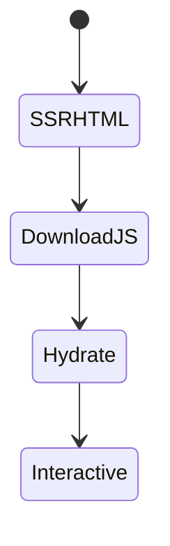
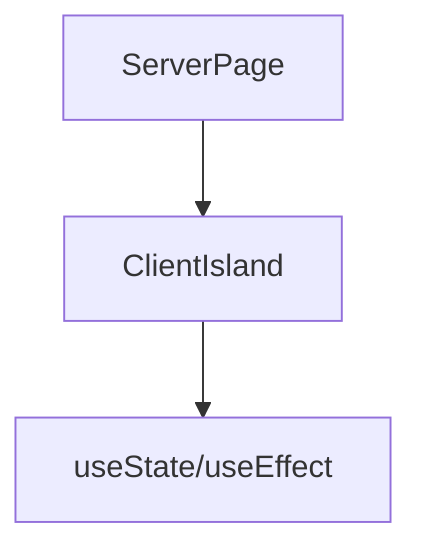

# Client Components

<TopicMeta />

<Prerequisites />

::: tip Published
This page meets the handbook **published** bar: deep explanation, ≥10 common mistakes, and official references. Further engine-level errata welcome via PR.
:::

## Introduction

**Client Components** opt into the client bundle with `"use client"` at the top of a file. They can use state, effects, and browser APIs. They should be **leaves** under Server Components, not the default for entire routes.

## Why does it exist?

Interactivity needs the browser. The Client Component boundary is how React/Next express which code must hydrate.

## Historical Background

Created alongside RSC so apps can mix server and client trees intentionally.

## Mental Model

The file with `"use client"` is the root of a client subgraph—all its imports are treated as client. Push the directive down to minimize JS.

## Internal Workflow

1. Identify stateful/interactive UI.
2. Extract to a Client Component file.
3. Pass serializable props from server parents.
4. Keep side effects in effects/event handlers, not module scope.

## Lifecycle



## Browser Perspective

Hydration attaches listeners; mismatches warn/error.

## JavaScript Engine Perspective

Not applicable.

## React Perspective

Hooks rules apply. Prefer events for user actions; effects for syncing with external systems.

## Next.js Perspective

Client components still SSR once for HTML unless you disable with dynamic ssr:false.

## Server Perspective

Not applicable.

## Network Perspective

Each client boundary can pull JS chunks—split wisely.

## Memory Perspective

Client state lives until unmount; avoid unbounded subscriptions.

## Performance

Hydration cost scales with client tree size. Measure INP; reduce client JS before micro-optimizing hooks.

## Production Example

Search combobox is a Client Component; results list markup streams from the server parent.

## Code Examples

```tsx
'use client'

import { useState } from 'react'

export function Counter() {
  const [n, setN] = useState(0)
  return <button onClick={() => setN((x) => x + 1)}>{n}</button>
}
```

## Diagrams



## Common Mistakes

1. Placing `"use client"` at the route top unnecessarily
2. Importing server-only code into client files
3. Hydration mismatch from Date.now()/random in render
4. Fetching confidential data from the client
5. Giant context providers as client wrappers around the whole app
6. Using useEffect for data that RSC could provide
7. Missing a production edge case for 11-nextjs.client-components (#1)
8. Missing a production edge case for 11-nextjs.client-components (#2)
9. Missing a production edge case for 11-nextjs.client-components (#3)
10. Missing a production edge case for 11-nextjs.client-components (#4)


## Best Practices

- Keep client modules small and focused
- Compose: server parent + client child
- Stabilize SSR output for hydratable UI
- Code-split heavy widgets with dynamic import

## Anti-patterns

- Client-only SPA inside App Router
- Re-implementing router state in context
- Silent catch of hydration errors

## Comparison

| Need | Component type |
| --- | --- |
| useState / DOM events | Client |
| DB query / secrets | Server |
| Static content | Server |

## Interview Questions

### Easy

**Q:** How do you create a Client Component?

**A:** Add `"use client"` at the top of the file before imports.

### Medium

**Q:** Why push `"use client"` down the tree?

**A:** Because the directive marks a client boundary; everything imported beneath becomes client JS. Lower boundaries ship less code.

### Hard

**Q:** How can a Client Component still SSR?

**A:** Next still renders Client Components to HTML on the server for the first paint, then hydrates. `ssr: false` with dynamic() skips that for browser-only widgets.

## Summary

- Client Components enable hooks and browser APIs
- Boundary is the "use client" file
- Keep them small under RSC parents
- Avoid hydration mismatches

## References

- [Next.js — Client Components](https://nextjs.org/docs/app/building-your-application/rendering/client-components)

<RelatedTopics />


Prev: [`11-nextjs.server-components`](/11-nextjs/server-components/) · Next: [`11-nextjs.server-actions`](/11-nextjs/server-actions/)
