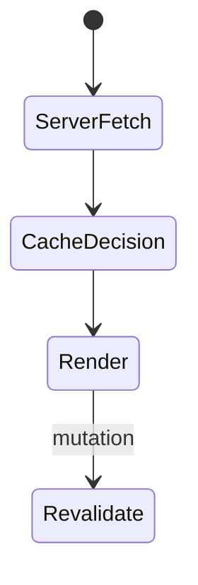
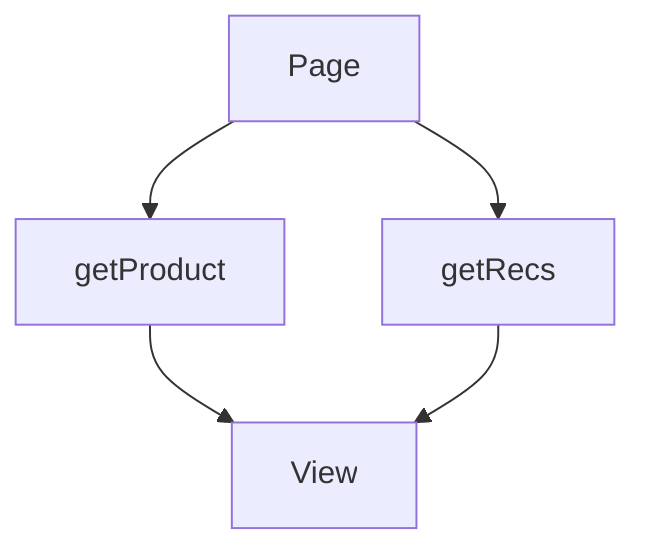

# Data Fetching

<TopicMeta />

<Prerequisites />

::: tip Published
This page meets the handbook **published** bar: deep explanation, ≥10 common mistakes, and official references. Further engine-level errata welcome via PR.
:::

## Introduction

**Data fetching** in App Router prefers **async Server Components** calling `fetch`, ORMs, or `unstable_cache`. Client fetching remains for highly interactive or post-hydration updates. The key skills are parallelization, caching tags, and avoiding waterfalls.

## Why does it exist?

UI is useless without data. Fetching on the server cuts client waterfalls and keeps tokens off the browser.

## Historical Background

Moved from gSSP/gSP toward RSC `async` + extended `fetch`.

## Mental Model

Server fetch by default → cache/revalidate → stream. Client fetch for user-triggered or realtime updates after hydration.

## Internal Workflow

1. Fetch in Server Components close to usage.
2. Kick off independent promises early; await together.
3. Tag and revalidate.
4. Use Route Handlers/Actions for mutations.
5. Client `fetch`/SWR/Query only when needed.

## Lifecycle



## Browser Perspective

Client fetches add after hydration cost.

## JavaScript Engine Perspective

Not applicable.

## React Perspective

Suspense integrates with async children.

## Next.js Perspective

fetch semantics + caches are Next-enhanced in the App Router.

## Server Perspective

Protect secrets; time out upstreams.

## Network Perspective

Parallelize to cut RTT chains.

## Memory Perspective

Not applicable.

## Performance

Waterfalls are the enemy. Use `Promise.all`, component-level fetch + Suspense, and HTTP caching where applicable.

## Production Example

Page starts product+recommendations promises together; reviews behind Suspense; admin mutations revalidate tags.

## Code Examples

```tsx
async function Product({ id }: { id: string }) {
  const productPromise = getProduct(id)
  const recsPromise = getRecs(id)
  const [product, recs] = await Promise.all([productPromise, recsPromise])
  return (
    <div>
      <h1>{product.name}</h1>
      <ul>{recs.map((r) => <li key={r.id}>{r.name}</li>)}</ul>
    </div>
  )
}
```

## Diagrams



## Common Mistakes

1. Sequential awaits for independent data
2. Client useEffect fetch duplicating server data
3. No timeouts/error handling on upstreams
4. Caching user-specific data as static
5. Overfetching large graphs for a small UI
6. Ignoring request deduplication and refetching blindly in every nested layout
7. Missing a production edge case for 11-nextjs.data-fetching (#1)
8. Missing a production edge case for 11-nextjs.data-fetching (#2)
9. Missing a production edge case for 11-nextjs.data-fetching (#3)
10. Missing a production edge case for 11-nextjs.data-fetching (#4)


## Best Practices

- Fetch on the server by default
- Parallelize independent calls
- Tag caches; revalidate on write
- Suspense for slow optional sections

## Anti-patterns

- Waterfall: layout await → page await → child await
- API routes for same-app reads that RSC could do
- Blocking UI on non-critical secondary data

## Comparison

| Place | Good for |
| --- | --- |
| RSC fetch | Initial data, SEO, secrets |
| Server Action | Mutations |
| Client fetch | Live updates, highly interactive |

## Interview Questions

### Easy

**Q:** Where should most App Router data fetching happen?

**A:** In async Server Components on the server.

### Medium

**Q:** How do you avoid server waterfalls?

**A:** Start promises without awaiting between them, use Promise.all, or split slow parts into Suspense children that fetch themselves.

### Hard

**Q:** Compare TanStack Query on the client vs RSC fetch.

**A:** RSC fetch excels for first paint and secrets; client Query excels for shared cache, optimistic updates, and fine-grained refetch after hydration. Many apps use RSC for initial data and Query for interactive freshness.

## Summary

- Prefer async RSC data fetching
- Parallelize and cache with tags
- Stream optional slow data
- Mutate via Actions; revalidate

## References

- [Next.js — Data Fetching](https://nextjs.org/docs/app/building-your-application/data-fetching)
- [Next.js — Caching](https://nextjs.org/docs/app/building-your-application/caching)

<RelatedTopics />


Prev: [`11-nextjs.partial-prerendering`](/11-nextjs/partial-prerendering/) · Next: [`11-nextjs.route-groups`](/11-nextjs/route-groups/)
