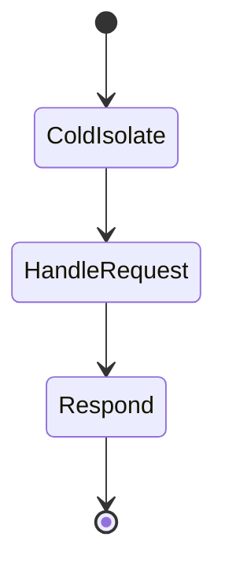

# Edge Runtime

<TopicMeta />

<Prerequisites />

::: tip Published
This page meets the handbook **published** bar: deep explanation, ≥10 common mistakes, and official references. Further engine-level errata welcome via PR.
:::

## Introduction

The **Edge Runtime** is a minimal JS runtime (V8 isolates) used by Middleware and optionally by Route Handlers/pages. It supports Web APIs (`fetch`, `Request`, `Response`) but not the full Node.js API surface.

## Why does it exist?

Running logic close to users cuts RTT for redirects, auth gates, and simple APIs. A smaller runtime starts faster than a cold Node serverless function.

## Historical Background

Popularized by Cloudflare Workers / Vercel Edge; Next integrated it for Middleware and `export const runtime = 'edge'`.

## Mental Model

Edge = fast, limited, globally distributed. If you need `fs`, native addons, or long Node libraries, use Node runtime instead.

## Internal Workflow

1. Set `export const runtime = 'edge'` on a route/handler (Middleware is edge by default).
2. Use Web-standard APIs only.
3. Keep CPU/time short; stream when possible.
4. Test locally that imports are edge-compatible.

## Lifecycle



## Browser Perspective

Clients just see HTTP—runtime is invisible except latency.

## JavaScript Engine Perspective

Not applicable.

## React Perspective

Not applicable.

## Next.js Perspective

Middleware always edge; Route Handlers choose runtime.

## Server Perspective

Not Node—verify polyfills. DB drivers often need HTTP/edge-friendly clients.

## Network Perspective

Deployed to PoPs; great for geo/header logic.

## Memory Perspective

Tight memory limits; avoid huge in-memory caches.

## Performance

Wins on TTFB for tiny work. Loses if you force heavy frameworks onto edge or add cold multi-hop I/O.

## Production Example

Geo rewrite in Middleware + edge `GET` for feature flags; checkout mutations stay on Node with full ORM.

## Code Examples

```ts
export const runtime = 'edge'

export async function GET(request: Request) {
  const country = request.headers.get('x-vercel-ip-country') ?? 'US'
  return Response.json({ country })
}
```

## Diagrams


## Common Mistakes

1. Importing Node-only packages into edge routes
2. Running heavy SSR on edge without measuring CPU limits
3. Assuming edge has filesystem access
4. Using edge for long-running jobs
5. Duplicating auth logic only on edge and not on Node handlers
6. Giant middleware bundles that erase edge latency wins
7. Missing a production edge case for 11-nextjs.edge-runtime (#1)
8. Missing a production edge case for 11-nextjs.edge-runtime (#2)
9. Missing a production edge case for 11-nextjs.edge-runtime (#3)
10. Missing a production edge case for 11-nextjs.edge-runtime (#4)


## Best Practices

- Default Middleware to cookie/JWT checks only
- Choose edge for latency-sensitive simple work
- Keep Node for ORM, files, and legacy SDKs
- Bundle-analyze edge entrypoints

## Anti-patterns

- Edge + huge polyfill shims for Node builtins
- Synchronous CPU-heavy crypto loops on edge
- One runtime for every route “for consistency”

## Comparison

| | Edge | Node |
| --- | --- | --- |
| APIs | Web-ish | Full Node |
| Cold start | Typically lower | Higher |
| Use | MW, simple APIs | RSC+ORM, heavy work |

## Interview Questions

### Easy

**Q:** What is the Edge Runtime in Next.js?

**A:** A limited V8 isolate runtime with Web APIs, used for Middleware and optional edge routes—not full Node.js.

### Medium

**Q:** When would you not use Edge?

**A:** When you need Node APIs, heavy native deps, long CPU, or DB drivers that only work on Node.

### Hard

**Q:** How does edge middleware + Node RSC interact on a request?

**A:** Middleware runs first at the edge (redirect/rewrite/headers), then the request continues to the Node (or edge) render for RSC/HTML. Design so middleware stays cheap and authz is re-checked in the render/action layer.

## Summary

- Edge = fast constrained runtime
- Middleware is edge by default
- Prefer Node for heavy server work
- Measure real latency, not slogans

## References

- [Next.js — Edge Runtime](https://nextjs.org/docs/app/api-reference/edge)
- [Next.js — Middleware](https://nextjs.org/docs/app/building-your-application/routing/middleware)

<RelatedTopics />


Prev: [`11-nextjs.middleware`](/11-nextjs/middleware/) · Next: [`11-nextjs.node-runtime`](/11-nextjs/node-runtime/)
