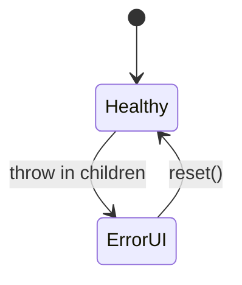
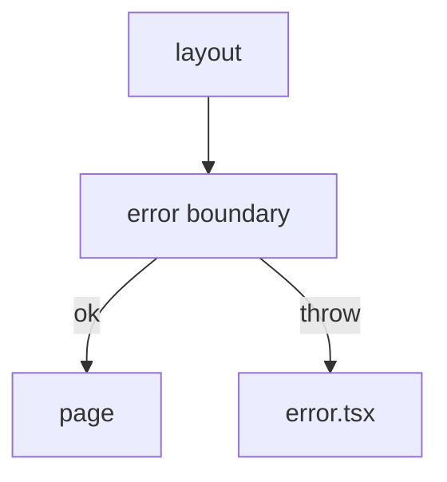

# Error UI

<TopicMeta />

<Prerequisites />

::: tip Published
This page meets the handbook **published** bar: deep explanation, ≥10 common mistakes, and official references. Further engine-level errata welcome via PR.
:::

## Introduction

**Error UI** uses `error.tsx`—a Client Component error boundary—for runtime errors in a segment’s children. It isolates failures so parent layouts can keep working and offers a `reset()` to retry rendering.

## Why does it exist?

Unhandled render errors should not white-screen the entire app. Segment boundaries contain blast radius and give users a recovery path.

## Historical Background

Maps React error boundaries onto the route tree with a file convention (plus `global-error.tsx` for root).

## Mental Model

`error.tsx` catches errors in the segment below it (not in the layout that sits beside it at the same level—nest carefully). It must be a Client Component because error boundaries use lifecycle/state.

## Internal Workflow

1. Add `error.tsx` with `"use client"`.
2. Accept `error` and `reset` props.
3. Log to monitoring; show actionable UI.
4. `reset()` re-renders the segment children.

## Lifecycle



## Browser Perspective

Users keep parent chrome; only the failed segment shows fallback.

## JavaScript Engine Perspective

Not applicable.

## React Perspective

Standard error boundary semantics; does not catch event-handler errors or async errors outside render unless rethrown into render.

## Next.js Perspective

`global-error.tsx` replaces root layout when the root fails—must define its own html/body.

## Server Perspective

Errors during RSC render are serialized to the client boundary; dig into server logs for the real stack.

## Network Perspective

Failed Server Actions should return errors intentionally—don’t rely only on error.tsx.

## Memory Perspective

Not applicable.

## Performance

Cheap when healthy. Avoid huge client bundles in error.tsx; keep it minimal.

## Production Example

Billing segment has error.tsx that reports to Sentry with route tags and offers “Retry” via reset, while the app shell stays usable.

## Code Examples

```tsx
'use client'

export default function Error({
  error,
  reset,
}: {
  error: Error & { digest?: string }
  reset: () => void
}) {
  return (
    <div>
      <h2>Something went wrong</h2>
      <p>{error.digest}</p>
      <button onClick={() => reset()}>Try again</button>
    </div>
  )
}
```

## Diagrams



## Common Mistakes

1. Forgetting `"use client"` in error.tsx
2. Expecting error.tsx to catch errors in the same segment’s layout.tsx
3. Swallowing errors without logging digests
4. No global-error.tsx for root failures
5. Using error.tsx for expected notFound (use notFound() + not-found.tsx)
6. Reset loops when the underlying data is still bad
7. Missing a production edge case for 11-nextjs.error-ui (#1)
8. Missing a production edge case for 11-nextjs.error-ui (#2)
9. Missing a production edge case for 11-nextjs.error-ui (#3)
10. Missing a production edge case for 11-nextjs.error-ui (#4)


## Best Practices

- Log error.digest + user-safe message
- Place error.tsx at feature boundaries
- Prefer not-found.tsx for 404s
- Keep recovery actions obvious

## Anti-patterns

- Empty catch in Server Actions that never surfaces to UI
- Error UI that exposes stack traces to end users in production
- One root error boundary only for a huge app

## Comparison

| File | Role |
| --- | --- |
| error.tsx | Segment runtime errors |
| global-error.tsx | Root failures |
| not-found.tsx | notFound() / missing routes |

## Interview Questions

### Easy

**Q:** Why must error.tsx be a Client Component?

**A:** React error boundaries rely on client-side lifecycle/state; the file convention requires `"use client"`.

### Medium

**Q:** Does error.tsx catch errors thrown in layout.tsx of the same folder?

**A:** No. It catches errors in its children. To catch layout errors, put error.tsx in the parent segment.

### Hard

**Q:** How do digests help production debugging?

**A:** Next redacts sensitive server error details from the client and provides an `error.digest` correlating to server logs—use that ID in observability tools.

## Summary

- error.tsx is a route-level error boundary
- Must be a Client Component with reset()
- Contain failures per segment
- Use not-found for missing resources

## References

- [Next.js — Error Handling](https://nextjs.org/docs/app/building-your-application/routing/error-handling)

<RelatedTopics />


Prev: [`11-nextjs.loading-ui`](/11-nextjs/loading-ui/) · Next: [`11-nextjs.metadata`](/11-nextjs/metadata/)
