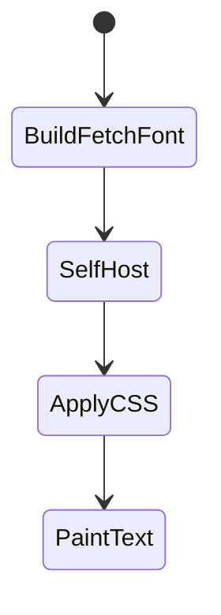

# Fonts

<TopicMeta />

<Prerequisites />

::: tip Published
This page meets the handbook **published** bar: deep explanation, ≥10 common mistakes, and official references. Further engine-level errata welcome via PR.
:::

## Introduction

`next/font` downloads and **self-hosts** Google or local fonts at build time, injecting optimized CSS with size-adjusted fallbacks to reduce CLS and remove render-blocking third-party font requests.

## Why does it exist?

Third-party font CDNs add DNS/TLS, privacy concerns, and layout shift. Self-hosting with metric-adjusted fallbacks keeps branding without tanking CWV.

## Historical Background

Built-in font optimization landed to replace manual `@font-face` + Google Fonts `<link>` patterns.

## Mental Model

Import a font loader, set subsets/weights, apply `className`/`variable` on `<html>` or layout. Fallbacks are adjusted so swap doesn’t jump.

## Internal Workflow

1. `import { Inter } from 'next/font/google'` or `next/font/local`.
2. Configure subsets, weight, display.
3. Apply to root layout.
4. Prefer CSS variables for design-system theming.

## Lifecycle



## Browser Perspective

Font files come from your origin; `font-display` strategy affects FOIT/FOUT.

## JavaScript Engine Perspective

Not applicable.

## React Perspective

Not applicable.

## Next.js Perspective

Build step inlines font CSS and places files in static assets.

## Server Perspective

Not applicable.

## Network Perspective

No extra connection to fonts.googleapis.com.

## Memory Perspective

Limit weights/subsets—each file costs bytes and memory when decoded.

## Performance

Reduces critical-path latency and CLS from font swap. Subset aggressively.

## Production Example

Root layout loads Inter variable font as `--font-sans`; marketing uses one display face locally via `next/font/local`.

## Code Examples

```tsx
import { Inter } from 'next/font/google'

const inter = Inter({ subsets: ['latin'], variable: '--font-sans' })

export default function RootLayout({ children }: { children: React.ReactNode }) {
  return (
    <html lang="en" className={inter.variable}>
      <body>{children}</body>
    </html>
  )
}
```

## Diagrams

```mermaid
flowchart LR
  Build[next build] --> Host[/static font files]
  Host --> CSS[size-adjusted CSS]
  CSS --> Page[Root layout className]
```

## Common Mistakes

1. Loading every weight/italic variant
2. Keeping Google Fonts `<link>` alongside next/font (double load)
3. Applying font class only deep in the tree causing FOUC-like swaps
4. Forgetting subsets for non-Latin locales
5. Huge icon fonts instead of SVG
6. No fallback font stack in CSS
7. Missing a production edge case for 11-nextjs.fonts (#1)
8. Missing a production edge case for 11-nextjs.fonts (#2)
9. Missing a production edge case for 11-nextjs.fonts (#3)
10. Missing a production edge case for 11-nextjs.fonts (#4)


## Best Practices

- One primary family + limited weights
- Use variable fonts when possible
- Set fonts on `<html>` in root layout
- Measure CLS before/after font changes

## Anti-patterns

- Five brand fonts on every page
- Client-only font loading libraries fighting next/font
- Base64 inlining megabyte fonts into CSS

## Comparison

| Approach | Trade-off |
| --- | --- |
| next/font | Best default for Next apps |
| Manual @font-face | More control, more footguns |
| Hosted CDN link | Extra connection, privacy |

## Interview Questions

### Easy

**Q:** What problem does next/font solve?

**A:** Self-hosts fonts with optimized CSS/fallbacks to improve performance, CLS, and privacy versus third-party font CDNs.

### Medium

**Q:** Why size-adjusted fallbacks matter?

**A:** They approximate the webfont’s metrics so swapping from fallback to webfont causes less layout shift (CLS).

### Hard

**Q:** How would you support many locales efficiently?

**A:** Subset per locale/script, load only needed families on those routes, prefer variable fonts, and avoid bundling all glyphs globally.

## Summary

- next/font self-hosts and optimizes fonts
- Apply in root layout with limited weights
- Helps CLS and removes third-party font RTT
- Prefer variable fonts + subsets

## References

- [Next.js — Font Optimization](https://nextjs.org/docs/app/building-your-application/optimizing/fonts)
- [web.dev — Font best practices](https://web.dev/learn/performance/optimize-web-fonts)

<RelatedTopics />


Prev: [`11-nextjs.image-optimization`](/11-nextjs/image-optimization/) · Next: [`11-nextjs.server-components`](/11-nextjs/server-components/)
